# PlantUML JSON 数据可视化官方文档

> 来源：官方文档 https://plantuml.com/zh/json（本地缓存，供 draw-plantuml 技能参考）
> 抓取于 2026-07-04。仅保留标题、说明段落与源码示例。

---

# JSON数据可视化

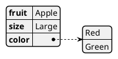

## 复杂一些的例子

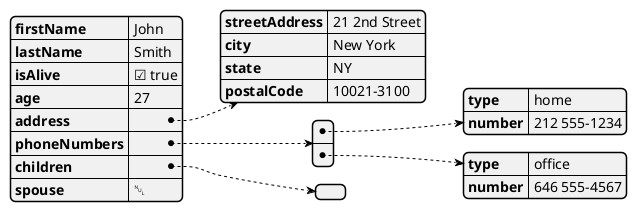

## 如何高亮显示

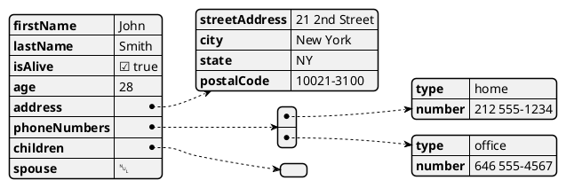

## 使用不同风格的高亮


## JSON基本类型

### 所有支持的JSON类型

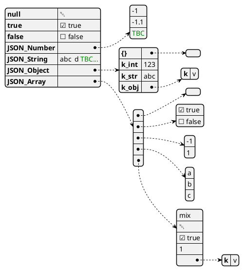

## JSON 数组或表格

### 数组

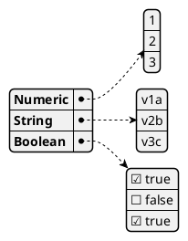

### 最小化的数组或表格

#### 数字类型数组

```plantuml
@startjson
[1, 2, 3]
@endjson
```

#### 字符串类型数组

```plantuml
@startjson
["1a", "2b", "3c"]
@endjson
```

#### 布尔型数组

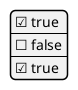

## JSON 数字

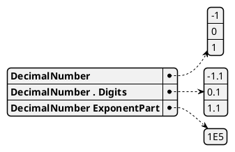

## JSON 字符串

### JSON Unicode

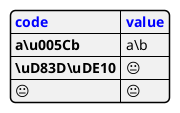

### JSON 双字符转义序列

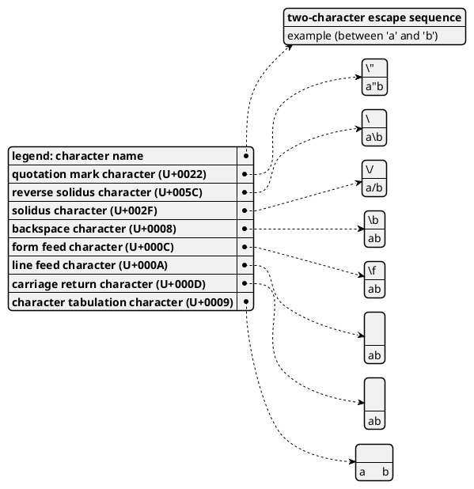

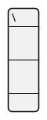

## 最小化 JSON 的例子


```plantuml
@startjson
42
@endjson
```

```plantuml
@startjson
true
@endjson
```

## 空表格或列表

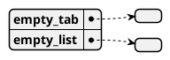

## 使用管局样式或局部样式

### 无样式的情况(默认)

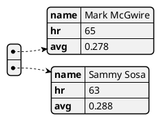

### 增加样式

```plantuml
@startjson
<style>
jsonDiagram {
  node {
    BackGroundColor Khaki
    LineColor lightblue
    FontName Helvetica
    FontColor red
    FontSize 18
    FontStyle bold
    RoundCorner 0
    LineThickness 2
    LineStyle 10-5
    separator {
      LineThickness 0.5
      LineColor black
      LineStyle 1-5
    }
  }
  arrow {
    BackGroundColor lightblue
    LineColor green
    LineThickness 2
    LineStyle 2-5
  }
  highlight {
    BackGroundColor red
    FontColor white
    FontStyle italic
  }
}
</style>
# highlight "1" / "hr"
[
  {
    "name": "Mark McGwire",
    "hr":   65,
    "avg":  0.278
  },
  {
    "name": "Sammy Sosa",
    "hr":   63,
    "avg":  0.288
  }
]
@endjson
```

## 使用类或者对象的像是显示JSON数据

### 简单例子

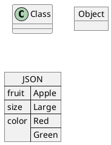

### 复杂例子: 包括所有的JSON的结构

```plantuml
@startuml
json "<b>JSON basic element" as J {
"null": null,
"true": true,
"false": false,
"JSON_Number": [-1, -1.1, "<color:green>TBC"],
"JSON_String": "a\nb\rc\td <color:green>TBC...",
"JSON_Object": {
  "{}": {},
  "k_int": 123,
  "k_str": "abc",
  "k_obj": {"k": "v"}
},
"JSON_Array" : [
  [],
  [true, false],
  [-1, 1],
  ["a", "b", "c"],
  ["mix", null, true, 1, {"k": "v"}]
]
}
@enduml
```

## 在部署图中显示JSON数据（用例，组件，部署）

### 简单例子

```plantuml
@startuml
allowmixing

component Component
actor     Actor
usecase   Usecase
()        Interface
node      Node
cloud     Cloud

json JSON {
   "fruit":"Apple",
   "size":"Large",
   "color": ["Red", "Green"]
}
@enduml
```

```plantuml
@startuml
allowmixing

agent Agent
stack {
  json "JSON_file.json" as J {
    "fruit":"Apple",
    "size":"Large",
    "color": ["Red", "Green"]
  }
}
database Database

Agent -> J
J -> Database
@enduml
```

## 在状态图中显示JSON数据

### 简单例子

```plantuml
@startuml
state "A" as stateA
state "C" as stateC {
 state B
}

json J {
   "fruit":"Apple",
   "size":"Large",
   "color": ["Red", "Green"]
}
@enduml
```

## Creole on JSON

```plantuml
@startjson
{
"Creole":
  {
  "wave": "~~wave~~",
  "bold": "**bold**",
  "italics": "//italics//",
  "stricken-out": "--stricken-out--",
  "underlined": "__underlined__",
  "not-underlined": "~__not underlined__",
  "wave-underlined": "~~wave-underlined~~"
  },
"HTML Creole":
  {
  "bold": "<b>bold",
  "italics": "<i>italics",
  "monospaced": "<font:monospaced>monospaced",
  "stroked": "<s>stroked",
  "underlined": "<u>underlined",
  "waved": "<w>waved",
  "green-stroked": "<s:green>stroked",
  "red-underlined": "<u:red>underlined",
  "blue-waved": "<w:#0000FF>waved",
  "Blue": "<color:blue>Blue",
  "Orange": "<back:orange>Orange background",
  "big": "<size:20>big"
  },
"Graphic":
  {
  "OpenIconic": "account-login <&account-login>", 
  "Unicode": "This is <U+221E> long",
  "Emoji": "<:calendar:> Calendar",
  "Image": ""
  }
}
@endjson
```
