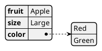
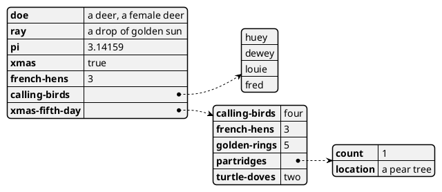
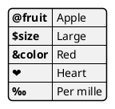
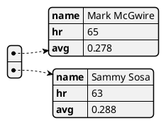
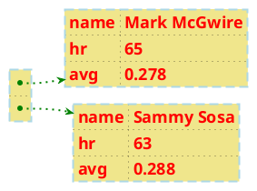
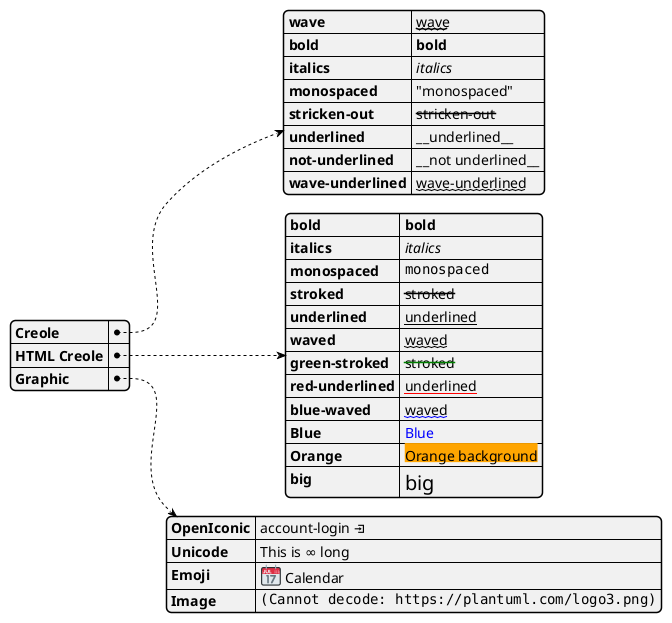

# PlantUML YAML 显示效果官方文档

> 来源：官方文档 https://plantuml.com/zh/yaml（本地缓存，供 draw-plantuml 技能参考）
> 抓取于 2026-07-04。仅保留标题、说明段落与源码示例。

---

# YAML 显示效果图

## 复杂例子

## 特定的 key (使用 symbols 或者 unicode)

## 强调

### 正常样式

### 自定义样式

## Using different styles for highlight

## 使用 (global) 全局样式

### 不带样式(默认)

### 使用样式

## Creole on YAML

