# PlantUML 内容组织指南

通过规范代码结构、合理控制内容、统一标签和注释规则，使生成的 UML 图逻辑清晰、层次分明且认知友好。

> **定位**：本文件是绘图**内容质量指南**，与 [style.md](./style.md)（统一样式配置）和 [layout.md](./layout.md)（布局优化技巧）互补。在 Step 6 生成 PlantUML 代码时**必须参照本指南**。

---

## 一、内容组织与认知控制

### 1.1 单一职责原则

**单图聚焦一个主题**，避免信息过载：
- 架构图：仅展示模块边界与依赖，不包含方法细节
- 时序图：仅描述一次典型交互，异常流程单独成图
- 类图：按职责域拆分，不要把所有类画进一张图

### 1.2 元素数量控制

**单图规模的核心矛盾**：认知负荷随**同层可见元素数**上升，而非随总元素数上升。一张 ~40 元素的嵌套架构图完全可以清晰——前提是任一层级（任一 frame 内部）的直接子元素保持在少量范围。

| 层级 | 判据 | 处理方式 |
|------|------------|---------|
| **认知友好** | 任一容器内直接子元素 ≤7 | 一眼可理解，首选 |
| **可接受** | 任一容器内直接子元素 8-12 | 需辅以分组/子容器 |
| **需再分层** | 某容器直接子元素 >12 | 再引入一层子容器，而**非**删除元素 |
| **总量上限** | 单图总元素 ~40 | 通过**嵌套容器**分摊到各层级，全部保留 |

> **对复杂嵌套架构图：不要为了降数量而拆图或删元素。** 目标是"保留全部元素 + 让每一层都稀疏"。拆分（C4 分层，§1.3）仅在业务主题本身可分离时才用；单一主题的密集架构应靠嵌套容器压缩，而非丢失信息。

### 1.3 C4 层级化拆分

复杂系统按 C4 模型分层绘制，每层一张图：

1. **系统上下文图 (Context)** — 系统与外部用户/系统的关系
2. **容器图 (Container)** — 系统内部的主要技术容器（服务、数据库等）
3. **组件图 (Component)** — 单个容器内部的逻辑组件
4. **类图 (Class)** — 单个组件内部的代码结构

跨图引用时在子图标题中注明：
```plantuml
title 支付服务内部组件（容器图见 01-system-containers）
```

### 1.4 代码结构映射布局

**按逻辑顺序编写元素**，先定义核心参与者/类，再描述关系：

```plantuml
' ✓ 好：先声明核心元素，再描述关系
participant OrderService
participant PaymentService
participant InventoryService

OrderService -> PaymentService : 发起支付
PaymentService -> InventoryService : 扣减库存
```

```plantuml
' ✗ 差：边定义边画关系，阅读混乱
participant OrderService
OrderService -> PaymentService : 发起支付
participant InventoryService
PaymentService -> InventoryService : 扣减库存
```

### 1.5 标签精简与富文本注释补充

> **组件文本描述能力有限时，用富文本注释补充。** 这是一条适用于所有图类型的通用规则，在 Step 6 生成代码时**必须遵守**。

#### 核心规则：标签 ≤10 字符 + note 补充

元素名称/标签不超过 10 个字符。当短标签无法充分描述元素职责时，使用 `note` 元素补充详细说明。

**为什么要限制标签长度**：过长的元素标签会导致框体过宽、自动换行不可预测、认知负荷增加。

```plantuml
' ✗ 差：元素标签过长，导致框体过宽
component [用户订单管理服务主模块] as OrderMain
participant "用户认证与授权服务中心" as Auth

' ✓ 好：简短标签 + note 补充说明
component [订单服务] as Order
participant "认证中心" as Auth

note right of Order
  包含订单创建、取消、
  退款、状态查询等子模块
end note
```

#### 关系线标签同样适用

```plantuml
' ✗ 差
A -> B : 发送异步HTTP请求并携带JWT令牌

' ✓ 好
A -> B : 异步调用
note on link
  HTTP POST + JWT Bearer
end note
```

#### note 语法速查

| 场景 | 语法 | 说明 |
|------|------|------|
| 元素旁注释 | `note right of X` / `note left of` / `note top of` / `note bottom of` | 定位在元素指定方向 |
| 多行注释 | `note right of X` ... `end note` | 多段说明文字 |
| 浮动注释 | `note "text" as N` + `N .. X` | 独立放置，用虚线连接 |
| 关系线注释 | `note on link` ... `end note` | 附加在箭头连线上 |
| 简短箭头标签 | `A -> B : 简短文字` | ≤10 字符，直接在箭头上 |

> **详细注释模式和示例见 [§二–三](#二注释策略)。**

### 1.6 嵌套清晰度：让嵌套框读起来像干净的包含关系

复杂架构图的可读性 80% 取决于**嵌套是否读得出层级**。目标：读者一眼能分辨"谁在谁里面"，而不是看到一堆重叠或含义不明的框。

#### 规则 A — 每一层深度用固定的容器类型

按深度分配容器关键字，形成视觉编码，读者靠框型即可判断层级：

| 深度 | 语义 | 建议容器 |
|------|------|---------|
| L0 外边界 | 系统 / 网络边界 | `rectangle` 或 `cloud` |
| L1 | 分区 / 子系统 | `package` |
| L2 | 部署单元 / 服务组 | `frame` 或 `node` |
| L3 | 叶子组件 | `component [X]` / `[X]` |

```plantuml
' ✓ 好：深度与容器类型一一对应，层级一目了然
rectangle "生产集群" as cluster {
  package "控制面" as cp {
    frame "API 层" as apis {
      [API Server] as api
      [Scheduler]  as sch
    }
  }
}
```

**不要混用**：同一深度的所有兄弟容器必须用同一种关键字，否则框型不一致会让人误读层级。

#### 规则 B — 控制嵌套深度 ≤4 层

超过 4 层，最内层框会被挤到极窄，标题与内容重叠。若语义确实更深，把最深的一两层"压平"为 `note` 列表或分离成引用子图（在 title 注明）。

#### 规则 C — 缩进镜像嵌套

源码缩进必须与嵌套深度一致（每层 2 空格）。这既让代码可读，也帮助你在编写时察觉"某个框子元素过多"。

#### 规则 D — 每个容器内部只用一个排布方向

在单个 frame 内，让其直接子元素朝**同一方向**排列（全部并排或全部堆叠），避免同层内既有横向又有纵向造成的锯齿。用 `together{}`（并排）或声明顺序（堆叠）实现。

#### 规则 E — 消灭"独子容器"与空容器

只含一个子元素的容器几乎不增加信息，却多占一圈边距。合并它：

```plantuml
' ✗ 差：独子容器徒增边距
package "存储层" {
  database "PostgreSQL" as db
}

' ✓ 好：单元素直接标注职责，省掉一层框
database "PostgreSQL\n<size:10>存储层</size>" as db
```

#### 规则 F — 容器标题比叶子标签更短

容器标题会横向撑开整个框，进而撑开其所有子元素。容器标题控制在 **≤6 字符**，细节移到容器内的浮动 `note`。

---

## 一·五、图例（legend）放置与拆分

大图例块会把画布横向或纵向撑开，产生大片空白。控制原则：

- **靠边、脱离主流**：用 `legend bottom right`（或 `left`）把图例钉在角落，不参与主体布局的 rank 计算。
- **超过 6 行就分列**：图例内用表格分两三列，避免单列过高把画布拉长。

```plantuml
' ✓ 好：图例居右下、多列，不撑画布
legend right
  |= 线型 |= 含义 |= 容器 |= 含义 |
  | --> | 数据流 | rectangle | 集群边界 |
  | ..> | 控制信号 | package | 子系统 |
  | ==> | 关键路径 | frame | 服务组 |
endlegend
```

- **图例只解释"编码"**，不复述元素职责（职责用 `note`）。线型、颜色、框型的含义各一行即可。
- **拆分超大图例**：若编码维度多（线型 + 颜色 + 框型 + 分区色块），拆成两个相邻 `legend` 或改用一个紧凑 note，切勿堆成一根长柱。

---

## 二、注释策略

> 核心规则见 [§1.5 标签精简与富文本注释补充](#一内容组织与认知控制)。本节提供注释写作的详细模式和示例。

注释紧贴关联元素，精简高效：

```plantuml
' ✓ 好：精简且位置明确
note right of AuthService
  Token TTL < 2h
  刷新间隔 30min
end note

' ✓ 好：关系线上的注释
note on link
  HTTP/2 + TLS 1.3
end note

' ✗ 差：长段落注释
note right of AuthService
  这个服务负责处理所有的认证逻辑，
  包括但不限于：Token 生成、Token 验证、
  Token 刷新、密码重置等一系列操作...
end note
```

### 注释锚定纪律（实测教训）

- **note 只挂顶层节点**：深层成员（cluster/package 内部的子元素）的细节**折叠进父节点的 note**，不单独挂 note——嵌套结构里给深成员挂 note 会被引擎甩到页面边缘、牵引线横穿画布（见 [large-diagram-playbook.md §5 反模式](large-diagram-playbook.md)）。
- **交叉引用写进内联标题**，不用浮动 note 互相牵引；**逐元素的决策日志写成 `'` 行内注释**（留在源码、不进渲染图），渲染图上只保留读者需要的解释。
- **先出「留白地图」再锚 note**：先渲染一版观察空白分布，把每处 note 锚到**留白多的一侧**（`note left/right/top/bottom of` 按图选边），而不是一律 `right of`——默认方向在密侧会挤压元素、在疏侧才填空。
- **note 配色用浅色系族彩**：note 底色取所属分组色相的**浅色 tint**（与元素同族但更浅），全局只保留**一处** `#FFCDD2`（红族）给最重要的单一标记（如 ★ 关键路径说明）——红色只出现一次才有强调意义，多处红 = 没有强调。

---

## 三、元素标签长度控制（≤ 10 字符）

> 核心规则和示例见 [§1.5 标签精简与富文本注释补充](#一内容组织与认知控制)。本节补充常见反模式。

**核心规则**：元素名称/标签不超过 10 个字符。超过时替换为更简短的描述，必要说明通过 `note` 元素补充。

过长的元素标签会导致：
- 元素框体过宽，破坏布局平衡
- 自动换行产生不可预测的渲染结果
- 认知负荷增加，读者难以快速扫描

```plantuml
' ✗ 差：元素标签过长，导致框体过宽
component [用户订单管理服务主模块] as OrderMain
participant "用户认证与授权服务中心" as Auth
A -> B : 发送订单创建请求并等待确认

' ✓ 好：简短标签 + note 补充说明
component [订单服务] as Order
participant "认证中心" as Auth
A -> B : 创建订单

note right of Order
  包含订单创建、取消、
  退款、状态查询等子模块
end note
```

**特别注意关系线标签**：关系线上的文本同样遵守 ≤10 字符规则，超过时用 `note on link` 补充：

```plantuml
' ✗ 差
A -> B : 发送异步HTTP请求并携带JWT令牌

' ✓ 好
A -> B : 异步调用
note on link
  HTTP POST + JWT Bearer
end note
```

---

## 四、别名与标签规范

- **别名必须可读**：`[OrderService] as OS` 优于 `[C1]`
- **关系标签必须描述交互方式**：`A --> B : HTTP调用` 优于 `A --> B : uses`
- **基数标记显式化**：`"1" --> "0..*"` 明确关联语义

---

## 五、协作与维护规范

### 5.1 文件命名

使用 `{nn}-{short-title}.puml` 格式，例如：
- `01-system-overview.puml`
- `02-order-flow-sequence.puml`
- `03-auth-component.puml`

### 5.2 元信息注释

在图表开头（`@startuml` 之后、样式之前）标注上下文：

```plantuml
@startuml
' 描述: 订单创建主流程（不含异常分支）
' 关联: 容器图见 01-system-containers.puml

' === 样式 ===
skinparam monochrome true
...
```



### 5.3 避免硬编码路径

样式复用时使用相对路径：
```plantuml
!include ../styles/base-style.puml
```

### 5.4 版本控制友好

- 每行一个元素或关系声明，便于 diff 对比
- 空行分隔逻辑区块（元素定义 / 关系 / 注释）
- 别名声明与关系声明分开，不要混写

---

## 六、质量自检清单

在交付前逐项确认：

- [ ] 单图核心元素 ≤7（可接受 ≤12，硬上限 15）
- [ ] **所有元素名称和关系标签 ≤10 字符；超过时用 note 补充说明**
- [ ] 每个元素至少有一条关系（无孤立元素）
- [ ] 关系标签描述了交互方式（不是泛泛的 "uses"）
- [ ] 元素声明在前，关系声明在后（代码结构清晰）
- [ ] 逻辑相关元素通过分组或方向指令保持邻近
- [ ] 图表聚焦单一主题（不混合架构/流程/数据模型）
- [ ] 复杂系统已按 C4 层级拆分为多图
- [ ] 文件命名遵循 `{nn}-{short-title}.puml` 规范
- [ ] 跨图引用在 title 中注明

---

## 扩展阅读

- **布局优化技巧**：参见 [layout.md](./layout.md)
- **统一样式配置**：参见 [style.md](./style.md)
- **PlantUML 语法参考**：参见 [syntax-reference.md](./syntax-reference.md)
