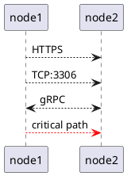
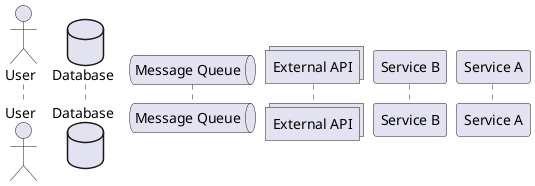
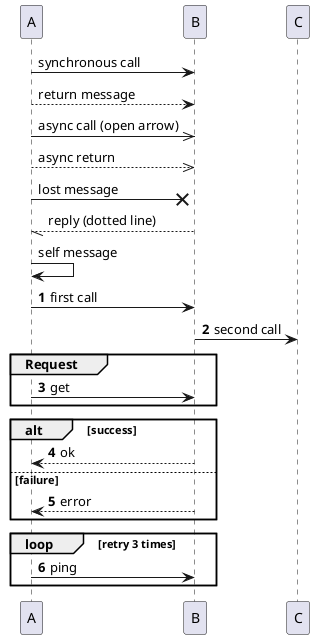
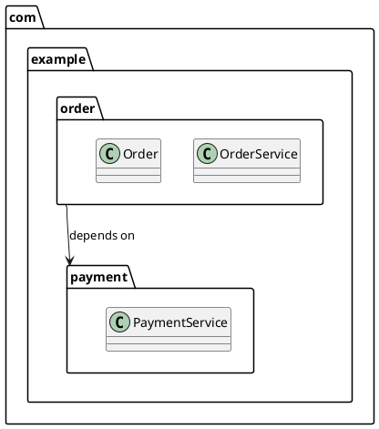
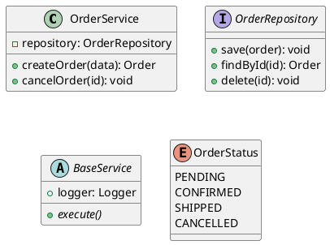
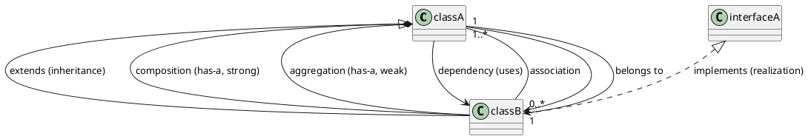
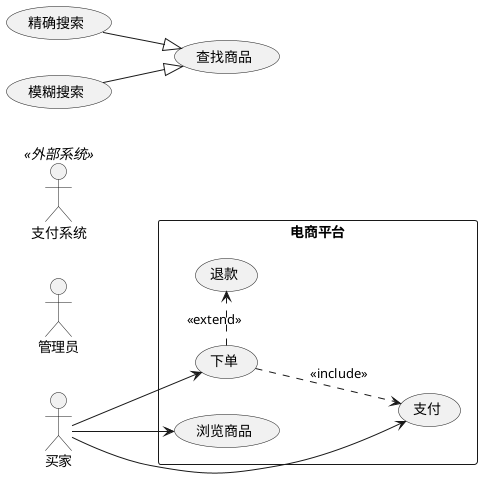
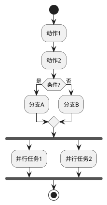
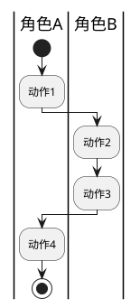
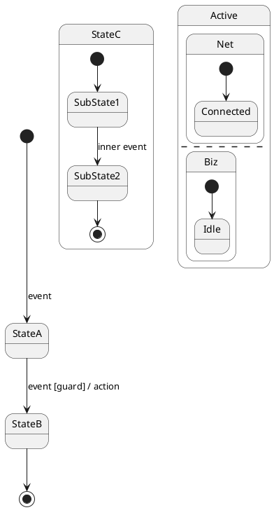

# PlantUML 架构图语法参考

绘制架构图的快速参考。覆盖 8 种 UML 图表类型（类图、包图、组件图、部署图、时序图、用例图、活动图、状态机图），以及 7 种专项图（WBS、甘特图、思维导图、JSON、YAML、Salt、ER）。

## 通用规则

- 每张图以 `@startuml` 开始，以 `@enduml` 结束
- 使用 `skinparam` 在顶部进行统一样式设置
- 注释：使用 `'`（单引号）进行行注释
- 多行标题：`title` 关键字，支持 `\n` 换行

## 1. 组件图

用途：展示系统的模块化分解——组件、接口及其依赖关系。

### 元素

```plantuml
@startuml
' Component
component "Component Name" as alias

' Interface (lollipop style)
interface "Interface Name" as alias

' Package / Boundary
package "Package Name" {
  component [Inner] as inner
}

' Database (stereotype)
database "DB Name" as alias

' Cloud / Actor
cloud "Cloud Service" as alias
actor "User/Role" as alias
@enduml
```

### 关系

```plantuml
@startuml
' Dependency
A --> B : uses

' Interface required/provided
A -()- B : provides

' Note
note left of A : description
note right of B : description
note on link : description

' Grouping relationship
A -[hidden]-> B  ' hidden line for layout
@enduml
```

### 样式

```plantuml
@startuml
skinparam componentStyle rectangle  ' rectangle or uml2
skinparam component {
  BackgroundColor #E1F5FE
  BorderColor #0288D1
  FontColor #000000
}
skinparam interface {
  BackgroundColor #FFF9C4
  BorderColor #FBC02D
}
skinparam package {
  BackgroundColor #F3E5F5
  BorderColor #7B1FA2
  FontStyle bold
}
skinparam ArrowColor #666666
@enduml
```

## 2. 部署图

用途：展示物理部署拓扑——节点、制品和通信路径。

### 元素

```plantuml
@startuml
' Node (server/container)
node "Node Name" as alias {
  [Artifact] as art
}

' Database stereotype
database "DB Name" as alias

' Cloud stereotype
cloud "Cloud" as alias

' Frame (logical grouping)
frame "Logical Group" {
  node [Inner]
}

' Collections / Stack
collections "Cluster" as alias
stack "Stack" {
  node [Instance 1]
  node [Instance 2]
}
@enduml
```

### 通信



### 样式

```plantuml
@startuml
skinparam node {
  BackgroundColor #E8F5E9
  BorderColor #388E3C
}
skinparam database {
  BackgroundColor #FCE4EC
  BorderColor #D32F2D
}
skinparam cloud {
  BackgroundColor #E3F2FD
  BorderColor #1565C0
}
skinparam frame {
  BackgroundColor #FFF3E0
  BorderColor #E65100
  FontStyle italic
}
@enduml
```

## 3. 时序图

用途：展示组件间随时间变化的交互流程。

### 参与者



### 消息



### 激活/生命线

```plantuml
@startuml
participant A
participant B

activate A
A -> B : request
activate B
B --> A : response
deactivate B
deactivate A

' Short form (auto activate/deactivate)
A ->++ B : request
B -->-- A : response

' Notes
note left of A : processing
note over A, B : shared note
@enduml
```

### 样式

```plantuml
@startuml
skinparam participant {
  BackgroundColor #E3F2FD
  BorderColor #1565C0
}
skinparam actor {
  BackgroundColor #FFF9C4
  BorderColor #F9A825
}
skinparam database {
  BackgroundColor #FCE4EC
  BorderColor #C62828
}
skinparam ArrowColor #333333
skinparam SequenceLifeLineBorderColor #999999
@enduml
```

## 4. 类图/包图

用途：展示代码级别的模块/包结构和类关系。

### 包



### 类与接口



### 关系



### 样式

```plantuml
@startuml
skinparam package {
  BackgroundColor #F3E5F5
  BorderColor #7B1FA2
}
skinparam class {
  BackgroundColor #FFF8E1
  BorderColor #F9A825
  BorderThickness 2
}
skinparam interface {
  BackgroundColor #E8F5E9
  BorderColor #388E3C
}
skinparam abstractClass {
  BackgroundColor #FCE4EC
  BorderColor #C62828
}
skinparam enum {
  BackgroundColor #E3F2FD
  BorderColor #1565C0
}
skinparam ArrowColor #555555
@enduml
```

## 5. 用例图

用途：从用户视角展示系统功能——角色、用例及其关系。

### 元素



### 样式

```plantuml
@startuml
skinparam actor {
  BackgroundColor #FFF9C4
  BorderColor #F9A825
}
skinparam usecase {
  BackgroundColor #E8F5E9
  BorderColor #388E3C
}
skinparam rectangle {
  BackgroundColor #FAFAFA
  BorderColor #9E9E9E
}
@enduml
```

## 6. 活动图

用途：展示业务流程或工作流——控制流、决策、分叉/汇合和泳道。

### 元素



### 泳道



### 样式

```plantuml
@startuml
skinparam activity {
  BackgroundColor #E3F2FD
  BorderColor #1565C0
  FontColor #000000
}
skinparam swimlane {
  BackgroundColor #F5F5F5
  BorderColor #9E9E9E
}
@enduml
```

## 7. 状态机图

用途：展示对象生命周期——状态、转换、事件、守卫和动作。

### 元素



### 样式

```plantuml
@startuml
skinparam state {
  BackgroundColor #E8F5E9
  BorderColor #388E3C
  FontColor #000000
}
skinparam ArrowColor #555555
@enduml
```

## 8. 专项图表（WBS / 甘特图 / 思维导图 / JSON / YAML / Salt）与 ER 图

以下 6 种为**非 UML** 专项图（§8.1~§8.6），各自用独立的 `@start.../@end...` 包裹，**不用** `skinparam`，靠原生配色与各自的 `<style>` 块控制外观。§8.7 的 ER 图例外：它用 `@startuml` + `entity` 语法，走 UML skinparam 规范。此处为紧凑速查，完整说明见 [howto/](../howto/) 13~19。

### 8.1 WBS（工作分解结构）

`@startwbs ... @endwbs`。`*` 个数表示深度（OrgMode）；或用 `+`/`-`（算术记法）同时表达深度与方向（`+` 右、`-` 左）。`<`/`>` 切换分支方向，`_` 去框，`[#色]` 内联着色，`<<类名>>` 引用样式类。

```plantuml
@startwbs
<style>
wbsDiagram {
  LineColor #4A90A4
  RoundCorner 8
  .phase { BackgroundColor #DDEEFF }
}
</style>
* 项目交付 <<phase>>
** 需求与设计
*** 需求调研
** 后端开发
****> 下单流程
***< 库存服务
***_ 无框说明节点
@endwbs
```

### 8.2 甘特图（Gantt）

`@startgantt ... @endgantt`。核心：`Project starts YYYY-MM-DD` 基准；`[任务] requires N days`（`lasts`/`needs` 等价）；依赖 `starts at [A]'s end` / `then [B]`；里程碑 `[M] happens at [X]'s end`；进度 `is N% complete`；着色 `is colored in 前景/边框`；分隔符 `-- 阶段 --`；今日线 `today is N days after start and is colored in #AAF`；工作日 `saturday are closed`、`YYYY-MM-DD is closed`；刻度 `printscale daily|weekly` / `projectscale monthly|quarterly|yearly`（可加 `zoom N`）。

```plantuml
@startgantt
printscale weekly
Project starts 2026-03-02
saturday are closed
sunday are closed
today is 35 days after start and is colored in #AAD4FF
-- 设计阶段 --
[需求分析] as [REQ] requires 8 days
[REQ] is 100% complete and is colored in GreenYellow/Green
-- 开发阶段 --
[后端开发] as [BE] starts at [REQ]'s end and requires 20 days
[BE] is 60% complete and is colored in Lavender/RoyalBlue
[设计评审] happens at [REQ]'s end
@endgantt
```

### 8.3 思维导图（MindMap）

`@startmindmap ... @endmindmap`。`*` 深度（OrgMode）或 `+`/`-`（右/左分置）；`left side`/`right side` 切换后续分支方向；`top to bottom direction` 改整体方向；`_` 去框，`[#色]` 内联着色，`<<类名>>` 样式类，`**:...;` 多行节点。样式作用域为 `mindmapDiagram`。

```plantuml
@startmindmap
<style>
mindmapDiagram {
  node { RoundCorner 12 }
  rootNode { BackgroundColor #2C3E50; FontColor white; FontStyle bold }
  .arch { BackgroundColor #D5F5E3 }
}
</style>
* 成长路线
**[#FDEBD0] 编程语言
***_ Java
left side
** 系统架构 <<arch>>
*** 微服务
@endmindmap
```

### 8.4 JSON

`@startjson ... @endjson`，中间直接粘贴合法 JSON。高亮：`#highlight "键"`，路径分隔符只有 `/`，数组下标用加引号的数字（如 `"电话" / "0" / "号码"`，从 0 开始），行尾 `<<类名>>` 套用高亮类。样式作用域 `jsonDiagram`，含 `node`（含 `separator`）、`arrow`、`highlight` 三个子块。

```plantuml
@startjson
<style>
jsonDiagram {
  node { BackGroundColor #FDFDFD; FontName "Noto Sans SC"; RoundCorner 8 }
  highlight { BackGroundColor #FFE082; FontColor #7A4F01; FontStyle bold }
  .warn { BackGroundColor #EF5350  FontColor white }
}
</style>
#highlight "服务名称"
#highlight "数据库" / "从库列表" / "0" / "地址" <<warn>>
{
  "服务名称": "订单服务",
  "副本数": 3,
  "端口": [8080, 9090],
  "数据库": { "从库列表": [ { "地址": "10.0.1.6:3306" } ] }
}
@endjson
```

### 8.5 YAML

`@startyaml ... @endyaml`，中间直接粘贴 YAML（空格缩进）。高亮用注释行 `# highlight "键"`，路径 `"父键" / "子键"`（每段带引号），只命中键。样式作用域 `yamlDiagram`，含 `node`（含 `separator`）、`arrow`、`highlight`；渲染脚本对 `@startyaml` 保留原生配色。

```plantuml
@startyaml
<style>
yamlDiagram {
  node { BackGroundColor #F8FAFC; FontColor #1E293B; RoundCorner 8 }
  highlight { BackGroundColor #FDE68A; FontColor #7C2D12; FontStyle bold }
}
</style>
# highlight "spec" / "容器"
apiVersion: apps/v1
kind: Deployment
spec:
  副本数: 3
  容器:
    - 名称: app
      镜像: order-service:2.3.1
@endyaml
```

### 8.6 Salt（UI 线框图）

`@startsalt ... @endsalt`，无需 Graphviz，渲染脚本按专项图保留原生线框外观。根面板 `{ ... }`；换行 = 行，`|` = 列（表单对齐核心）；`{` 后紧跟网格线修饰符 `#`（全部线）/`!`（竖线）/`-`（横线）/`+`（仅外框）。控件：按钮 `[文字]`、输入框 `"文字"`、复选 `[X]`/`[]`、单选 `(X)`/`()`、下拉 `^文字^`；容器：分组框 `{^"标题"`、树 `{T`（仅 `+` 层级）、表 `{#`（`.` 空单元格，首行 `<b>` 作表头）、菜单 `{*`、页签 `{/`；分隔线 `..`/`==`/`~~`/`--`；图标 `<&图标名>`。

```plantuml
@startsalt
{^"用户登录"
  用户名 | "admin          "
  密码   | "****           "
  [X] 记住登录状态
  --
  [取消] | [    登 录    ]
}
@endsalt
```

### 8.7 ER 图（实体关系图）

`@startuml ... @enduml` + `entity` 语法，**走 UML skinparam 规范**（需 Graphviz）。`entity { ... }` 内用 `--` 分隔主键区与普通属性区，`*` 前缀 = 必填；乌鸦脚基数：`|` 一、`o` 零、`}` 多，组合为 `||`（恰好一）、`o|`（零或一）、`}|`（一或多）、`}o`（零或多）；实线 `--` 标识性关系、虚线 `..` 非标识性；可嵌方向 `-down-`。

```plantuml
@startuml
hide circle
entity "user 用户" as user {
  * id : BIGINT <<PK>>
  --
  * username : VARCHAR(64)
}
entity "order 订单" as order {
  * id : BIGINT <<PK>>
  --
  * user_id : BIGINT <<FK>>
  * status : VARCHAR(16)
}
user ||--o{ order : 下单
@enduml
```

## 按图表类型的快速语法参考

| 图表 | 关键元素 | 关系语法 |
|------|---------|---------|
| **组件图** | `component [Name]`, `package "Name" {}`, `interface "Name"` | `-->` 依赖 |
| **部署图** | `node "Name" {}`, `database "Name"`, `cloud "Name"` | `-->` 带协议标签 |
| **时序图** | `participant "Name"`, `actor "Name"`, `database "Name"` | `->` 同步, `-->>` 异步, `activate`/`deactivate` |
| **类图/包图** | `class`, `interface`, `enum`, `package {}` | `--|>` 继承, `*--` 组合, `o--` 聚合, `..>` 依赖 |
| **用例图** | `actor "Name"`, `usecase`, `rectangle "边界" {}` | `-->` 关联, `..>` 包含, `.>` 扩展, `--|>` 泛化 |
| **活动图** | `start`/`stop`, `:action;`, `if/else`, `fork/end fork` | `->` 控制流, `\|泳道\|` 泳道 |
| **状态机图** | `[*]`, `state "Name"`, 组合状态 `{}`, `--` 并发 | `-->` 带事件 `[guard] / action` 转换 |
| **WBS 图** | `@startwbs`, `*`/`**` 深度或 `+`/`-` 方向, `[#色]`, `<<类名>>` | `<`/`>` 切换方向, `_` 去框（见 [howto/13](../howto/13-wbs-diagram.md)） |
| **甘特图** | `@startgantt`, `Project starts`, `[任务] requires N days`, `-- 阶段 --` | `starts at [A]'s end`, `then`, `happens at`（见 [howto/14](../howto/14-gantt-diagram.md)） |
| **思维导图** | `@startmindmap`, `*`/`+`/`-` 深度与方向, `left side`, `[#色]`, `<<类名>>` | `_` 去框, `**:...;` 多行（见 [howto/15](../howto/15-mindmap-diagram.md)） |
| **JSON 图** | `@startjson` + 合法 JSON, `#highlight "键"`, `<style> jsonDiagram` | 路径 `"键" / "0" / "子键"`（见 [howto/16](../howto/16-json-diagram.md)） |
| **YAML 图** | `@startyaml` + YAML, `# highlight "键"`, `<style> yamlDiagram` | 路径 `"父" / "子"`, 只命中键（见 [howto/17](../howto/17-yaml-diagram.md)） |
| **Salt 线框图** | `@startsalt`, `{ }` 面板, `[按钮]` `"输入"` `[X]` `(X)` `^下拉^` | `|` 分列, `{^"标题"` 分组, `{T`/`{#`/`{*`/`{/`（见 [howto/19](../howto/19-salt-diagram.md)） |
| **ER 图** | `@startuml` + `entity { }`, `--` 分主键区, `*` 必填 | `||--o{` 乌鸦脚基数, `..` 非标识性（见 [howto/18](../howto/18-er-diagram.md)） |

## 常见模式

### 分层架构（组件图）

```plantuml
@startuml
skinparam package {
  BackgroundColor #FAFAFA
  BorderColor #9E9E9E
}

package "Presentation Layer" {
  component [Web UI] as web
  component [Mobile App] as mobile
}

package "Business Layer" {
  component [Order Service] as order
  component [User Service] as user
}

package "Data Layer" {
  database [MySQL] as mysql
  database [Redis] as redis
}

web --> order
mobile --> order
order --> mysql
order --> redis
user --> mysql
@enduml
```

### 微服务架构（组件图 + 部署图）

```plantuml
@startuml
cloud "API Gateway" as gw
node "K8s Cluster" {
  component [Service A] as svcA
  component [Service B] as svcB
}
database "DB" as db
queue "Kafka" as mq

gw --> svcA : REST
gw --> svcB : REST
svcA --> mq : publish
mq --> svcB : subscribe
svcA --> db : read/write
svcB --> db : read
@enduml
```

### 请求生命周期（时序图）

```plantuml
@startuml
actor Client
participant Gateway
participant Auth
participant Service
database DB

Client -> Gateway: POST /api/orders
activate Gateway
Gateway -> Auth: validateToken()
activate Auth
Auth --> Gateway: valid
deactivate Auth
Gateway -> Service: createOrder()
activate Service
Service -> DB: INSERT
DB --> Service: ok
Service --> Gateway: 201
deactivate Service
Gateway --> Client: 201 Created
deactivate Gateway
@enduml
```

## 技巧

1. **统一使用 `skinparam`**：在同一文档的所有图表中复制相同的 skinparam 块
2. **别名要有意义**：`[OrderService] as OS` 优于 `[C1]`
3. **给关系添加标签**：`A --> B : uses via HTTP` 具有自文档性
4. **使用 `note` 补充非显而易见的细节**：协议、端口、SLA 等
5. **拆分大图**：如果一张图超过 7 个核心元素，拆分为概览图 + 下钻图（硬上限 15）
6. **最大化渲染质量**：始终在样式块中包含 `skinparam dpi 300` 和 `scale 4`（参见 [style.md](./style.md)）；这确保 SVG viewBox ≥ 3840×2160（4K UHD）且 PNG ≥ 4096px。配合 `ArrowThickness 2` 和 `BorderThickness 2`，图表在缩放时保持清晰。使用 [render-plantuml.sh](../../scripts/render-plantuml.sh) 自动注入样式块并渲染。
7. **按图表类型的详细操作指南**：参见 [howto/](../howto/)——每个指南提供分步说明和完整示例
8. **主动控制布局**：使用方向关键字（`-right->`、`-down->`）、隐藏连接（`-[hidden]->`）和 `together{}` 分组，防止自动布局打散相关元素。详见 [layout.md](./layout.md) §二。
9. **先声明元素再声明关系**：先列出所有参与者/组件/类，再定义连接——这使源代码可扫描且产生更可预测的布局。
10. **为密集图表调整间距**：元素重叠时使用 `skinparam nodesep 40` 和 `skinparam ranksep 60`。按复杂度级别的推荐值见 [layout.md](./layout.md) §二.4。
