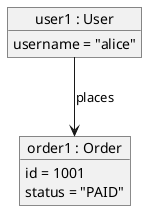
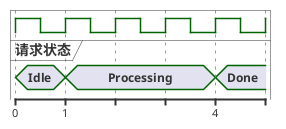

# 如何选择 UML 图表类型

> 根据用户描述的系统特征和要表达的架构视角，快速选择最合适的 UML 图表类型。

## 选择决策流程

```
用户描述系统 →
  ├─ 描述"系统由哪些部分组成"？         → 结构图
  │   ├─ 模块/代码层面的组成？          → 类图 / 包图
  │   ├─ 软件组件/服务层面的组成？       → 组件图
  │   └─ 物理节点/硬件层面的组成？       → 部署图
  │
  ├─ 描述"数据/界面如何组织"？         → 数据·界面图（专项）
  │   ├─ 数据库表结构与表间关系？        → ER 图
  │   └─ 界面布局与控件排布？           → Salt 线框图
  │
  └─ 描述"系统如何运作/交互"？         → 行为图
      ├─ 对象之间按时间顺序的消息交互？   → 时序图
      ├─ 业务流程/算法步骤？             → 活动图
      ├─ 对象生命周期中的状态变化？       → 状态机图
      └─ 用户与系统的功能交互？           → 用例图
```

## 快速匹配表

| 我想表达... | 使用... | 如何画 | 关键词 |
|------------|--------|--------|--------|
| 系统的静态结构（类、接口、继承关系） | **类图** | [02-class-diagram.md](02-class-diagram.md) | "领域模型"、"有哪些类"、"继承关系"、"接口设计" |
| 代码模块分组与依赖（包结构） | **包图** | [06-package-diagram.md](06-package-diagram.md) | "模块结构"、"包依赖"、"分层架构" |
| 软件组件的组织结构和依赖 | **组件图** | [03-component-diagram.md](03-component-diagram.md) | "微服务"、"系统拆分"、"服务依赖"、"子系统" |
| 物理部署拓扑（服务器、节点） | **部署图** | [04-deployment-diagram.md](04-deployment-diagram.md) | "部署架构"、"服务器"、"集群"、"K8s"、"容器" |
| 对象间按时间顺序的消息交互 | **时序图** | [05-sequence-diagram.md](05-sequence-diagram.md) | "调用流程"、"交互过程"、"请求链路"、"API调用" |
| 用户能看到的系统功能 | **用例图** | [07-usecase-diagram.md](07-usecase-diagram.md) | "用户功能"、"角色权限"、"系统边界" |
| 业务流程、工作流、算法步骤 | **活动图** | [08-activity-diagram.md](08-activity-diagram.md) | "业务流程"、"审批流程"、"工作流"、"算法" |
| 对象的状态随事件变化 | **状态机图** | [09-state-machine-diagram.md](09-state-machine-diagram.md) | "状态流转"、"生命周期"、"订单状态" |
| 数据库表结构与表间基数关系 | **ER 图**（专项） | [18-er-diagram.md](18-er-diagram.md) | "数据库设计"、"表结构"、"实体关系"、"数据建模" |
| 界面布局与控件排布 | **Salt 线框图**（专项） | [19-salt-diagram.md](19-salt-diagram.md) | "界面原型"、"线框图"、"wireframe" |
| 某时刻对象实例的快照 | **对象图** | 本文 §其他图类型 | "对象实例"、"运行时快照"、"测试数据" |
| 信号/状态随时间轴变化 | **Timing 图** | 本文 §其他图类型 | "时序约束"、"信号波形"、"协议时序" |

> 其余五种专项图（WBS/甘特图/思维导图/JSON/YAML）的选择入口见 SKILL.md「专项图表」表与 [howto/13–17](.)。

## 按开发阶段推荐

| 开发阶段 | 推荐图表 | 说明 |
|---------|---------|------|
| 需求收集与分析 | 用例图 + 概念类图（领域模型） | 理解用户需求和业务概念 |
| 架构设计 | 包图 + 组件图 + 部署图 | 定义系统边界、模块划分和物理拓扑 |
| 详细设计 | 类图 + 时序图 + 状态机图 | 细化类结构、交互流程和状态变迁 |
| 流程设计 | 活动图 + 时序图 | 描述业务流程和关键交互 |
| 设计评审 | 时序图 + 类图 | 验证核心交互和结构合理性 |

## 按系统类型推荐

| 系统类型 | 核心图表 | 辅助图表 |
|---------|---------|---------|
| **微服务架构** | 组件图（服务边界）+ 时序图（服务间通信） | 部署图（基础设施拓扑） |
| **领域驱动设计 (DDD)** | 类图（实体、值对象、聚合根） | 状态机图（聚合状态流转） |
| **单体应用** | 包图（分层架构）+ 类图（核心领域） | 时序图（关键流程） |
| **分布式系统** | 部署图（物理拓扑）+ 时序图（分布式交互） | 组件图（子系统划分） |
| **API 设计** | 时序图（请求-响应流程） | 用例图（系统边界） |
| **遗留系统重构** | 类图（逆向工程现有结构）+ 包图（模块依赖） | 时序图（理解调用链） |

## 常见组合模式

### 架构全景 = 组件图 + 部署图

先用组件图展示系统拆分为哪些服务/模块，再用部署图展示这些服务部署在哪些节点上。

### 设计细节 = 类图 + 时序图

先用类图定义领域模型的结构（有哪些类、什么关系），再用时序图演示这些类如何协作完成一个用例。

### 需求全景 = 用例图 + 活动图

先用用例图展示系统的功能边界和参与者，再用活动图深入描述单个用例的详细步骤。

## UML 使用的三种模式（Fowler）

| 模式 | 目的 | 详细程度 | 适用场景 |
|------|------|----------|---------|
| **草图模式 (Sketch)** | 沟通和探索想法 | 非正式，手绘或快速工具 | 团队讨论、设计评审、日常开发 |
| **蓝图模式 (Blueprint)** | 详细设计文档 | 完整、精确 | 外包开发、严格合规 |
| **编程语言模式** | 从模型生成代码 | 极其精确 | MDA 工具、代码生成 |

> **推荐**：绝大多数场景下，草图模式就足够了。用 PlantUML 文本化描述，版本控制友好，随时可调整。

## 其他图类型（无独立操作指南）

以下图类型 PlantUML 官方支持、本技能可渲染，但使用频率低，此处仅给最小语法入口；需要深入时查阅官方文档。

### 对象图（Object Diagram）

展示某一时刻的对象实例及其属性值/链结，适合表达测试数据、运行时快照。语法与类图同源（`object` + 类图关系符），参考 [02-class-diagram.md](02-class-diagram.md)：



官方文档：https://plantuml.com/zh/object-diagram

### Timing 图（时序图/定时图）

展示信号或对象状态随时间轴的变化，适合协议时序、硬件信号、 SLA 时间窗。`concise`（紧凑多态）/ `robust`（精确瞬时）两种时钟，需 Graphviz：



官方文档：https://plantuml.com/zh/timing-diagram

### 超出本技能范围的图类型

以下 PlantUML 图类型与本技能「系统架构图」定位距离较远，**不提供指南**；确有需求时直接查阅官方文档自行编写，渲染脚本同样支持（nwdiag/Archimate 需额外组件）：

- **nwdiag 网络图**（`@startnwdiag`）——机架/网段拓扑，部署图可覆盖大多数场景
- **Archimate 企业架构图**——需外部 Archimate 库
- **EBNF / Regex 图**——语法与正则可视化
- **Ditaa**——ASCII Art 转图
- **数学公式**（AsciiMath/JLaTeXMath）

## 注意事项

- **不要试图一张图画出所有东西**：每张图聚焦一个视角，多张图组合表达完整设计
- **简单场景不需要 UML**：CRUD 应用、快速原型可直接写代码
- **图要随代码更新**：PlantUML 纳入版本控制，与代码同步维护
- **先从用户描述中提取核心问题**：用户说"我想看看系统有哪些服务"→ 组件图；用户说"下单流程是怎样的"→ 时序图
