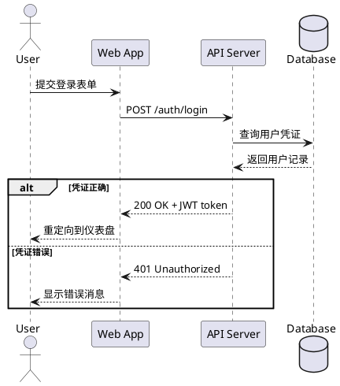
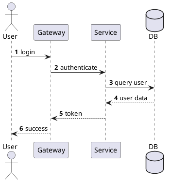

# 如何画时序图 (Sequence Diagram)

> 时序图展示对象之间如何按时间顺序进行消息交互，是设计 API 调用流程、分析分布式交互、验证协作逻辑的首选图表。

## 时序图的用途

时序图回答的是"完成一个操作，哪些对象参与了，它们之间按什么顺序传递了什么消息"：
- 设计 API 调用流程（请求→响应链路）
- 分析分布式系统交互（微服务间调用）
- 调试复杂业务逻辑的执行顺序
- 在编码前确认服务间协作契约
- Sprint Planning 中讨论实现方案

## 关键元素

### 参与者 (Participant)

```plantuml
@startuml
actor "用户" as User           ' 人类用户
participant "Web App" as Web   ' 软件组件（默认）
participant "API Server" as API
database "Database" as DB      ' 数据库
queue "Message Queue" as MQ    ' 消息队列
collections "External API" as Ext ' 外部服务集合
@enduml
```

| 参与者类型 | PlantUML 关键字 | 图标 |
|-----------|---------------|------|
| 用户/角色 | `actor` | 小人图标 |
| 组件/服务 | `participant` | 矩形框 |
| 数据库 | `database` | 圆柱体 |
| 消息队列 | `queue` | 队列图标 |
| 外部系统集合 | `collections` | 多层矩形 |

### 消息类型

| 消息类型 | 箭头样式 | PlantUML 语法 | 说明 |
|---------|---------|--------------|------|
| 同步消息 | 实线实心箭头 → | `A -> B: message` | 调用方等待返回 |
| 异步消息 | 实线开放箭头 → | `A ->> B: message` | 调用方不等待 |
| 返回消息 | 虚线开放箭头 ⇢ | `A --> B: response` | 方法返回值 |
| 自调用 | 箭头指向自身 | `A -> A: message` | 对象调用自己的方法 |
| 创建消息 | 实线开放箭头 → | `A ->> B: <<create>>` | 创建新对象 |

### 激活条 (Activation Bar)

表示对象正在执行操作的时间段：

```plantuml
@startuml
participant A
participant B

' 手动激活
activate A
A -> B: request
activate B
B --> A: response
deactivate B
deactivate A

' 简写（自动激活/取消）
A ->++ B: request
B -->-- A: response
@enduml
```

### 组合片段 (Combined Fragments)

控制逻辑的可视化表达：

| 片段类型 | 用途 | PlantUML 语法 |
|---------|------|--------------|
| `alt` | 条件分支（if-else） | `alt 条件` ... `else 条件` ... `end` |
| `opt` | 可选行为（if） | `opt 条件` ... `end` |
| `loop` | 循环 | `loop 次数或条件` ... `end` |
| `par` | 并行执行 | `par` ... `and` ... `end` |
| `critical` | 关键区域（原子操作） | `critical 描述` ... `end` |
| `break` | 中断/异常退出 | `break 条件` ... `end` |
| `group` | 通用分组标注 | `group 描述` ... `end` |

## PlantUML 完整示例

### 基本请求-响应流程



### 微服务订单创建（含循环和并行）

```plantuml
@startuml
' Semantic: Entry=Customer (left), Hub=OrderSvc (center), Edge=PaySvc/InvSvc, Sink=DB/MQ (right)

' Entry — 发起交互的用户
actor Customer order 1

' Hub — 协调者/编排者
participant "Order Service" as OS order 2

' Edge — 被调用的依赖服务（紧邻排列）
together {
    participant "Inventory Service" as IS order 3
    participant "Payment Service" as PS order 4
}

' Sink — 最终数据汇聚
together {
    participant "Notification Service" as NS order 5
    queue "Message Queue" as MQ order 6
}

' -> 同步调用：Customer 发起订单
Customer -> OS: createOrder(items)

loop 对每个商品
    ' -> 同步调用：查询库存
    OS -> IS: checkStock(productId, qty)
    ' --> 同步返回
    IS --> OS: stockAvailable
end

alt 库存充足
    ' -> 同步调用：处理支付
    OS -> PS: processPayment(amount)
    ' --> 同步返回
    PS --> OS: paymentSuccess
    
    ' ->> 异步消息：发布事件到 MQ
    OS ->> MQ: publish(OrderCreatedEvent)
    
    par 并行通知
        ' ->> 异步消息：MQ 投递事件
        MQ ->> NS: OrderCreatedEvent
        NS -> NS: sendEmail()
    and
        MQ ->> NS: OrderCreatedEvent  
        NS -> NS: sendSMS()
    end
    
    ' --> 同步返回
    OS --> Customer: orderConfirmed
else 库存不足
    OS --> Customer: orderFailed
end
@enduml
```

### 带自调用和注释的流程

```plantuml
@startuml
participant "Auth Service" as Auth

Auth -> Auth: validateToken(token)
activate Auth

note right of Auth
  <b>验证逻辑：</b>
  1. 检查 token 格式
  2. 验证签名
  3. 检查过期时间
end note

Auth ->++ Auth: checkExpiry()
Auth -->-- Auth: valid

deactivate Auth
@enduml
```

### 使用 autonumber 自动编号



## 时序图建模步骤

1. **确定场景**：要描述哪个用例或操作的交互流程？
2. **列出参与者**：哪些对象/服务参与了这次交互？（从左到右排列，actor 在最左）
3. **按时间顺序写出消息**：谁先调用谁，传递了什么参数，返回了什么结果
4. **添加控制逻辑**：用 `alt/loop/opt/par` 表达条件分支和循环
5. **标注关键注释**：对于复杂逻辑添加 `note` 说明
6. **检查完整性**：确认所有消息都有明确的发送者和接收者

## 语义布局分析

> 时序图的语义角色映射（角色决定参与者位置）：

| 语义角色 | 含义 | 典型参与者 | 位置 |
|---------|------|---------|------|
| **Entry (入口)** | 发起交互的用户或系统 | User、Client、Browser | 最左侧 |
| **Hub (中心)** | 协调者/编排者 | OrderService、API Gateway | 中间偏左 |
| **Edge (边缘)** | 被调用的依赖服务 | PayService、Inventory | 中间偏右 |
| **Sink (汇聚)** | 最终数据存储或外部系统 | Database、MQ、External API | 最右侧 |
| **Peer (对等)** | 同层级的关联服务 | 同一团队的多个微服务 | 紧邻排列 |

**位置规则**：从左到右 = Entry → Hub → Edge → Sink

**布局技巧**：
- 使用 `together {}` 将关联参与者紧邻放置
- 使用 `order N` 关键字精确控制参与者位置（N 越小越靠左）
- `->` 同步调用，`->>` 异步调用，`-->` 返回，`..>` 弱耦合

**布局优化要点**：
- **从左到右排列**：Entry（用户）最左，Hub（核心服务）居中，Sink（数据库/MQ）最右
- **`together{}`**：关联服务紧邻排列，如 `together { participant PaySvc; participant InvSvc }`
- **`order` 关键字**：`participant OrderSvc order 2` 精确控制位置
- **箭头语义**：`->` 同步请求，`->>` 异步消息，`-->` 同步返回，`..>` 弱耦合回调
- **间距**：核心服务放中间，减少长距离交叉箭头
- **分组**：`box "Domain" #LightBlue` 将相关参与者框在一起（注意：monochrome 模式下不支持颜色）
- **参与者构造型 + 着色（角色一眼可辨）**：`participant "订单服务" as OS <<Hub>> #BBD8EE`——构造型 `<<Entry/Hub/Edge/Sink>>` 声明语义角色，底色按角色族着色（与「位置规则」呼应：角色即位置、关联即同色）。比纯 `box` 分组更轻量，participant 不多时首选。
- **note 预算 ≤ 5 条**：一张时序图的 note 总数控制在 5 条以内，每条只写非显而易见的信息（协议、超时、幂等等）；超过预算说明图承载了过多文字，细节应移入 legend 或配套文档。锚定侧别与配色遵守 [content.md 注释锚定纪律](../guide/content.md)。

## 最佳实践

- **只展示关键交互**：忽略简单的 getter/setter 调用，聚焦核心业务流程
- **参与者数量 ≤ 8 个**：超过 8 个 lifeline 的时序图难以理解，拆分场景
- **使用组合片段表达复杂逻辑**：`alt/loop/opt/par` 远比文字说明直观
- **同步和异步消息要区分**：`->` 是同步（等待结果），`->>` 是异步（发出即返回）
- **激活条清晰表达并发**：用 `activate/deactivate` 或 `->++/-->--` 简写
- **autonumber 用于评审**：自动编号方便在评审中引用"第 N 步"
- **先画正常流程，再补异常分支**：`alt` 的主分支是 happy path
- **用 note 解释复杂逻辑**：协议细节、业务规则等不适合放在箭头文本中的信息

## 常见误区

| 误区 | 正确做法 |
|------|---------|
| 逐行翻译代码 | 画的是设计意图和协作模式，不是代码执行追踪 |
| lifeline 太多 | 超过 8 个就拆分；可用多层时序图（一张概览 + 多张细节） |
| 箭头方向混乱 | 从调用方指向被调用方；返回消息用 `-->` |
| 忽略异常路径 | alt 中至少包含成功/失败两个分支 |
| 消息文本太技术化 | 用业务语言描述而非代码方法签名；如"提交订单"而非"POST /api/v1/orders" |
| 所有消息都用同步 | 消息队列、事件通知应该用异步 `->>` |
