# 如何画工作分解结构图 (WBS Diagram)

> WBS（Work Breakdown Structure，工作分解结构）以树状层级把一个项目/目标自顶向下拆解为可管理的工作包，回答"要做这件事需要分解成哪些子任务"。是项目计划、任务拆分、组织结构、功能树等场景的核心工具。

## WBS 图的用途

WBS 图回答的是"这个大目标由哪些逐层细化的工作包组成"：
- 把一个项目拆解成阶段 → 任务 → 子任务 → 工作包的层级树
- 制定项目计划、估算工作量、分配责任人
- 组织架构图（部门 → 团队 → 岗位）
- 产品功能树 / 需求分解
- 决策树、知识分类等任意"整体—部分"层级关系

WBS 与思维导图（Mindmap）语法几乎一致，但 WBS 默认呈**自上而下的组织结构树**（矩形节点 + 连接线），更贴近工程制图中的分解图。

## 核心概念

### 层级与节点

| 概念 | PlantUML 语法 | 说明 |
|------|-------------|------|
| **图边界** | `@startwbs` / `@endwbs` | WBS 图必须包裹在这对标签中 |
| **根节点** | 第一层（`*` 或 `+`） | 整棵树唯一的顶点，有且仅有一个 |
| **深度 (depth)** | 星号/加号数量 | `*` 一级、`**` 二级、`***` 三级，逐层缩进 |
| **叶子节点 (leaf)** | 没有更深子节点的节点 | 分解到底的工作包 |
| **方向 (side)** | `<` 左 / `>` 右 | 控制该子树挂在父节点的哪一侧 |
| **样式类** | `<<类名>>` | 引用 `<style>` 中定义的样式 |

### 两套等价写法

WBS 支持两种深度记法，功能完全等价，二选一即可（不要混用）：

- **OrgMode 记法**：用星号 `*` 表示深度，`*` / `**` / `***`。
- **算术记法（Arithmetic）**：用 `+` / `-` 表示深度，同时 `+` 代表挂在右侧、`-` 代表挂在左侧。

## PlantUML 语法

### 1. OrgMode 基础语法（星号缩进）

星号数量表示层级深度，PlantUML 自动按树形排布：

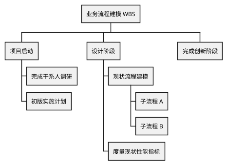

### 2. Markdown 记法（减号缩进）

除星号外，也可以用 Markdown 风格的 `-` 缩进（靠缩进空格数决定层级）：

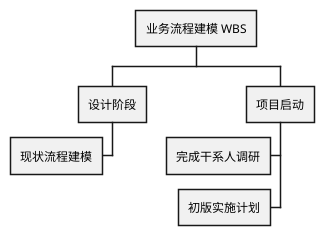

### 3. 切换分支方向（`<` 与 `>`）

默认所有子树都在同一侧展开。在深度符号**后面**加 `<`（左）或 `>`（右），可把该节点挂到父节点的另一侧，让树左右平衡：

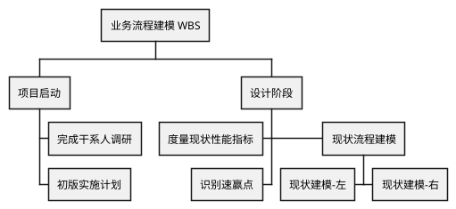

### 4. 算术记法（`+` / `-` 同时表达深度与方向）

`+` 与 `-` 的个数表示深度，符号本身表示方向：`+` 挂右侧，`-` 挂左侧。这是控制左右平衡最紧凑的写法：

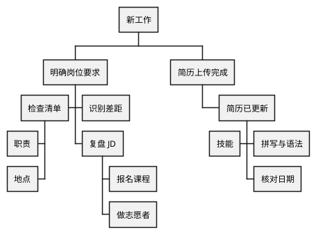

### 5. 无框节点（下划线 `_`）

在深度符号后紧跟 `_`，可以去掉该节点的方框，只保留文字（boxless）。既可用于个别节点，也可整树使用。

单个/局部无框（OrgMode）：

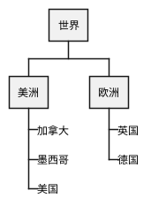

无框也可与方向、算术记法组合，例如 `-_`（左侧无框）、`+_`（右侧无框）：

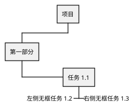

> **跳过一层 / 直连上层**：只写深度符号加 `_` 而**不写标签**（如单独一行 `**_`），会完全省略该节点，使其下的子节点直接挂到再上一层的父节点。可用于"越级汇报"这类结构。

### 6. 多行节点（`\n` 或 `:...;`）

节点文字过长时可换行。两种写法：

- 行内 `\n` 强制换行；
- `:内容;` 块把多行文字包在冒号与分号之间。

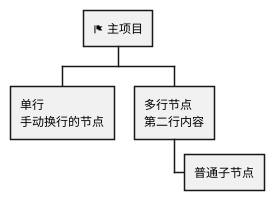

### 7. 逐节点着色（内联颜色）

在深度符号后用 `[#颜色]` 给单个节点上色，颜色名或 `#RRGGBB` 均可：

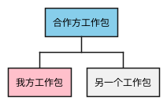

算术记法同理：


### 8. 用 `<style>` 统一控制样式

在 `@startwbs` 内用 `<style> ... </style>` 定义针对 `wbsDiagram` 的样式，可复用类、按深度选择、统一去框等。常用元素：

> ⚠️ **`@startwbs` 默认是灰白单色**：不写 `<style>` 的 WBS 所有节点同一种浅灰底、层级只靠连线区分，状态 / 责任方 / 完成度完全看不出来。**要状态色与层级对比，`<style>` 是必需项而不是可选装饰**——至少设 `rootNode` / `node` / `leafNode` 三档字号与底色，再加状态样式类（见「完整示例 · 带状态色 · 责任人 · 里程碑锚点的交付 WBS」）。
>
> ⚠️ **每个属性必须独占一行，或用 `;` 分隔**：`node { FontSize 18 Margin 9 }` 这种"一行多属性、无分隔符"的写法**不报错**，但实测画布从 `725×1912` 膨胀到 `2862×8100`（甘特图同样中招，膨胀约 50 倍）。写成多行、或写 `node { FontSize 18; Margin 9 }` 都正常。本文正文里为紧凑而写成一行的样式片段，抄进 `.puml` 时务必补 `;` 或拆行。

| 选择器 | 作用范围 | 常用属性 |
|--------|---------|---------|
| `wbsDiagram { ... }` | 整张 WBS 图 | `LineColor`、`RoundCorner`、`BackgroundColor` |
| `.类名 { ... }` | 引用 `<<类名>>` 的节点 | `BackgroundColor`、`FontColor` |
| `node { ... }` | 所有节点框 | `Padding`、`Margin`、`MaximumWidth`、`LineThickness` |
| `rootNode` / `leafNode` | 根节点 / 叶子节点 | 同 `node` |
| `arrow { ... }` | 连接线（内部按 arrow 处理） | `LineColor`、`LineStyle`、`LineThickness` |
| `:depth(N) { ... }` | 指定深度的节点/连线 | 与 `node`/`arrow` 嵌套使用 |
| `boxless { ... }` | 所有 `_` 无框节点 | `FontColor` |

自定义样式类示例：

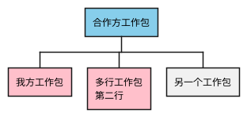

### 9. 去掉方框 / 调整外观

- **单个节点去框**：深度符号后加 `_`（见上文第 5 节）。
- **整图统一样式**：在 `<style>` 的 `node { }` 中设置 `RoundCorner`、`LineColor`、`BackgroundColor` 等；用 `boxless { }` 统一控制所有无框节点的字体色。
- **长文本自动换行**：在 `node { }` 中设置 `MaximumWidth 100`（配合 `Padding`/`Margin`）让 PlantUML 自动折行。

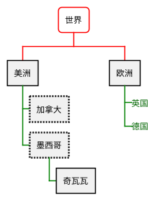

## 完整示例

### 电商平台交付 WBS（4 层 + 左右平衡 + 配色）

一个真实软件项目的分解：阶段用浅蓝、已完成阶段用浅绿、高风险阶段用浅红；底层测试任务挂在左侧、后端子服务左右分布，使整张图更紧凑。

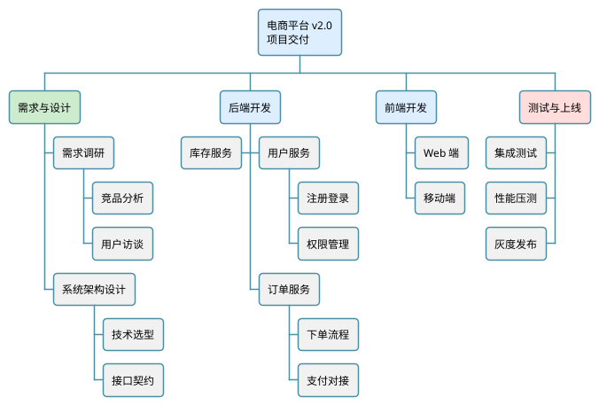

要点：
- 根节点用 `\n` 分两行显示，避免节点过宽。
- 三个 `<<phase>>` / `<<done>>` / `<<risk>>` 样式类形成清晰的视觉层次（进行中/已完成/风险）。
- 订单服务下的 `****>` 强制挂右侧，库存服务用 `***<` 挂左侧，让第二层的子树左右分布。
- 测试阶段整组用 `***<` 挂左侧，进一步压缩整体宽度。

### 带状态色 · 责任人 · 里程碑锚点的交付 WBS（实测 1.58:1 / 正文有效字号 19.0px）

最终读者看 WBS 时问的是三件事：**分解成了什么、每块什么状态、谁负责**。把这三层信息一次编进节点即可，不必另配表格。下面这张图用四个状态样式类（已完成 / 进行中 / 未开始 / 有风险）、节点第二行 `\n【责任人】`、阶段标题上的 `◆Mn` 里程碑锚点与 `✓` 完成标记，配一条横排图例把编码说明清。实测：`viewBox 14775×9337`、长宽比 1.58:1、正文有效字号 19.0px@1400px，量测判据全通过。

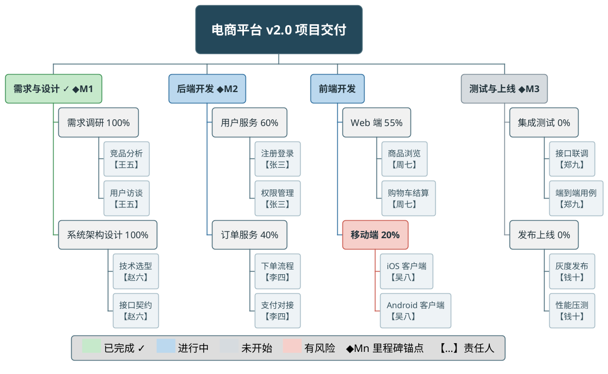

要点：
- **责任人用节点第二行 `\n【姓名】`**：中括号把人名与工作包名在视觉上分开，不挤在一行、也不需要额外一层节点；`leafNode` 的框会自动包住两行。
- **`◆Mn` 当里程碑锚点**：WBS 本身不表达时间，但把 `◆M1`/`◆M2`/`◆M3` 写在阶段标题上，就能与甘特图/里程碑视图的 `M1…Mn` 一一对照，读者可以在两张图之间对齐。菱形符号 `◆` 渲染稳定。
- **完成标记用 `✓`(U+2713)，不要用 `✔`(U+2714)**：`✔` 在部分渲染环境的字体里没有字形、会渲染成豆腐块（实测两者走的字体回退不同，`✔` 的字宽比 `✓` 宽约 5%）。
- **状态类可用在任意深度**：`<<risk>>` 打在中间节点「移动端」上，能精确标出风险落在哪个子块，而不是整个阶段一起变红。
- **未开始（`.todo`）底色要明显深于 `leafNode`**：`#D6DBDF` 对 `leafNode` 的 `#EEF3F6`，否则缩略预览时"未开始阶段"会与普通叶子混成一片。
- **图例把三套编码一次说清**：色块 = 状态、`◆Mn` = 里程碑锚点、`【…】` = 责任人；横排铺在底部空带，同时兼作压低重心的留白平衡器。

## 布局与美观技巧

### 阶段顺序与阅读方向（保证语义正确）

- **让阶段从左到右符合项目时间/逻辑顺序**：WBS 常被用来表达"需求→开发→测试"这类有先后关系的阶段，读者会本能地从左到右按时间读。切忌只为了压缩宽度就随手用 `**<` 把后段阶段甩到左侧——那样成图从左到右会变成"测试→前端→需求→后端"这类乱序，破坏 WBS 的时间/逻辑语义。
- **理解左右两侧的排列方向差异（关键诀窍）**：在同一父节点下，**右侧**（默认或 `>`）子节点按声明顺序从内向外、即从左到右排列；而**左侧**（`<`）子节点是"后声明的排在更外侧（更靠左）"，也就是**从内向外为逆序**。因此若想让最终成图从左到右严格按时间排列：
  - **右侧列正序声明**（先声明的阶段靠近根、在左）；
  - **左侧列逆序声明**（把本应最靠左的阶段放到最后声明）。
  - 例如目标顺序为 `需求→后端〔根〕前端→测试`：左侧先写 `**< 后端开发` 再写 `**< 需求与设计`，右侧写 `** 前端开发`、`** 测试与上线`，渲染后即得到 `需求 后端〔根〕前端 测试`。
- **拿不准就先渲染验证左右顺序**：`<`/`>` 的实际落位受声明顺序影响，改完务必渲染一次确认从左到右的阶段序列正确，再定稿。

### 颜色图例（让配色自解释）

- **颜色承载语义时必须配图例**：一旦用绿/蓝/红等颜色编码"已完成/进行中/风险"等状态，就要给出图例，否则读者只能靠猜。WBS 支持 `legend bottom ... endlegend`（也可 `legend left`/`right`/`top`）。
- **用 Creole 色块画图例项，色块与文字同行垂直居中**：在 legend 内用 `<back:#色值>       </back> 说明文字` 画出与样式类同色的色块，色值与 `<style>` 里的 `BackgroundColor` 保持一致，做到"图例即配色说明"。默认色块窄小、偏矮，视觉分量不足；应主动放大：**用 `<size:20>...</size>` 包住整段提高行高与字号**、**在 `<back>` 内填 7~10 个空格加长色块**。色块与说明文字写在同一 `<size>` 段内时天然垂直居中，比零散小方块规整精致。
- **优先横排图例以匹配宽画布（本轮关键）**：4 列结构的 WBS 成图偏宽（长宽比常 1.4~1.6:1），此时竖排堆叠的图例会显得小而孤立、撑不起底部横带。**把三组"色块 + 说明"写在同一 `<size:20>...</size>` 行内、用空格分隔**，图例即横向铺开、填满下方空带、与宽画布匹配。示例（横排，推荐用于宽图）：

  ```plantuml
  legend bottom
    <size:20>  <back:#C6E9CB>       </back> 已完成    <back:#BBD8EE>       </back> 进行中    <back:#F6CFCA>       </back> 风险  </size>
  endlegend
  ```

  若图较窄或状态项较多，也可竖排——每行一个 `<size:18><back:#色值>          </back> 说明</size>`，各行色值紧邻时色块会纵向首尾相接堆成等宽实心色柱、三行自动对齐。
- **图例位置兼作留白平衡器（关键·压低重心）**：WBS 树主体通常只占画布上方约 3/4，下方一条横带容易空旷、造成"重心偏上、下半部利用率低"。把 legend 放到这条下方空带里正好补重：**四列子树左右高度对称时，用 `legend bottom` + 横排图例铺满根节点正下方的最空区域**，重心居中、左右不偏、横向撑满；**若某一象限（如左下）明显更空，则用 `legend left` 定点补白**。避免用 `legend right`/`top` 把图例放到本就不空的一侧——那样只会让空白转移、重心更偏。改完务必渲染确认下方空带是否被有效填补。

### 用 `caption` 声明"图内为什么缺某类信息"

WBS（以及思维导图）支持 `caption <一句话>`，实测有效：它渲染在图例**下方**、左对齐、无框，且不参与树布局（不改变节点排布）。这个位置最适合放一句**图内声明**——说明"本图为什么没有某类信息"，避免读者把"没采到"误读为"没有"：

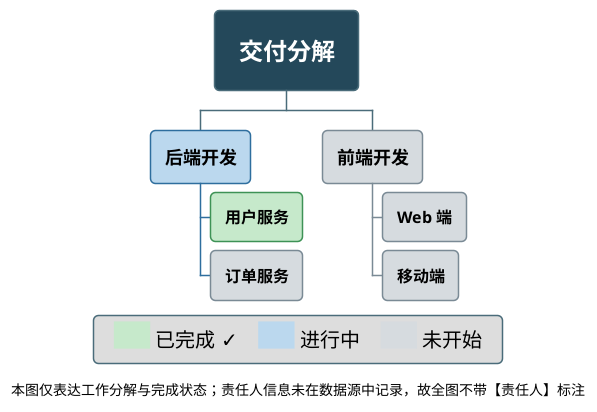

要点：
- **`caption` 承载"缺失声明"，`legend` 承载"编码说明"**，两者职责不同、可并存（上例即同时出现）。典型 caption 内容：某个维度的材料不存在于数据源、本图只覆盖某个子集、某类标注被刻意省略。
- **一句话、陈述事实**，不要写成免责声明或流程说明。
- 若按 [guide/style.md](../guide/style.md) §十 的图例契约裁剪后图例只剩 1 行、不再承载区分作用，就把整个 `legend` 换成 `caption`——不要留一个单行图例框。

### 父节点状态由子节点聚合时，聚合规则必须覆盖混合态

只要父节点（阶段 / 中间节点）的状态是从子节点**推**出来的，就必须先把聚合规则写清。常见的三分支写法是有缺口的：

```
全部子节点已完成            → done
存在"进行中"子节点          → doing
否则                        → todo   ← 缺口在这里
```

"否则"这一支会把**"部分已完成 + 部分未开始、但没有任何一项显式进行中"**的父节点判成 `todo`（未开始色）。实测这会造成明显的视觉误导：读者在同一个父节点下看到绿色的已完成子节点，父节点自己却是未开始的灰色，第一反应是图错了。

规则必须显式补上这一支：

```
全部子节点已完成                          → done（已完成）
存在"进行中"子节点                        → doing（进行中）
有"已完成"但无"进行中"且有"未开始"        → doing（进行中 / 部分完成）  ← 必须显式覆盖
全部子节点未开始                          → todo（未开始）
```

配套两条纪律：

- **状态类可用在任意深度**，但同一层的判定口径必须一致——不要一部分父节点按聚合、另一部分按手工标注。
- **图例 / 图说里的状态计数必须与图元逐一核对**：写"3 个阶段进行中"就去数图里有几个 `<<doing>>`。计数与图元不一致是最容易被一眼抓住的缺陷；同时按 [guide/style.md](../guide/style.md) §十 检查零实例编码（例如聚合后全图已无 `todo` 阶段，图例就不该保留"未开始"那一行）。状态的符号 / 颜色冗余编码见 [guide/style.md](../guide/style.md) §九。

### 尺寸、清晰度与留白（成图美观的关键）

- **内联进文档前先量「有效字号」，别按 `width="100%"` 一把梭（关键）**：能不能一眼读清，取决于 `有效字号 = SVG font-size × 显示宽度 ÷ viewBox 宽`，而不是声明的 `FontSize`。渲染后跑量测脚本：

  ```bash
  ${SKILL_HOME}/scripts/measure-svg-layout.py <图.svg> --display-width <文档栏宽>
  ```

  看 `display.readable`（阈值 12px）。实测：4 层 × 4 列的 WBS 成图 `14775×9337`，在 1400px 栏宽下正文有效字号 19.0px，清晰；但节点再多一档、画布宽到 16000+ 时，同样 `width="100%"` 内联进窄栏就会掉到 2~3px、完全不可读——**画布越大、内联后越糊，这与"图很大所以很清楚"的直觉正好相反**。三条处置（按优先级）：
  1. **按子树拆成多张 WBS**（概览图 + 下钻子图），这是唯一能同时保住清晰度与信息量的办法；
  2. 按脚本给出的 `display.widthPxNeededForBodyThreshold` **显式指定内联宽度**，配合横向滚动或"点开看大图"链接；
  3. 减少末层节点 / 合并同类工作包，把画布压回去。

  **放大 `zoom`/`scale` 无效**——画布与字号同比放大，有效字号不变。
- **主动放大字号，让文字清晰不拥挤**：不要依赖默认字号。在 `node { FontSize 16~18 }` 设正文字号、`rootNode { FontSize 20~24 }` 突出根节点。**叶子字号不要压得太小**：`leafNode { FontSize 16~17 }` 即可——相对根节点 22~24 仍有层次，但在缩小预览时不会因为叶子太小（如 15）而局促、难读。字号偏大后成图在缩放/嵌入文档时仍锐利可读，是"清晰度"得分的直接来源。
- **用 `Padding` / `Margin` 拉开呼吸感**：在 `node { Padding 14~18; Margin 10~14 }` 同时加大**框内**留白（Padding，文字不顶框）与**框间**间距（Margin，节点不相邻挤压）。根节点可给更大的 `Padding 22~24`。这是消除"局促感"、避免"标签顶到边框"最有效的两个旋钮。
- **给密集堆叠的叶子列更大的 `Margin`（缓解拥挤）**：当某列有 4 个叶子上下堆叠（如"后端开发/前端开发"下各挂两组 2 叶子）时，默认行距会显拥挤。把 `leafNode { Margin }` 单独调到 11~12（比中间节点 `node` 的 `Margin` 略大），拉开叶子行距，堆叠列不再挤成一坨。
- **让结构丰满以撑起大画布**：目标是让每个顶层分支都有 2 层以上、粒度相当的子树（如"2 个中间节点 × 2 个叶子"），使整图元素密度均匀、没有大片空白导致重心偏移。稀疏的单链分支会让画布一侧空旷、另一侧拥挤。
- **加粗连接线与圆角，提升成图质感**：`LineThickness 1.4~1.6` 让连线在大图上不显纤细断续；`RoundCorner 10~14` 让方框更柔和统一。避免过细的线在高分辨率成图里显得"发虚"。
- **加宽根节点横跨中部、消除"左右两块分离"感（本轮关键）**：四列子树以根为中轴左右展开时，根节点正下方、内侧两列之间会留出一段中部空档，使整图看起来像被劈成"左右两块"而非一棵完整的树。最有效的对策是把**根做宽**去横跨这段间距：标题写成**单行**（`电商平台 v2.0 项目交付` 而非 `\n` 分两行）、`rootNode { MaximumWidth 380~420; Padding 28~30 }`。宽根像一根横梁把左右两半"顶"在一起、连成一体，同时充当顶部的视觉压舱石。注意宽根与"多行窄根"是二选一的取舍：**四列分叉时优先宽根弥合中部**；只有两三列、不存在中部劈裂时才考虑用 `\n` 收窄根节点。
- **加宽节点 `MaximumWidth` 缓解单列"瘦长/垂直拥挤"**：4 层深的列天然又高又窄。把 `node { MaximumWidth 240~260 }` 调大、正文 `FontSize 18`，让中间节点与叶子的方框更横向铺展，配合宽根把整图从"高瘦四列"拉成更舒展的横向比例（长宽比 1.5:1 左右），单列不再显得瘦长。这比压缩纵向间距（会加重拥挤）更稳妥。
- **让末梢有实体、把重量下移，避免"重心偏上、下方中部空旷"**：四列子树悬挂后，根节点正下方、各列之间的中部容易留白，加上顶部若空旷会整体"头重脚轻"。对策有二：其一，末层叶子用 `leafNode` **浅色实框**而非纯文字无框——实框占面积、把视觉重量压到画面下部；其二，让每个顶层分支都有足够层数与叶子（如统一 `2 中间 × 2 叶子`）撑满两侧。二者叠加即可把重心拉回中央。

### 平衡、配色与层次

- **在根节点的直接子节点上做左右平衡（关键）**：真正决定整图长宽比的是**第二层**（根的直接子分支）挂在哪一侧。给根节点的一半子分支加 `<`（如 `**< 前端开发`），另一半保持默认（右侧），整棵树就会以根节点为中轴左右对称展开，得到接近正方形、最适合文档嵌入的比例。只在更深层加方向符号（如 `****>`）往往只微调子树内部，无法平衡整图。
- **让左右两侧的"高度"也对称（避免重心下坠）**：左右分支数量相等还不够——每侧子树的**总高度**也要接近。把叶子最多的分支与叶子最少的分支分到两侧，或让每个顶层分支保持相同的"中间节点数 × 叶子数"结构（如统一 `2×2`），可避免一侧拖得很长、另一侧很短造成的对角失衡。
- **让分支边框与背景同色系**：每个样式类同时设 `BackgroundColor` 与相近色调的 `LineColor`（例如 `.done { BackgroundColor #C6E9CB; LineColor #3E9256 }`），使方框与其连接线成为一个视觉整体，比统一黑线更精致、层次更清晰。给分类节点加 `FontStyle bold` 进一步强化主干。
- **让"无天然语义色"的分类底色够深、与叶子拉开辨识度**：done（绿）、risk（红）天生有语义色，容易识别；而像 phase（后端/前端开发）这类没有约定俗成颜色的分类，若用过浅的蓝，缩略预览时会与叶子的浅灰蓝混淆、四个顶层板块区分度不足。应把这类分类底色**加深一档**（如 `.phase { BackgroundColor #BBD8EE; LineColor #2E6E9E }`，明显深于 `leafNode` 的 `#EEF3F6`），并加粗，确保四大板块在缩图时也能一眼分清。
- **强调根节点**：用 `rootNode { BackgroundColor 深色; FontColor white; FontStyle bold; FontSize 22; RoundCorner 14; Padding 24 }` 让顶点在深色底上突出，与浅色分支形成主次对比。
- **叶子优先用 `leafNode` 浅色小实框，而非无框（关键·风格统一）**：末层工作包用 `_` 无框 + 手动 `▪` 项目符号虽能弱化末梢，但会与上层带框节点产生**视觉断层**、缩进也比色块节点松散，风格统一性变弱；更稳妥的做法是让叶子保留方框，用 `leafNode { BackgroundColor 浅色; LineColor 浅色系; FontSize 略小 }` 统一控制——`leafNode` 自动命中所有叶子，无需逐个加符号。把叶子设成"比中间节点更浅、更小的实框"（如背景 `#F3F7F9`、字号 15），既与全图方框风格一致，又通过深浅/大小拉开层级；同时实框比纯文字占更多面积，能为画面下部补足视觉重量，缓解"重心偏上、下方留白"。
- **确需无框弱化时，整树统一而非个别混用**：若刻意追求极简末梢，可用 `boxless { FontColor 灰; FontSize }` 统一所有 `_` 节点风格，但要**整层一致**（同层要么全无框、要么全实框），避免个别无框、个别实框造成缩进与对齐的断层。无框节点没有方框，`BackgroundColor` 对其无效，只能靠字号/字色区分层级。
- **配色表达层次而非装饰**：给同一类别的节点用同一样式类（`<<phase>>`、`<<done>>`、`<<risk>>`），用颜色编码状态/优先级/责任方，而不是随意上色。全图配色控制在 3~4 种以内，去色打印后仍能读懂结构。
- **标签保持简短**：节点文字尽量是名词短语（"支付对接"而非"完成支付网关的对接与联调工作"）。确需长文本时用 `\n` 手动断行，或依赖 `MaximumWidth`（如 170~180）自动折行，避免个别宽节点把整层撑开。
- **控制树深**：一般 3~4 层最易读，超过 5 层考虑拆分为多张 WBS 或折叠为工作包。
- **用 style 统一而非逐节点内联**：优先在 `<style>` 定义类和 `node`/`arrow` 规则，只在极个别节点用 `[#颜色]` 内联，便于全局调整与保持一致。

## 最佳实践

- **100% 原则**：子节点之和应完整覆盖父节点的范围，既不遗漏也不重叠。
- **面向交付物而非活动**：工作包尽量描述"可交付的结果"，便于验收和估算。
- **单一根节点**：一张 WBS 只有一个顶点（整个项目/目标），不要出现多个一级节点。
- **深度一致性**：同一层级的节点粒度应大致相当，避免一层里既有大阶段又有琐碎步骤。
- **两套记法不混用**：整图统一用 OrgMode（`*`）或算术（`+`/`-`），不要在同一图里混写。
- **颜色/样式服务于信息**：颜色用于传达状态或分类，能被去色打印后仍可理解结构。
- **优先分解、再排期**：WBS 只回答"分解成哪些工作"，工期/依赖属于甘特图（Gantt），不要塞进 WBS。

## 推荐测试图

下面是一张综合运用了本文全部关键技巧的完整 WBS，可作为渲染测试用例（已用本地 jar 验证可正常渲染，成图约 3260×2103px、清晰不局促、左右平衡、无裁剪重叠，长宽比约 1.55:1 舒展横展）。它同时覆盖：4 层深度、**以根节点为中轴的左右平衡且两侧高度对称**（每个顶层分支统一 `2 中间节点 × 2 叶子` 结构）、**加宽的单行根节点横跨中部以弥合左右两半、消除"两块分离"感**（`MaximumWidth 420` + 大 `Padding`）、**阶段按项目时间/逻辑顺序从左到右排列**（需求与设计→后端开发→前端开发→测试与上线）、**横向图例（legend）铺满下方空带以压低重心并平衡宽画布**（`<size:20>` 放大 + 加长 `<back>` 色块、色块与文字垂直居中）、放大字号与加大 `Padding`/`Margin` 撑出呼吸感（正文字号 18、`MaximumWidth 260` 让文字横向铺展缓解列瘦长）、**phase 顶层用更深的底色与描边**（与 done/leaf 拉开即时辨识度）、状态配色样式类（背景与边框同色系 + 加粗）、强调根节点（深色 + 白字加粗 + 大字号）、**四级末梢统一用 `leafNode` 浅色实框**（风格与上层带框节点一致、并为画面下部补足视觉重量避免重心偏上）：

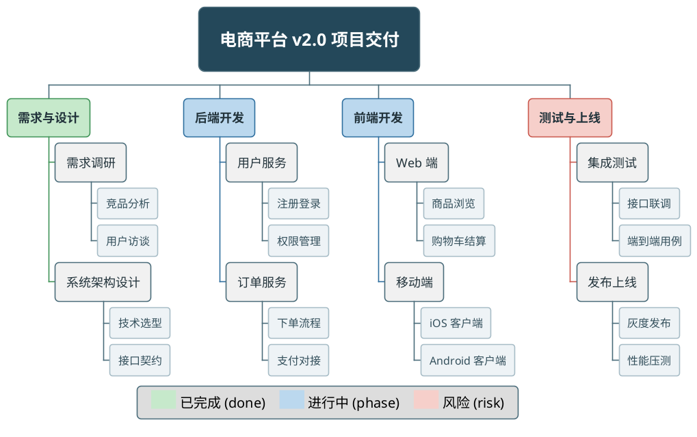

关键点回顾：
- **加宽根节点横跨中部、消除"两块分离"感（本轮关键）**：四列子树以根为中轴左右展开时，根节点正下方、内侧两列之间容易留出一段中部空档，使整图看起来像"左右两块"而非一棵完整的树。对策是把根做**宽**——标题写成单行 `电商平台 v2.0 项目交付`、`rootNode { MaximumWidth 420; Padding 30 }`，让根节点横向跨越内侧两列的间距、把左右两半"顶"在一起，视觉上连成一体。宽根还兼作顶部的视觉压舱石。
- **横向图例铺满下方、平衡宽画布（本轮关键）**：4 列结构的成图偏宽（约 1.55:1），若图例仍竖排堆在下方中央，会显得小而孤立、撑不起底部横带。改为**单行横排图例**——把三组 `<back>` 色块 + 说明写在同一 `<size:20>...</size>` 行内、用空格分隔，图例便横向铺开填满底部空带，与宽画布匹配、重心下沉且左右均衡。色块与说明文字同处一行天然垂直居中，观感比竖排小方块更精致。
- **phase 顶层用更深底色描边、提升即时辨识度**：done/risk 天生有绿/红语义色，而 phase（后端/前端）若用过浅的蓝，缩略预览时与叶子浅色区分度不足。把 `.phase` 底色加深到 `#BBD8EE`、描边用 `#2E6E9E`，四个顶层板块（绿/蓝/蓝/红）在缩图时也能一眼分清。
- **加宽节点缓解列瘦长**：`node { MaximumWidth 260 }` + `FontSize 18` 让中间/叶子节点文字更横向铺展、方框更宽，配合宽根把整图从"高瘦四列"拉成更舒展的横向比例，改善单列"瘦长/垂直拥挤"的观感。
- **阶段顺序符合项目流程**：渲染后从左到右依次为 `需求与设计 → 后端开发 →〔根〕→ 前端开发 → 测试与上线`，与"需求→开发→测试"的时间/逻辑顺序一致。诀窍是左右两侧声明顺序不同（详见「布局与美观技巧 · 阶段顺序与阅读方向」）：**左侧列逆序声明**（先写 `后端开发` 再写 `需求与设计`），右侧列正序声明。
- **左右平衡、两侧等高**：4 个顶层分支左右各 2 列，每列都是"2 个中间节点 × 2 个叶子"的同构结构，两侧高度一致，整图以根节点为中轴、重心不偏移。
- **呼吸感来自字号 + 间距**：`node` 用 `FontSize 18` + `Padding 16` + `Margin 9`，`rootNode` 用 `FontSize 25` + `Padding 30`，成图元素间距充裕、文字不顶框、缩放后依旧锐利。
- **同色系配色 + 加粗**：每个状态类（`done`/`phase`/`risk`）成对设置 `BackgroundColor` 与同色系 `LineColor` 并加粗，方框与连线浑然一体、层次分明。
- **末级统一浅色实框**：末层工作包统一走 `leafNode { BackgroundColor #EEF3F6; LineColor #A7BCC6; FontSize 16 }` 的浅色小实框——字号 16 相对根节点 25 仍有层次但缩小预览时不局促；实框为画面下部补足视觉重量，避免"重心偏上、下方中部空旷"。
- **强调根节点**：`rootNode` 深色底 + 白色加粗大字突出顶点，与浅色分支形成主次对比。
