# 如何画思维导图 (MindMap Diagram)

> 思维导图以一个中心主题为根，向四周呈放射状展开分支，表达"一个主题可以拆解成哪些子主题、子主题下又有哪些要点"。它是知识梳理、方案规划、需求拆解、学习路线设计等场景的首选工具，强调层次归纳而非流程或时序。

## 思维导图的用途

思维导图回答的是"围绕一个中心，如何逐层拆分出结构化的要点"：

- 知识体系梳理（技术栈、学科框架、读书笔记）
- 学习/成长路线图规划（分主题、分阶段）
- 产品与需求拆解（把一个大目标拆成模块与任务）
- 头脑风暴与方案发散（快速记录、事后归类）
- 会议纪要、大纲整理（用层级代替长段落）

与 WBS（工作分解结构）相比，思维导图更偏"发散归纳"，WBS 更偏"自上而下的工作分解"；两者语法相近，但思维导图支持左右分置、无框节点等更适合展示的能力。

## 核心概念

### 三种等价的层级写法

思维导图的核心就是"层级"。同一层级的深度可以用三种符号表达，效果完全等价，只需在一张图里保持一致：

| 写法 | 语法 | 深度控制 | 说明 |
|------|------|---------|------|
| **OrgMode** | `*` / `**` / `***` | `*` 的个数 = 深度 | 最常用、最直观，`*` 越多层级越深 |
| **Markdown** | `*` + 缩进 | 缩进（Tab/空格）= 深度 | 贴近 Markdown 列表书写习惯 |
| **运算符** | `+` / `-` | 符号个数 = 深度 | `+` 在右侧，`-` 在左侧，天然区分左右 |

- 深度必须从根节点逐层加一，不能跳级（不能从 `*` 直接跳到 `***`）。
- 一张图里可以有多个根（Multiroot），即出现多个 `*`（一级）节点。

### 节点的四类语义角色（配合 style 使用）

| 角色 | 对应节点 | style 选择器 |
|------|---------|-------------|
| 根节点 (Root) | 中心主题 | `rootNode` |
| 内部节点 (Node) | 有子节点的中间层 | `node` |
| 叶子节点 (Leaf) | 没有子节点的末端 | `leafNode` |
| 连接线 (Arrow) | 节点之间的连线 | `arrow` |

## PlantUML 语法

所有思维导图都包裹在 `@startmindmap ... @endmindmap` 之间（**不是** `@startuml`）。

### OrgMode 语法（推荐）

```plantuml
@startmindmap
* 云原生
** 容器
*** Docker
*** containerd
** 编排
*** Kubernetes
*** Nomad
** 服务网格
*** Istio
*** Linkerd
@endmindmap
```

### Markdown 语法（缩进表示层级）

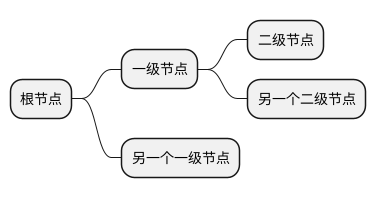

### 运算符语法（`+` 右侧 / `-` 左侧）

`+` 表示画在右侧，`-` 表示画在左侧，符号个数代表深度。这是**在一张图里手动控制左右分置最直接的方式**：

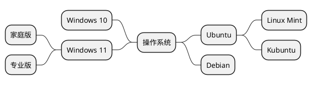

### 左侧分置（`left side` 关键字）

除了运算符，OrgMode/Markdown 写法可以用 `left side` 关键字把其后的一级分支放到左侧，`right side` 再切回右侧（默认右侧）。这样就能让根节点两侧均衡展开：

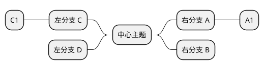

### 多行节点（`**:` 开头，`;` 结尾）

普通节点写在符号后面即可（`** 文本`）。若节点内容需要多行、代码块或富文本，用 `**:` 开头、以 `;` 结尾，中间可换行：

```plantuml
@startmindmap
* 类模板
**:示例 1
<code>
template <typename T>
class cname{
  void f1();
}
</code>
;
**:第二行说明
可以自由换行
写多段内容;
@endmindmap
```

> 提示：`\n` 也可以在单行节点里强制换行，如 `** 第一行\n第二行`。

### 无框节点（末尾加 `_`）

在深度符号末尾加下划线 `_`，可去掉该节点的方框，只留文字，常用于展示"叶子级要点"，让图更轻量。下划线加在符号串末尾，深度仍由符号个数决定：

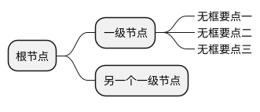

运算符写法同理，`+++_` / `--_` 分别是右侧/左侧的无框节点。也可以整棵树都无框（每层符号都带 `_`）。

### 每节点内联着色（`*[#颜色] 文本`）

在深度符号后紧跟 `[#颜色]` 即可单独给某个节点上色，颜色可用英文名或十六进制：

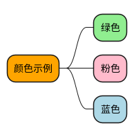

### 通过 `<style>` 批量设置样式

用 `<style>` 块并以 `mindmapDiagram` 为作用域，可以对全体节点或某类节点统一设置。常用属性：`BackgroundColor`、`LineColor`、`RoundCorner`、`FontColor`、`FontStyle`、`Padding`、`MaximumWidth`（配合自动换行）：

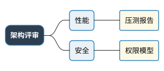

也可以定义**命名样式类**（以 `.` 开头），再用 `<<类名>>` 挂到节点上，实现"一次定义、多处复用"：

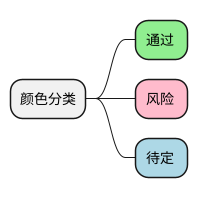

> 内联着色（`**[#...]`）适合零散点缀；`<style>` + 命名类适合"按主题统一配色"的规范做法，二者可以混用。

### 按深度设置样式

`:depth(N)` 选择器可针对某一层统一改样式：

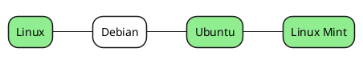

### 改变整体方向

- `left side` / `right side`：控制**其后分支**的左右分置。
- `top to bottom direction`：把整张图改为自上而下（默认是左到右的水平放射）。
- `right to left direction`：整张图从右向左。
- 可加 `caption`、`title`、`header`/`endheader`、`legend`/`endlegend` 等装饰元素。

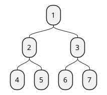

## 完整示例

### 示例一：技术学习路线图（左右均衡 + 配色 + 无框叶子）

一个真实的"后端工程师成长路线图"：根节点居中，右侧放**硬技能**（编程语言、工程能力），左侧放**架构与软技能**，一级分支各自配色、叶子节点无框：

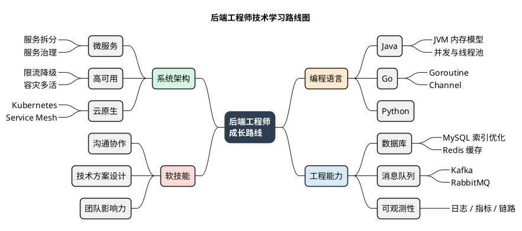

### 示例二：产品规划（命名样式类 + 运算符左右分置）

用运算符 `+`/`-` 直接决定左右，用命名样式类统一配色：

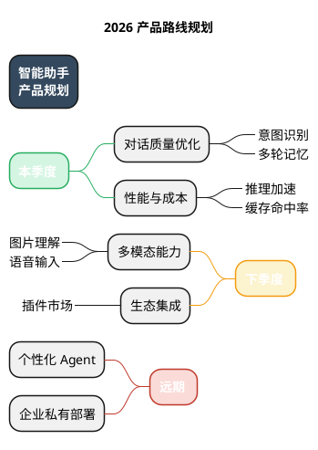

## 最佳实践

- **中心主题要聚焦**：根节点是整张图的"题眼"，用一句短语概括，不要写成长句。
- **每层保持同一维度**：同一父节点下的子节点应属于同一分类维度（例如都按"技术方向"或都按"阶段"），避免维度混杂。
- **控制层级深度**：思维导图一般 3–4 层最清晰，超过 4 层建议拆分成多张图或改用其他图型。
- **叶子用无框节点**：把最末端的具体要点用 `_` 去框，视觉上更轻，突出中间层的分类骨架。
- **配色按一级分支区分**：给每个一级分支一种颜色，让读者一眼看出属于哪个大类；同分支下的子节点继承或使用同色系。
- **善用命名样式类**：主题较多时用 `<style>` 定义 `.类名` 再 `<<类名>>` 引用，比逐个内联着色更易维护、风格更统一。
- **不要塞流程/时序进去**：有先后依赖、条件分支的内容应使用活动图或状态机图，思维导图只表达"归纳层级"。

## 布局与美观技巧

- **左右分支均衡**：思维导图默认全部向右展开，节点一多就会变成又高又窄的长条。把一半一级分支用 `left side`（或运算符 `-`）放到左侧，让根节点两侧对称，得到接近正方形的紧凑长宽比，既好看又省版面。**经验法则**：左右各放相近数量的一级分支（如每侧 2 个），且每侧的子树深度、叶子数量大致相当，才不会出现一边空一边挤。
- **按一级分支上色区分**：用颜色标记每个一级分支，读者无需读文字即可分辨大类归属；这是提升思维导图可读性性价比最高的手段。**优先用命名样式类（`.类名` + `<<类名>>`）而非内联 `[#...]`**：命名类可同时设定 `BackgroundColor`/`LineColor`/`FontColor`，一处定义多处复用，避免"内联色 + 样式类"重复上色导致的冗余与不一致。
- **配一套协调的调色板**：同一分支的 `BackgroundColor` 用浅色（如 `#FDEBD0`）、`LineColor` 用同色系的中深色（如 `#E67E22`）、`FontColor` 用同色系的深色（如 `#6E2C00`），形成"浅底 + 中线 + 深字"的同色三档，视觉统一且对比清晰；不同分支之间选色相差异明显（暖橙 / 冷蓝 / 绿 / 红）的色轮组合，避免相邻分支撞色。
- **连线用"中灰"而非"浅灰"，兼顾干净与主干引导**：把 `arrow` 的 `LineColor` 设成**中性中灰**（如 `#99A3A4`，而不是过浅的 `#B2BABB`/`#AAB7B8`）、`LineThickness` 提到 `2.0–2.2`。过浅的连线在浅色背景下对比不足、主干引导感弱；中灰 + 略粗既让彩色节点仍是焦点，又把放射骨架清楚勾勒出来。**额外规律**：思维导图里**根→一级分支段的连线会继承一级分支节点的 `LineColor`**（分支主题色），所以只要给一级分支样式类配了饱和的 `LineColor`，中心到骨架的主干天然就比灰色叶子连线更醒目——想强化主干，优先把一级分支的 `LineColor` 调饱和，再把全局 `arrow` 设为中灰做叶子连线。
- **根节点做强对比**：`rootNode` 用深底白字加粗（如深蓝 `#2C3E50` + `FontColor white` + `FontStyle bold`）、更大的 `RoundCorner` 与 `Padding`，让"题眼"一眼可辨、稳居中心。
- **无框 + 短词做叶子**：末端要点用 `_` 无框，并在 `<style>` 里给 `boxless` 设一个偏灰的 `FontColor`（如 `#566573`），减少方框噪声的同时让叶子文字比分类节点更"轻"，中间分类层次自然成为视觉主干。
- **节点文字尽量短**：思维导图靠"关键词联想"，每个节点 2–6 个字最佳；需要展开说明时用多行节点（`**:...;`）而不是把长句塞进单行，避免撑出超宽节点破坏对齐。
- **需要长文本时用换行/自动换行**：单行内用 `\n` 主动换行；或在 `<style>` 的 `node` 里设置 `MaximumWidth`，让 PlantUML 自动折行，避免出现一个极长的节点把整图撑宽、挤压另一侧。
- **统一间距参数**：在 `node` 上设置一致的 `Padding`、`Margin`、`RoundCorner` 与 `FontSize`，让各分支节点尺寸协调、行距均匀，避免大小不一显得杂乱。
- **字号偏大、按深度分档**（提升清晰度与尺寸感的第一杠杆）：思维导图默认字号偏小，成图会显得局促。建议主动放大并分三档形成层次——`rootNode` 用最大字号（如 `FontSize 22–23` 加粗）、`:depth(1)` 一级分支用中大字号（如 `FontSize 19` 加粗）、普通节点 17 号、无框叶子 **17 号**（与普通节点持平即可，不要更小）。**叶子字号不宜低于 17**：无框叶子往往是密集区（如"JVM 内存模型/并发与线程池"），若压到 15–16 号，在整图缩放下细节会明显发虚；把 `boxless` 的 `FontSize` 提到 17，通过"去框 + 灰字"而非"更小字号"来弱化叶子，既保清晰又保层次。字号越大，PlantUML 排布出的画布越大、成图越清晰（本技能渲染脚本会自动 `scale/dpi` 放大，配合大字号可稳定得到 3000px 以上的清晰图）。
- **加大 Padding/Margin 换取呼吸感**（提升留白的第一杠杆）：把 `node` 的 `Padding` 提到 12–16、`Margin` 提到 8–10，根节点再更大（`Padding 18–20`）。`Padding` 撑开方框内文字与边框的间距（避免"顶字裁剪"），`Margin` 撑开相邻方框的间距（避免拥挤重叠）。留白不足是"局促"的主因，宁可略大也不要过挤。
- **用结构丰满度撑满画布、平衡重心**：字号和留白放大后，若节点太少会显得空。确保每个一级分支下有 2–3 个二级节点、每个二级节点带 1–2 个叶子，让四个象限都被填充；同时保持**左右子树的深度与叶子数量相当**，避免一侧沉重、一侧空荡导致重心偏移、大片留白失衡。
- **用"每侧分支数"调节长宽比，把成图拉向 16:10**（提升尺寸均衡与纵向呼吸感的关键杠杆）：思维导图的**宽度由层级深度决定，高度由同级分支/叶子的数量决定**。若成图偏扁（长宽比远超 2:1、横向拉伸感明显、纵向留白局促），根源多是"深度够但每侧分支太少"——纵向撑不起来。**解决办法是给每侧再加一个一级分支**（如从每侧 2 个增到每侧 3 个），高度随之增长、宽度基本不变，长宽比自然从 ~2.1:1 收敛到接近 16:10（约 1.6:1）的舒展比例，纵向呼吸感明显改善。反过来，若太高太窄，则减少单侧分支或把叶子合并。**经验值**：每侧 3 个一级分支、每个一级分支带 3 个二级、每个二级带 1–2 个无框叶子，通常能得到接近 16:10、四象限均衡填满的画布。
- **图例用"顶部色块"做法，别用左下角小字**（提升图例可读性与视觉权重的首选）：默认 `legend left`/`legend right` 会把图例塞进某侧角落、字号偏小、容易被忽略。更好的做法是 **`legend top`** 放在标题正下方（视觉权重强、天然居中，还能填满原本空旷的顶部留白让重心更稳），并做两件事提升可读性：① 用 `<style>` 里的 `legend { FontSize 18; BackgroundColor #FBFCFC; LineColor #99A3A4; Padding 14; Margin 12 }` 放大字号、给图例框一点浅底与描边；② **用 Creole 色块代替纯文字说明**——`<back:#RRGGBB>    </back>`（成对空格撑出色块宽度）能直接画出一个填充色块，把每个一级分支的颜色示例摆出来，比"颜色 = 一级分支主题"一行字直观得多。多个条目可分成 2 行 × 3 列排布（一行写 3 个 `色块 名称`，`endlegend` 前换行写第二行），紧凑又清晰。**务必让图例色块的十六进制值与分支样式类的 `BackgroundColor` 完全一致**，做到"图例颜色 = 图内颜色"。
- **图例放角落时给它留出间距，避免底部拥挤**：若确需 `legend right`/`legend left`（如顶部空间被超长标题占满），它会贴在对应一侧分支附近，若该侧最下方的分支（如"软技能/团队影响力"）离图例太近会显挤。三种缓解手段：① **把图例放到分支较少或较短的一侧**；② 调整 `left side` 前后各分支的**排列顺序**，让密集/高大的分支远离图例所在角落；③ 图例不要孤悬在远离主体的角落。渲染后专门检查图例与最近节点的间距，既不要挤在一起、也不要孤零零飘在角上。
- **拆分并列短语为多个 boxless 叶子，别把多个词塞进一个节点**：一个无框叶子应只承载一个关键词。像"日志 / 指标 / 链路"这种并列点，拆成"日志采集 / 指标监控 / 链路追踪"三个独立 `****_` 叶子，既避免单行过长、靠近彩色父节点边缘时的拥挤感，又能把该分支纵向撑高、帮助填充画布。**判断标准**：若一个叶子里出现 `/`、`、`、空格分隔的两个以上概念，优先拆成多行独立叶子；确需并排的短词才保留在一行。
- **垂直 Margin 是"双向杠杆"，按长宽比两头调**：`node`/`:depth(1)`/`rootNode` 的垂直 `Margin` 直接决定画布高度，据此双向微调长宽比，目标区间约 **1.5–1.6:1**。① **图偏扁（>1.7:1）、上下空白带明显、横向偏宽** 时——多因纵向内容"撑不满"，除了"每侧加分支/拆叶子"，就**加大**垂直间距（`node` 22–26、`:depth(1)` 28–30、`rootNode` 40–48），把树在纵向舒展撑高、空白带占比下降。② **图偏方（<1.5:1）、或加了顶部图例后又高又挤** 时——则反向**回收**垂直间距（`node` 16–18、`:depth(1)` 22–24、`rootNode` 40–42），压薄多余上下留白、把长宽比拉回 1.5–1.6:1。（`boxless` 的 `Margin` 两个方向都无效，见上条，不要指望它撑高或压扁。）**先定内容与图例，再用这把杠杆把长宽比校到 1.5–1.6:1。**
- **左右外层留白是 PlantUML 硬约束，靠"拉开内部 + 撑大画布"间接缓解**（实测结论）：思维导图的画布会**紧贴最外层叶子文字**裁切，横向外边距无法通过 `<style>` 加大——实测在 `mindmapDiagram` 作用域设 `Margin`/`Padding` 只会增加**上下**空白（并会把 `legend` 推离主体、显得孤悬），**对左右外层留白毫无作用**（viewBox 宽度不变），因此不要用这种方式去"顶开"左右边界。缓解最外层叶子贴边观感的可行手段有三：① **保持最外层叶子文字短**（2–6 字，如"Kafka""哈希表"），文字越短贴边的视觉压力越小；② **把根节点/一级分支的 Margin 放大**（见上文 40–48 的做法），整张图被撑得更大更开阔后，最外层文字在整体版面中的相对占比下降、贴边感减弱；③ 若某侧最外层文字确实过长，用 `\n` 换行或 `MaximumWidth` 折成两行，缩短单行横向延展。
- **给深色根节点单独放大 Margin，缓解视觉压迫、拉开中心**（提升中心开阔度的关键杠杆）：`rootNode` 是深底白字的"重色块"，若紧贴相邻一级分支会产生压迫感、根到 `:depth(1)` 的连线也会显得过短、中心拥挤。给 `rootNode` 单独设一个明显更大的 `Margin`（实测 **40–48** 效果佳，远大于普通节点的 20 左右），即可在根节点四周留出"呼吸圈"、把根到一级分支的水平间距明显拉开，让居中的题眼与两侧分支分离、重心更稳；同时给 `:depth(1)` 设 `Margin 28–30` 在骨架层进一步拉开。这是缓解"中心区域拥挤、连线短"最直接有效的做法。
- **靠 `node` Margin（而非 `boxless` Margin）疏松密集叶子**（实测要点）：想加大无框叶子组的行距、给密集分支松绑，应增大 **`node` 的 `Margin`**（如从 16 提到 22–26）——它会撑开同级框状节点间距，其下挂的叶子行距随之变宽，画布高度增加、长宽比更舒展。**注意：在思维导图里给 `boxless` 设 `Margin` 是无效的**（viewBox 完全不变，实测 `boxless Margin 12/22/40` 三者成图尺寸一致）；`boxless` 只用来设 `FontColor`/`FontSize`。要弱化叶子层次请用更中性的 `FontColor`（如 `#566573`）而不是给它加 Margin 或缩小字号。
- **左右轻微再平衡，消除配重差异**：即便左右各放相同数量的一级分支，若一侧叶子密集、另一侧稀疏，视觉重心仍会偏移。做法：① 把叶子数量在左右两侧**大致对齐**（每侧总叶子数相差不超过 1–2 个）；② 对个别特别密集的分支单独调小 `Margin`（如从 10 降到 6–8）让它更紧凑，或把其中一个叶子上移到较空的分支，使左右配重更对称。
- **防裁剪/防顶边框的自检**：渲染后检查四条边——标题与图例是否贴顶/贴边、最外层叶子文字是否被画布裁掉、深色根节点白字是否离框足够远。若出现顶字，优先加大对应节点的 `Padding`；若某个节点特别宽把整图撑变形，用 `\n` 换行或 `MaximumWidth` 折行收窄它。
- **方向的选择**：内容偏"两三个大类各自很深"时用默认左右放射；内容偏"一个主题下并列很多同级项"时可试 `top to bottom direction` 做成自上而下的树。**长宽比目标约 1.6:1（16:10）到 2:1**：若默认左右放射后长宽比过于扁平（超过 2.2:1），优先按上一条"每侧加一个分支"把高度撑起来；仍过扁再考虑把部分分支移到另一侧或改用 `top to bottom direction`，让长宽比回到舒展区间。

### 分组节点不得使用状态色（实测）

一张脑图里常同时存在两类节点：**分组节点**（只做归类，如"交易域/用户域"）与**业务叶子**（承载真实条目与状态）。若给分组节点也套上三态状态色，读者会把"分组"读成"状态"——看到一个灰色的"交易域"就以为该域未开始。规则：

- **分组节点用中性色，且必须在图例里显式标注「分组节点（非状态）」**，让它在语义上退出状态编码。
- **根节点不打任何状态类**：根是题眼，不参与状态。
- **中性色必须与"未开始"灰明显拉开**（实测踩坑）：先用 `#CFD8DC`（描边 `#78909C`）做分组色、`#D6DBDF` 做"未开始"色，成图里两者**几乎无法区分**，图例上的两个色块看起来是同一个颜色，等于规则白写。把分组色加深到 `#B0BEC5`（描边 `#546E7A`）并加粗后，分组节点与"未开始"叶子一眼可分。经验档位：分组色取 **200~300 级中性灰蓝**（比所有状态色都更"深而不彩"），状态色留在 **100~200 级的彩色档**。

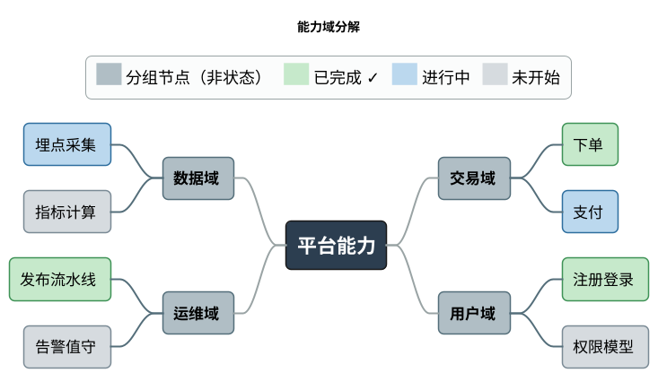

图例四行覆盖了图内出现的全部四种编码、且没有一行是零实例——这正是 [guide/style.md](../guide/style.md) §十 的图例契约（可用那一节的自检脚本核对，本例两个方向均为空列表）；状态同时用符号 `✓` 冗余编码，符号字形白名单见同文 §九。

## 推荐测试图

下面是一张综合了**左右均衡分置（每侧 3 个一级分支、每侧 16 个叶子）、根节点强对比 + 大 Margin 呼吸圈拉开中心、按深度递减的字号层次、一级分支同色系配色（浅底/中线/深字）、加深连线强化主干、无框灰字叶子（18 号保清晰）、多叶子分支短词化缓解拥挤、顶部色块图例强化可读性、收敛到 ~1.5:1 的均衡长宽比**的思维导图，适合作为渲染测试与效果基准（已用本地 jar 验证可正常渲染，成图约 4091×2754px、长宽比约 1.49:1、两侧对称、四象限填满、中心开阔、密集叶子行距舒展、无裁剪重叠、文字不顶边框）。

要点：
- **字号分三档、随深度递减**：`rootNode` 24 号加粗做题眼，`:depth(1)` 一级分支 19 号加粗做骨架，普通节点 17 号、无框叶子 18 号（叶子靠"去框 + 灰字"弱化而非缩小字号，略大半档提升小字在缩放后的可读性）；层次分明且整体偏大，密集区（如"可观测性"下三条叶子）也清晰不发虚。
- **加深连线、强化主干视觉引导**（本轮关键改进）：`arrow` 的 `LineColor` 从浅灰 `#B2BABB` 加深到 `#99A3A4`、`LineThickness` 提到 `2.2`，在浅色背景下主干与分支的连线对比更足、层次更清楚，不再"引导过弱"。同时，思维导图里**根→一级分支段的连线会继承子节点的 `LineColor`**（即分支主题色），彩色主干天然比灰色叶子连线更醒目，进一步强化了从中心放射的骨架感——因此给一级分支样式类设一个饱和的 `LineColor`（如 `#E67E22`/`#2980B9`）本身就是强化主干的手段。
- **顶部色块图例、强化可读性**（本轮关键改进）：图例从左下角小字 `legend left` 改为 `legend top` 放在标题正下方，并用 `<style>` 的 `legend { FontSize 18 }` 放大字号、用 Creole 色块 `<back:#RRGGBB>    </back>`（成对空格撑出色块宽度）直接展示每个一级分支的颜色示例（2 行 × 3 列），比"颜色 = 一级分支主题"一行纯文字直观得多，视觉权重明显提升、不再被忽略；同时它填充了原本空旷的顶部留白，让重心更稳。
- **多叶子分支短词化、缓解局部拥挤**（本轮关键改进）：把"MySQL 索引优化""并发与线程池""Goroutine 调度""Docker 镜像""流水线设计"等偏长的叶子精简为"MySQL 索引""并发编程""Goroutine""Docker""流水线"等 2–4 字短词。叶子越短，靠近彩色父节点边缘时的拥挤感越弱、横向延展越小，"工程能力/运维部署"等多叶子分支的局促随之缓解（缩短文案比强行加 `Margin` 更有效，因为 `boxless` 的 `Margin` 在思维导图里不生效）。
- **叶子层次靠"去框 + 灰字"而非缩小/加 Margin**：`boxless` 只设 `FontColor #566573`（比彩色父节点更中性、更轻）与 `FontSize 18`。注意 **`boxless` 的 `Margin` 在思维导图里不生效**（不会改变叶子间距，viewBox 不变），控制叶子行距请改用 `node` 的 `Margin`；控制叶子层次对比用 FontColor 深浅即可。
- **适度收敛垂直 Margin、压缩多余上下留白**（本轮关键改进）：`node` 的 `Margin` 从 22 回收到 **17**、`:depth(1)` 从 30 回收到 24、`rootNode` 从 48 回收到 42。配合顶部图例填满上方空白，画布高度从 ~2819px 压到 ~2754px，长宽比从偏方的 ~1.45:1 拉回到更均衡的 ~1.49:1，顶/底固定留白带被压薄、内容更饱满。**注意与"撑高画布"是相反方向的杠杆**：图偏扁（>1.7:1）时加大垂直 Margin 撑高，图偏方或上下空白过多时回收垂直 Margin 压扁，目标区间约 1.5–1.6:1。
- **每侧放 3 个一级分支、叶子数量对齐**（右：编程语言 / 工程能力 / 运维部署；左：系统架构 / 数据与算法 / 软技能，各 16 个叶子），两侧配重对称，避免一侧沉重、一侧空荡。
- **配色一律用命名样式类**（不再叠加内联 `[#...]`），六个一级分支各用一档色相拉开区分，连线加深、叶子用无框灰字，让彩色分类节点成为视觉主干；图例色块与分支样式类共用同一组十六进制值，保证"图例颜色 = 图内颜色"严格一致。

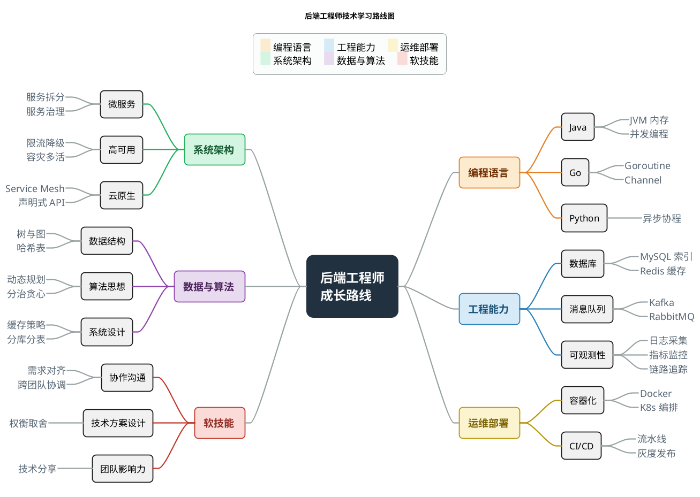

渲染命令：

```bash
bash skills/draw-plantuml/scripts/render-plantuml.sh <input.puml> <outdir> <prefix>
```
