# 如何画 JSON 数据可视化图 (JSON Diagram)

> JSON 图把一段 JSON 文档渲染成层次化的「链接表格 / 树」，让复杂的嵌套配置、API 响应、数据结构一眼可读。它不是 UML 图，而是数据结构的可视化工具，特别适合放进设计文档、接口说明和配置说明中。

## 用途

JSON 图回答的是「这段数据长什么样，字段之间怎么嵌套」：

- 可视化 REST / RPC 接口的请求体与响应体结构
- 展示微服务配置文件（副本数、资源限制、健康检查、数据库连接等）的层次
- 说明复杂配置项（Helm values、application.yml 转 JSON、CRD spec）
- 在设计评审中高亮关键字段、异常字段或需要讨论的路径
- 把数据结构直接嵌入类图 / 组件图 / 部署图，说明「哪个组件消费哪份数据」

JSON 图不适合：表达行为、流程、时序（那是活动图 / 时序图 / 状态机图的职责）。

## 核心概念

### JSON 图的渲染模型

PlantUML 把 JSON 渲染成一组相互链接的「表格节点」：

| JSON 结构 | 渲染结果 |
|-----------|---------|
| **对象 `{}`** | 一个两列表格：左列是键，右列是值 |
| **数组 `[]`** | 一个单列表格：每行一个元素，行号即下标（从 0 开始） |
| **嵌套对象 / 数组** | 值列画一个「锚点圆点」，用连线指向另一张子表格 |
| **标量值** | 直接显示在值列（字符串 / 数字），或渲染为图标（布尔 / null） |

嵌套越深，链接的表格越多；整张图从左上角的根节点向右下展开成一棵树。

### 各数据类型的呈现方式

| 类型 | 示例写法 | 渲染效果 |
|------|---------|---------|
| 字符串 string | `"名称": "订单服务"` | 值列直接显示文本 |
| 数字 number | `"副本数": 3`、`"金额": 299.5`、`"科学计数": 1E5` | 值列显示数字（支持负数、小数、指数） |
| 布尔 boolean | `"启用": true` | 值列显示一个复选框图标 + `true`/`false`（勾选=true） |
| null | `"灰度标签": null` | 值列显示一个空复选框图标（几乎是空白行，语义含糊） |
| 数组 array | `"端口": [8080, 9090]` | 链接到一张单列表格，每行一个元素 |
| 对象 object | `"资源限制": { ... }` | 链接到一张两列子表格 |
| 空数组 / 空对象 | `"a": []`、`"b": {}` | 渲染为空表格占位（同样是一格空白，看不出含义） |

> 提示：值里可以直接写 Creole / HTML 标记，例如 `"状态": "<color:green>正常"`，会被渲染成带颜色的富文本。

> ⚠️ **null / 空数组 / 空对象会渲染成「空白行 / 空复选框 / 空格子」，在主表里留下一条含糊的视觉空行**，读者分不清是「没这个字段」「值为空」还是「渲染出错」。做展示图时，**优先用显式占位字符串替代**：`"灰度标签": "未启用"`、`"备注": "-"`、`"子项": "无"`（可加灰色富文本 `"<color:#9E9E9E>未启用"` 弱化）。只有当「值确实是 JSON null / 空集合」本身是要表达的重点（如 API 契约说明某字段可为 null）时，才保留原样。

### 顶层可以是任意 JSON 值

根节点不必是对象，标量、数组同样合法：

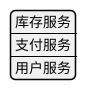

```plantuml
@startjson
42
@endjson
```

## PlantUML 语法

### 基本结构：@startjson / @endjson

JSON 图用独立的 `@startjson ... @endjson` 包裹，中间直接粘贴合法的 JSON：

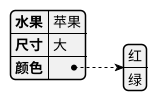

### 嵌套对象与对象数组

对象数组（数组里每个元素都是对象）是最常见的复杂结构，会渲染成「数组表格 → 多张对象子表格」：

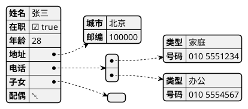

### 高亮字段：#highlight 与路径分隔符

用 `#highlight` 高亮某个字段。路径分隔符固定为斜杠 `/`，**数组元素用「加引号的下标数字」引用**（下标从 0 开始）：

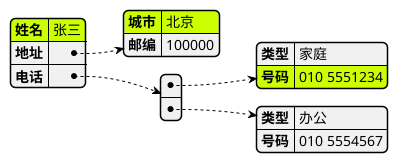

关于「命名空间 / 路径分隔符」的说明：JSON 高亮的路径分隔符**只有** `/` 一种，不可配置。写成 `"地址.城市"` 或试图用 `set separator .`、`!option namespaceSeparator` 修改分隔符都是无效的（前者会报 “Your data does not sound like JSON”，后者报 “No such !option”）。要定位深层字段，就用 `"外层" / "内层" / "0" / "字段"` 这种逐级路径。

### 自定义高亮样式：<style> + 高亮类

在 `<style>` 里为高亮定义全局外观（`highlight { ... }`），也可以定义多个「高亮类」（以 `.` 开头，如 `.warn`、`.ok`），在 `#highlight` 行尾用 `<<类名>>` 引用：

```plantuml
@startjson
<style>
jsonDiagram {
  highlight {
    BackGroundColor #FFE082
    FontColor #7A4F01
    FontStyle bold
  }
  .warn {
    BackGroundColor #EF5350
    FontColor white
    FontStyle bold
  }
  .ok {
    BackGroundColor #66BB6A
    FontColor white
    FontStyle bold
  }
}
</style>
#highlight "服务名称"
#highlight "健康检查" / "路径" <<ok>>
#highlight "端口" / "0" <<warn>>
{
  "服务名称": "订单服务",
  "端口": [8080, 9090],
  "健康检查": { "路径": "/actuator/health", "间隔秒": 10 }
}
@endjson
```

> 未带 `<<类名>>` 的 `#highlight` 使用 `highlight { ... }` 的默认样式；带 `<<warn>>` / `<<ok>>` 的则使用对应类的样式。

> ⚠️ **关键坑：样式属性必须每行一条，不要写成单行块。**在近期 PlantUML 版本（已在 1.2026.6 复现）里，把多条属性挤在一行的写法——如 `.ok { BackGroundColor #66BB6A  FontColor white  FontStyle bold }`——会**静默丢弃 `BackGroundColor`**：类高亮会退化成默认 `highlight` 样式（只有文字变色、没有底色），导致 `.ok` / `.info` / `.warn` 三色渲染成同一个橙棕色文字、彼此无法区分。务必展开成多行：
> ```
> .ok {
>   BackGroundColor #66BB6A
>   FontColor white
>   FontStyle bold
> }
> ```
> 这条规则对 `node` / `arrow` / `highlight` 和所有自定义类都适用。类定义写在 `jsonDiagram { ... }` 内或 `<style>` 顶层皆可（两处均已验证生效），关键只在于**每个属性独占一行**。渲染后应能在 SVG 里看到三种不同底色（如 `fill="#66BB6A"`、`fill="#1E88E5"`、`fill="#E53935"`）而非统一橙棕文字。

> 备用方案（不依赖类高亮）：若只想给个别标量值上语义色，可直接在值里用内联富文本，如 `"运行状态": "<color:#2E7D32><b>运行中"`，绿/蓝/红分别用 `#2E7D32` / `#1565C0` / `#C62828`。这种方式对样式块解析不敏感，最稳，但不会给整格加底色，适合点缀 1~2 处；需要「整格底色 + 精确路径定位」时仍用多行类高亮。

### <style> 完整样式属性

`jsonDiagram` 支持三个子块 `node`（表格节点）、`arrow`（连线）、`highlight`（高亮），常用属性如下：

```plantuml
@startjson
<style>
jsonDiagram {
  node {
    BackGroundColor Khaki
    LineColor lightblue
    FontName Helvetica
    FontColor red
    FontSize 16
    FontStyle bold
    RoundCorner 0
    LineThickness 2
    LineStyle 10-5
    separator {
      LineThickness 0.5
      LineColor black
      LineStyle 1-5
    }
  }
  arrow {
    LineColor green
    LineThickness 2
    LineStyle 2-5
  }
  highlight {
    BackGroundColor red
    FontColor white
    FontStyle italic
  }
}
</style>
#highlight "1" / "hr"
[
  { "name": "Mark McGwire", "hr": 65, "avg": 0.278 },
  { "name": "Sammy Sosa",   "hr": 63, "avg": 0.288 }
]
@endjson
```

- `node`：控制表格节点。`separator { ... }` 单独控制表格内部的行/列分隔线（线宽、颜色、虚实）。
- `arrow`：控制表格之间的连线（颜色、线宽、虚实 `LineStyle`）。
- `highlight`：控制默认高亮（背景色、字色、字形）。
- `RoundCorner` 控制圆角半径，`0` 为直角，越大越圆。
- `LineStyle a-b` 表示虚线（`a` 实、`b` 空的比例），省略即实线。

### 把 JSON 嵌入其他图

用 `json` 关键字，可以在普通 `@startuml` 图里嵌入一份 JSON 数据，与类、对象混排：

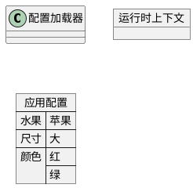

配合 `allowmixing`，还能与组件图 / 部署图元素连线，说明数据流向：

```plantuml
@startuml
allowmixing

agent 采集器 as Agent
stack {
  json "config.json" as J {
    "水果": "苹果",
    "颜色": ["红", "绿"]
  }
}
database 数据库 as DB

Agent -> J
J -> DB
@enduml
```

## 完整示例

### 示例一：微服务配置

一份带对象、对象数组、布尔、数字、null 的真实配置，并用样式区分「正常关注项（默认黄）」「健康探针（绿）」「疑似异常从库（红）」：

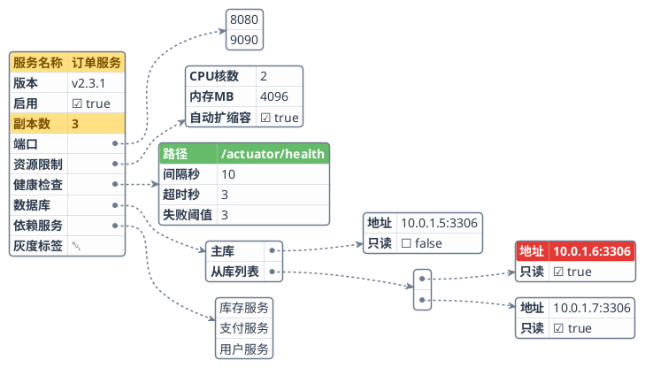

### 示例二：API 响应结构

用默认样式高亮状态码与首个订单金额，适合放进接口文档：

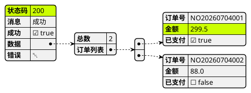

## 布局与美观技巧

JSON 图的布局由数据结构自动决定，无法像状态机那样用隐藏连线摆位。优化重点是**用字号撑出尺寸与留白**、**塑造数据形状让树均衡展开**、**用颜色分层引导视线**、**用样式统一视觉基调**：

**用字号撑出尺寸、清晰度与呼吸感（最重要的美观杠杆）**

- **`FontSize` 是 JSON 图唯一能整体放大、增加呼吸感的开关**：把 `node.FontSize` 提到 `16~18`，单元格随文字变高变宽、行距变松、字更清晰。渲染脚本还会对 `@startjson` 自动叠加 `scale=4/dpi=300`，成图通常 3000~3500px、锐利不糊。字号太小（≤12）时即便放大也显局促、笔画糊。
- **`Padding` / `Margin` 对 `jsonDiagram` 无效，别指望它们加内边距**：实测在 `node { ... }` 里写 `Padding`/`Margin` 会被静默忽略（viewBox 与行高完全不变），它们不在官方支持的属性列表内。要「格子更宽松」只能靠 `FontSize`；要「节点更柔和」用 `RoundCorner 8~10`；要「边框更清晰」用 `LineThickness 1.2` 左右、`separator.LineThickness 0.5~0.7` 的浅灰细线分行。**不要**在样式里堆砌臆造属性，只用文档确有的 `BackGroundColor / LineColor / FontName / FontColor / FontSize / FontStyle / RoundCorner / LineThickness / LineStyle / separator`。
- **让结构足够丰满以撑起大画布**：只有两三个字段的 JSON 放大后会显得空、重心飘。安排 5~6 张规模相近的子表 + 一条 3~4 层的深分支（如推荐图的「数据库→从库列表→对象」），画布被自然填满、不会大片空白导致失衡。
- **控制宽高比接近方形或轻度横向（约 1.0~1.4）**：JSON 树天然向右铺、容易变成又宽又扁的长条。让最深的分支只有一条、其余子表纵向错落堆叠，能把宽高比拉回均衡（推荐图约 2592×2512 ≈ 1.03），避免过扁导致上下大片空白。

- **JSON 连线无法正交，`linetype ortho`/`polyline` 一律无效；`nodesep`/`ranksep` 同样无效**：JSON 图的表间连线是 graphviz 生成的三次贝塞尔曲线，`skinparam linetype ortho`（或 `polyline`）对 `@startjson` **完全不起作用**——实测加与不加，SVG 的 viewBox 与每条连线的 `d="..."` 路径逐字节相同。**`skinparam nodesep` / `skinparam ranksep` 也一样无效**：本地 1.2026.6 实测把它们放在 `@startjson` 之后、`<style>` 之前，取任意值，viewBox 仍逐字节不变（`2592×3156`），并不能压缩节点间距或改宽高比。因此别试图靠 `linetype`/`nodesep`/`ranksep` 去「压缩纵向间距、调宽高比、消除中部扇出聚集」——这些开关在 JSON 图里都是空转。真正可控的杠杆只有**数据结构本身**：**聚合散标量**（让根几乎全是锚点行）、**统一子表体量**（让锚点纵向均匀分布，曲线自然均匀扇开）、**收深分支/控宽高比**（减少长跨曲线）、**控制根的直接子表数量**（子表越多整图越高，见下条）。

- **聚合散标量：把根前部的元信息标量收进一张子表，让根几乎全是锚点行（消除连线聚集最有效的一招）**：graphviz 只从「值列的锚点圆点」引出连线。若根对象前部堆着一串标量（`版本`/`启用`/`副本数`…），这些行没有锚点，会把后面所有对象/数组的锚点**全部挤到根表的下半段**——于是 N 条出线从下半部同一小段集中射出，在中部聚集、交错，正是「点状散布/杂乱」的根因。把这些标量整体收进一张 `"基本信息": { ... }` 子对象，根就变成 `根标识 + 若干锚点行` 的清爽结构，**锚点沿根表纵向等距分布，出线均匀扇开、互不交叠**。它还顺带把「又高又杂的长根表」压成规整的锚点列、并多出一张体量适中的子表填充画布。代价：多一张子节点会让整图略偏纵向（子节点是纵向堆叠的），若更看重方形可只聚合一部分标量、或把这张子表并回根部。这是 JSON 图里**最直接**的「规整连线」手段（连线本身无法设为正交，见上）。

- **加粗连线让虚线读作连续细线**：JSON 原生连线是虚线，放大到 3~4 倍后细线（`LineThickness` ≤1.6）会碎成一串「散点」，观感杂乱。把 `arrow.LineThickness` 提到 `2~2.4`，每条连线读作一条连续的细线；再把 `arrow.LineColor` 设成比节点边框**更浅的中性灰**（如边框 `#6B7A8F` 配连线 `#7C8BA0`），连线退到节点之后、不与彩色高亮抢眼，整体更干净。

**塑造结构，让树均衡展开**

- **让最上方的锚点节点是一张「饱满的中等子表」**：graphviz 会把根的第一个对象子节点排到最上方。若第一个子对象只有一两行（甚至是标量小数组），顶部就挂个孤零零的高瘦小表、连线又长，把重心拽向右上、上方留白。**把 3~4 行的子对象（如资源限制/健康检查/限流）排在靠前的键**，让顶部锚点饱满、承托整棵树。

- **让根对象挂多张「中等大小」的子表格**：JSON 树从左上根节点向右下生长。若根下只有一两个巨大的嵌套对象，树会畸形地偏向一侧；反之，安排 4~6 个规模相近的嵌套字段（如推荐图的 端口/资源限制/健康检查/限流/数据库/依赖服务），子表格会沿纵向错落排开，整体接近方形、更均衡。
- **控制嵌套深度在 3~4 层内**：层级越深，树向右铺得越开越扁。超过 4~5 层时，拆成多张 JSON 图分别讲解，或压平不重要的中间层。
- **宽高比只由结构决定：`rank=深度`（横向）、`同层子表纵向堆叠`（纵向）**：graphviz 把每一层排成一列（横坐标=深度），同一层的兄弟子表在纵向上依次堆叠。因此**整图高度≈根的直接子表个数×子表高度**，**宽度≈最深分支的层数**。想让偏高的图更接近方形，最有效的办法是**把一批子表按语义收进 2~3 个「分类父对象」（语义分组，见下条独立技巧）**：根的直接子表骤减、多出的一层深度把整图向右加宽，宽高比能从「竖条」拉回「接近方形」。相比之下，去调 `nodesep/ranksep` 无效（见上）。要注意区分两种「套父对象」：给**一两张扁平小表**硬套一个只含它们的中间父对象（如把 `端口`+`依赖服务` 收进 `"接入配置": {}`）收益很小——只少一个根级子表，却**多渲染出一张几乎只有锚点行的「中间锚点表」并把子表推到更深一层，实测整图反而更高**；而把**5~7 张有内容的子表**按语义分成 2~3 组（每组 3~4 张），则是把一次大扇出拆成几把中等扇面、同时加宽画布，收益明显（见下条）。若不做分组，退而求其次可把扁平小表的内容**并入已有子对象**（减少表的总数），或接受略偏纵向的布局：锚点均匀、连线不交叉、无大片空白比强行拉宽高比更重要。
- **语义分组：把 5~7 张子表收进 2~3 个「分类父对象」，一次拆解「大扇出 + 竖条 + 平铺表头」三个问题（本轮最有效的一招）**：当根直接挂 6~7 张子表时，会出现三个典型毛病——① 根表下部一次扇出 6~7 条连线，在中段密集交错；② 这些子表全在同一列纵向堆叠，整图变成「又高又窄的竖条」（宽高比 <0.9）；③ 各子表只靠单点高亮，缺乏「大类」层次。把它们按语义收进 2~3 个父对象（如 `"运行配置": { 基本信息, 资源限制, 健康检查, 端口 }`、`"网络与数据": { 监控, 数据库, 依赖服务 }`）能同时解决三者：根降为「标题行 + 2~3 个分组锚点行」，**大扇出被拆成每组 3~4 条的中等扇面、中部不再拥挤**；多出的一层深度把画布向右加宽，**宽高比从竖条（~0.82）拉回接近方形（~1.0）**；再给每个分组父对象的键加一个**统一的结构色高亮类**（如 `.group { BackGroundColor #455A64 FontColor white ... }`，深板岩灰/蓝灰），两个分类共用同一底色，就有了「资源类 / 网络类」的表头分组，层次不再只靠单点高亮。**分组数控制在 2~3 个、每组 3~4 张表**最均衡；分组后高亮路径要带上父对象层级（`"运行配置" / "健康检查" / "路径"`）。注意分组父对象的键会占用一个高亮通道，其结构色应选**中性色（板岩灰 `#455A64` / 蓝灰 `#546E7A`）**、明显区别于语义高亮的绿/蓝/红/黄，避免读者把「结构分组」误读成「状态」——尤其别用与 `.info` 蓝（`#1E88E5`）相近的靛蓝。
- **对齐同级列宽：让同一扇面里子表的值长度相近**：JSON 图**没有列宽属性**（`node` 不支持 `MinWidth/MaxWidth`），列宽由该列最长内容撑开，因此同一组里「路径列很宽、端口块很窄」的落差无法直接设定，只能靠内容对齐——给同组子表安排**长度相近的代表值**（如都用 `ip:port`、都用简短枚举），或把超长值（长 URL、长 ID）截断成示例值，同级子表的宽度就自然接近、横向更整齐。跨组的宽度差异因为已被分组分列，视觉上不再刺眼。
- **控制单元格宽度，避免超宽**：值太长（长 URL、Base64、长数组、长枚举）会把某张表格撑得极宽，挤压其余布局。可拆成子对象、截断示例值，或只保留代表性字段。
- **对象数组优于「平行数组」**：`[{"名":..,"值":..}]` 比 `{"名":[..], "值":[..]}` 语义更清晰，渲染成整齐的「数组→多张对象表」，也更易用 `"下标"` 高亮到单条记录。
- **元素只有单值时，用字符串数组而非对象数组，消除中段的「数组序号小方块」**：对象数组 `[{"地址":"a"},{"地址":"b"}]` 会先拉出一张「数组序号表」（渲染成中部一个孤立的小方块），再从它分流到每个元素的对象子表，连线在中段交叉、显杂乱、还拉长跨度。**当每个元素只需展示一个值时，直接写字符串数组** `["a", "b"]`——它渲染成一张整洁的单列子表，紧挨父节点、连线短、无中间小方块，视觉干净得多。仅当每个元素需要展示多个字段（如 `地址`+`只读`）时才用对象数组；退一步也可用命名对象 `{"从库1":"a","从库2":"b"}` 保留键名。高亮字符串数组元素用 `"字段" / "下标"`（如 `"从库列表" / "1"`），无需再往下钻一层。
- **收缩最深分支的层级，把重心拉回中央、避免过宽的横铺**：JSON 树的**宽度由最深的那条分支决定**（不是由子表数量决定），一条 4~5 层的深分支会把整棵树向右拉得又宽又扁、重心偏右、右端悬着一张远离主体的小表。把最深分支压到 **3 层以内**（如 `数据库→主库→地址`、`监控→告警→阈值`），并**安排两条对称的 3 层分支分别落在右上、右下**，右侧上下就均衡了，与左侧较高的根节点在纵向上互相承托，整体从「宽扁横条」收成「接近方形」（宽高比约 1.0~1.4），留白更匀、重心居中。深层信息若非讲不可，拆成第二张 JSON 图单独展开。
- **把体量最大的子结构放在靠后的键**：靠后的键渲染在下方，最大的表格落在右下角有更充裕的伸展空间，不会把上方节点顶乱。
- **短标量数组内联为对象、别单独挂表**：像 `"端口": [8080, 9090]` 这种只有一两个元素的标量数组，会单独拉出一张小表格挂到根节点顶部，连线长、又拉高整图重心、右上留白。若这些值语义上是「命名端口」，改写成对象 `"端口": { "http": 8080, "grpc": 9090 }` 更清晰，也让它和其它子对象一样错落排在中部，减少孤立高节点。真的需要保留数组形态时，把它放到靠后的键，别让它第一个渲染。
- **用规模相近的子表格压平左右差**：布局重心偏左、右侧散而空，多半是根下子表格大小悬殊——一两张巨表在右、其余是单值挂在左。让每张子表格都有 3~4 行（如推荐图的 资源限制/健康检查/限流 各 3~4 行），高度接近，graphviz 会把它们纵向均匀铺开，整体更接近方形、左右更对称。
- **统一子表体量：把过矮的小子表补到 3+ 行（同时缓解连线聚集）**：根下若有一张只有 1~2 行的小子表（典型如两项的命名端口 `{ "http":.., "grpc":.. }`），它会比旁边 3~4 行的表明显矮小、孤立悬在中部，显局促、破坏体量一致性；更矮的表还让它在根上的锚点与相邻锚点间距忽大忽小，**扇出的曲线因此在某处挤成一束**。给它补一行有意义的字段（如再加 `"管理": 9990`）凑到 3 行，与相邻子表等高——既消除局促的小方块，又让根锚点纵向分布更均匀、曲线扇开更规整。这是 JSON 图里唯一能间接「规整连线」的手段（连线本身无法设为正交，见上）。反过来，也别让某张子表比其它高出一大截，落差越小越均衡。

**用颜色分层，引导视线**

- **用 `#highlight` 聚焦关键路径**：一张大 JSON 里读者往往只关心几处（异常字段、待讨论项、示例值）。高亮这些路径，其余保持默认灰白，视线立刻被引导过去；一张图高亮 2~5 处即可，全高亮等于没高亮。
- **用高亮类分层语义**：定义 `.warn`（红=异常）/ `.ok`（绿=正常）/ `.info`（蓝=信息）/ `.muted`（浅灰=弱状态/未启用）/ 默认（黄=关注）等类，用颜色编码状态，比全部一个颜色信息量更大。颜色数量建议 ≤5 种，且彼此对比度高、字色与背景反差足够（如深底配 `FontColor white`，浅灰底 `#ECEFF1` 配深灰字 `#546E7A`）。**每个类的属性务必写成多行**（`BackGroundColor` / `FontColor` / `FontStyle` 各占一行）：单行块会丢掉底色，让 `.ok` / `.info` / `.warn` 退化成默认高亮的同一橙棕文字，语义色全丢，这是 JSON 高亮最容易踩的坑。
- **状态统一用高亮类表达，不要与内联 `<color>` 混用（配色规则单一可维护）**：想标注「运行中 / 未启用 / 已废弃」等状态时，容易顺手在值里写内联富文本 `"<color:#2E7D32><b>运行中"`、`"<color:#616161>未启用"`。它渲染正确，但**样式来源就分成了两套**——彩色状态来自值里的 `<color>`，其余高亮来自 `<<类名>>`，同一张图里「怎么上色」有两种规则，既不一致也难维护（改配色要同时改样式块和 JSON 值）。**优先把状态也做成高亮类**：正常态 `#highlight "基本信息" / "运行状态" <<ok>>`（绿底）、弱状态 `#highlight "基本信息" / "灰度标签" <<muted>>`（浅灰底）——这样整图**只有 `<<类名>>` 一条上色规则**，配色集中在 `<style>` 里，改一处即全图生效，状态色块与其它高亮层级也天然一致。内联 `<color>` 只保留给「样式块管不到、纯粹点缀 1 个字」的极少数场景。注意高亮作用于整行（键+值），若只想给值本身上色而不高亮键，才退回内联富文本。
- **保持高亮体系视觉一致**：默认 `highlight` 与自定义类要么都用「底色+字色」、要么都用「仅文字色」，不要一半有底色一半只有文字色，否则同为高亮却外观割裂。推荐统一为「都有底色」：默认黄 `#FFE082`+深棕字，`.ok`/`.info`/`.warn` 用绿/蓝/红底+白字，四者都是实心色块，视线扫过时高亮层级一致。
- **富文本点缀单个值**：在值里用 `"<color:#2E7D32><b>运行中"` 给单个标量上色，可在不新增高亮类的情况下标注状态；但同一张图里富文本值 1~2 处为宜，避免与 `#highlight` 抢注意力。
- **弱状态文字要够深，别用浅灰**：想弱化「未启用 / 已废弃 / 默认」等弱状态文字时，容易顺手用浅灰 `#9E9E9E`/`#BDBDBD`——但节点底色是近白的 `#FDFDFD`，浅灰字对比度不足、读起来发虚（弱状态也是信息，不该看不清）。用**深灰 `#616161`（或 `#546E7A` 蓝灰）**：仍比正文的深色字浅、保留「弱」的层级，又保证清晰可读。若要更明确的「弱状态徽标」，可给这一行加一个浅灰底的高亮类（`BackGroundColor #ECEFF1` + `FontColor #546E7A`，属性记得多行写），用底色而非仅靠字色来区分状态。

**用样式统一基调**

- **中文务必设字体**：`FontName "Noto Sans SC"`（或环境已安装的中文字体），否则中文可能显示为方块。
- **柔化默认外观**：`FontSize 14` 左右保证清晰，`RoundCorner 8` 让节点柔和，`node.separator` 用浅灰细线（`LineColor #C0C7D0`、`LineThickness 0.5`）区分行，`arrow.LineColor` 用与边框同系的中性灰，整体比默认样式更耐看。
- **优先输出 SVG**：JSON 图容易变宽，SVG 是矢量、无尺寸上限，缩放不糊；PNG 有 4096 像素上限，超宽时可能被裁剪。

## 最佳实践

- **粘贴合法 JSON**：`@startjson` 内必须是严格合法的 JSON（双引号键、逗号、无尾逗号），否则整图渲染成 “Your data does not sound like JSON data”。
- **数组下标用带引号的数字**：高亮数组元素写 `"字段" / "0" / "子字段"`，`0` 要加引号，下标从 0 开始。
- **路径分隔符只有 `/`**：不要用 `.` 或其它符号，也没有可配置的命名空间分隔符。
- **高亮要克制**：一张图高亮 2~5 处即可；全高亮等于没高亮。
- **用占位符替代展示图里的 null / 空集合**：`null`、`[]`、`{}` 会渲染成含糊的空白行/空格子；除非「值可为 null」本身是要表达的重点，否则改用 `"未启用"` / `"-"` / `"无"` 等显式占位字符串（可套灰色富文本弱化）。
- **元素单值就用字符串数组，别用对象数组**：`["a","b"]` 渲染成一张整洁单列子表；对象数组会多出一个中段「序号小方块」并分流连线，仅在每元素需多字段时才用。
- **收深分支、控宽高比**：树宽由最深分支决定；把最深分支压到 3 层内、让多条深分支左右呼应，可把「宽扁横条」收成接近方形、重心居中。
- **语义分组化解「大扇出 + 竖条」**：根挂 6~7 张子表时，把它们按语义收进 2~3 个「分类父对象」（每组 3~4 张），大扇出拆成几把中等扇面、中部不再交错，画布因多一层深度变宽、宽高比从竖条（<0.9）拉回接近方形（~1.0）；给每个分组键加**统一的中性结构色高亮类**（板岩灰 `#455A64`），形成大类表头分组，并明显区别于绿/蓝/红/黄的语义色。仅一两张扁平小表时不要套父对象（只会多出过渡表、反而更高）。
- **聚合散标量规整连线**：根前部堆一串无锚点的标量会把所有对象锚点挤到根表下半段、出线聚集交错；把它们收进一张 `"基本信息": {}` 子表，让根几乎全是锚点行，出线沿纵向等距均匀扇开。这是消除连线聚集最有效的一招（代价是整图略偏纵向）。
- **别指望 `linetype ortho` / `nodesep` / `ranksep` 规整或压缩 JSON 布局**：`skinparam linetype ortho`/`polyline`、`skinparam nodesep`/`ranksep` 对 `@startjson` 均无效（连线是 graphviz 贝塞尔曲线、间距不受 skinparam 控制，实测 viewBox 逐字节不变）；宽高比只由结构决定（高度≈根直接子表数、宽度≈最深分支层数）。要减轻扇出曲线聚集，靠「聚合散标量」「统一子表体量」让根锚点纵向均匀分布，并把 `arrow.LineThickness` 提到 2~2.4 让虚线读作连续细线，而非切换线型或调间距。
- **状态统一用高亮类，不与内联 `<color>` 混用**：`运行中`/`未启用` 等状态优先做成 `<<ok>>`/`<<muted>>` 高亮类（绿底、浅灰底），让整图只有 `<<类名>>` 一条上色规则、配色集中在 `<style>` 里可维护；内联 `<color>` 只留给「只想给单个值上色、不高亮整行」的极少数点缀。
- **统一子表体量**：根下过矮的小子表（1~2 行）补到 3 行、与相邻子表等高，消除局促小方块，同时让根锚点均匀、连线扇开更规整。
- **弱状态文字用深灰 `#616161`**：近白底上浅灰 `#9E9E9E` 对比度不足；深灰仍保留「弱」的层级又清晰可读，必要时加浅灰底徽标。
- **样式属性写多行，别用单行块**：`.ok { BackGroundColor ... FontColor ... }` 这种单行写法会在近期 PlantUML 里静默丢弃 `BackGroundColor`，导致自定义类高亮退化成默认样式、语义色全丢。每个属性独占一行；改完后到 SVG 里确认能查到对应的 `fill="#..."` 底色。
- **中文务必设字体**：`FontName "Noto Sans SC"`（或环境已安装的中文字体），否则中文可能显示为方块。
- **需要与架构元素连线时才用 `json` 内嵌形式**：单纯展示数据用 `@startjson`；要表达「组件 ↔ 数据」关系时才在 `@startuml` 里用 `json ... {}` + `allowmixing`。
- **值里可用 Creole/HTML 富文本**：`<color:...>`、`<b>`、`<size:..>` 等可用于标注单个值，但不要滥用以致喧宾夺主。

## 推荐测试图

以下是一份综合了**语义分组（两个分类父对象）**、嵌套对象、命名端口对象、字符串数组、四层深度嵌套（网络与数据→监控→告警→阈值）、布尔、数字、默认高亮、**分组结构色 `.group` 与四个语义高亮类（`.ok` 绿 / `.info` 蓝 / `.warn` 红 / `.muted` 浅灰，含四层深度路径高亮）**、完整 `<style>` 的复杂用例，适合作为渲染回归测试。为了在放大后仍**大而清晰、留白得当、连线均匀、不局促、宽高比接近方形、配色规则单一**，它做了六处刻意处理：

1. **语义分组：把 7 张子表收进 2 个「分类父对象」，一次拆解大扇出、竖条、平铺表头三个问题（本轮的核心改进）**：旧版根直接挂 7 张子表——出线在中段密集交错、整图是「又高又窄的竖条」（~2592×3156，宽高比 ~0.82）、各表只靠单点高亮缺乏大类层次。本版把它们按语义收进 `"运行配置": { 基本信息, 资源限制, 健康检查, 端口 }` 与 `"网络与数据": { 监控, 数据库, 依赖服务 }`：根降为「服务名称标题 + 2 个分组锚点行」，**7 路大扇出被拆成 4+3 的两把中等扇面、中部不再拥挤**；多出的一层深度把画布向右加宽，**宽高比从 0.82 竖条拉回 ~1.02 接近方形**（成图 ~3220×3156）；两个分组键统一用结构色高亮类 `.group`（深板岩灰 `#455A64` 白字），形成「资源类 / 网络类」的表头分组（见下文技巧「语义分组」）。
2. **分组结构色选中性板岩灰，明显区别于语义色**：`.group` 用 `#455A64`（蓝灰）而非靛蓝，**刻意避开与 `.info` 蓝 `#1E88E5` 相近的色相**——否则读者会把「结构分组」误读成「信息状态」。结构色（灰）与语义色（绿/蓝/红/黄）分属两个层级，扫一眼就能分清「这是大类表头」还是「这是被高亮的状态」。
3. **状态统一走高亮类，不用内联 `<color>`**：`运行状态` 用 `<<ok>>`（绿底白字）、`灰度标签` 用 `<<muted>>`（浅灰底 `#ECEFF1` + 深灰字 `#546E7A`）。**整图只有 `<<类名>>` 一条上色规则，配色全部集中在 `<style>`**，改一处即全图生效；弱状态用浅灰底色块比「浅灰文字」对比度更足、更清晰。
4. **arrow 加粗到 `LineThickness 2.2` 并改用更浅的中性灰 `#7C8BA0`**——放大后细连线的原生虚线会碎成「散点」；加粗到 2.2 让每条连线读作一条连续的细线，浅灰又让连线退到节点之后、不与彩色高亮抢眼。
5. **字号提到 `FontSize 17`**（配合渲染脚本的 `scale=4/dpi=300` 自动放大，成图约 3220×3156px、清晰不糊）——`FontSize` 是 JSON 图唯一能整体撑大单元格、增加行内呼吸感的杠杆（`Padding`/`Margin`、`nodesep`/`ranksep` 对 `jsonDiagram` 均无效，见上文技巧）。
6. **从库列表用字符串数组、命名端口补到 3 行、同组子表值长度相近**：从库列表 `["10.0.1.6:3306", "10.0.1.7:3306"]` 渲染成整洁单列子表、无中段孤立序号小方块；端口 `{ "http": 8080, "grpc": 9090, "管理": 9990 }` 与同组的 资源限制 / 健康检查 高度相当；同组子表尽量用长度相近的代表值（`ip:port`、简短路径），列宽差异小、横向更整齐（JSON 无列宽属性，只能靠内容对齐，见下文技巧）。

根节点降为「服务名称 + 2 个分组锚点行」，两个分类父对象再分别扇出 4 张、3 张规模相近的子表（每张 2~5 行），其中 监控、数据库 各含一条 3~4 层子分支；**大扇出被拆成两把中等扇面**，中部不再密集交错；两级深度把画布向右加宽，整棵树接近方形（成图 ~3220×3156，宽高比 ~1.02）、无大片空白、无连线聚集；**分组结构色（灰）与四种语义色（绿/蓝/红/黄）分层清晰**、上色规则单一。

> 💡 **为什么语义分组能同时改善「扇出拥挤」和「竖条比例」**：JSON 树的宽高比**只由结构决定**——高度≈某一列里堆叠的子表数、宽度≈最深分支层数，`nodesep`/`ranksep`/`scale` 都改不动它（均已实测无效）。旧版 7 张子表全挤在根的下一列、纵向堆成竖条；把它们收进 2 个分类父对象后，**根这一层只剩 3 行（扇出从 7 路降为 2 路）**，画布因多一层深度而变宽，宽高比从 0.82 拉到 ~1.02。注意区分：给**一两张扁平小表**硬套父对象只会多出一张过渡表、反而更高（得不偿失）；把**5~7 张有内容的子表分成 2~3 组**才有此收益（见上文技巧「语义分组」）。

> ⚠️ **`linetype ortho`/`polyline`、`nodesep`/`ranksep` 对 `@startjson` 全部无效**：实测这些 skinparam 加与不加，SVG 的 viewBox 与每条连线的 `d="..."` 路径逐字节相同。JSON 连线是 graphviz 三次贝塞尔曲线，既不能切成曼哈顿折线，也不能靠间距开关压缩。要减轻「扇出曲线在中段聚集」，最有效的是**语义分组把大扇出拆成几把中等扇面**（见上）；辅以让同组子表高度接近、把 `arrow.LineThickness` 提到 2~2.4 让虚线读作连续细线。

**注意所有样式属性都写成多行**（每属性独占一行）——这是让 `.group`(灰) / `.ok`(绿) / `.info`(蓝) / `.warn`(红) / `.muted`(浅灰) 五格底色真正区分开的前提；写成单行块会丢底色、退化成同一个橙棕文字（见上文「关键坑」）。已用本地 PlantUML 1.2026.6 + 渲染脚本验证：成图 viewBox 约 3220×3156（接近方形 ~1.02），根节点为 `服务名称 + 运行配置 + 网络与数据` 三行、扇出为 2 路（再各扇出 4/3 张子表）、中段无聚集交错，两个分组键为板岩灰底、语义高亮各色分明；中文、默认黄高亮（`服务名称` 与 `副本数`）、`<<group>>` 灰底（`运行配置`/`网络与数据`）、`<<ok>>` 绿底（`运行状态 运行中` 与 `路径 /actuator/health`）、`<<info>>` 蓝底 `错误率阈值 0.05`（四层路径 `网络与数据 / 监控 / 告警 / 错误率阈值`）、`<<warn>>` 红底 `10.0.1.7:3306`（`网络与数据 / 数据库 / 从库列表 / 1`）、`<<muted>>` 浅灰底 `灰度标签 未启用` 均正确着色且彼此可辨；SVG 中可查到 `fill="#455A64"`（分组灰）、`fill="#66BB6A"`（绿）、`fill="#1E88E5"`（蓝）、`fill="#E53935"`（红）、`fill="#FFE082"`（默认黄）、`fill="#ECEFF1"`（浅灰）六种底色，无裁剪、重叠或边框顶字：

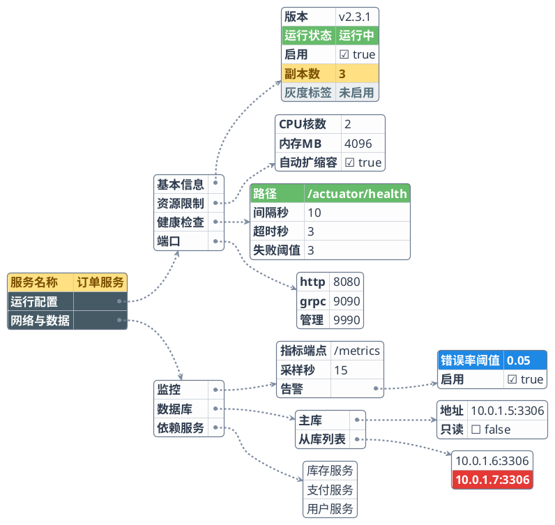
