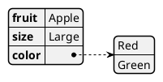
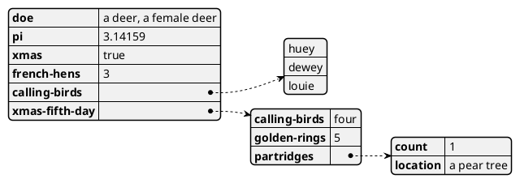
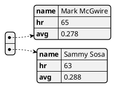
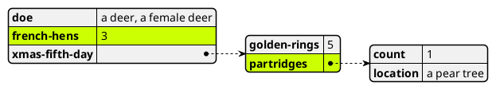
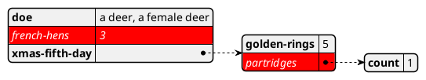
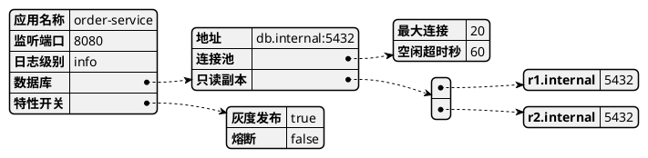
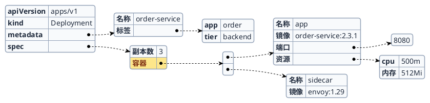
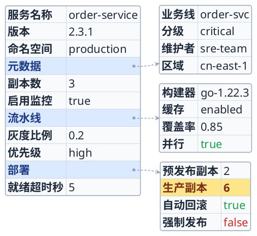

# 如何画 YAML 显示效果图 (YAML Diagram)

> YAML 显示效果图把一段 YAML 文本直接渲染成结构化的可视图形：映射（map）显示为带表头的键值表格，列表（list）展开为条目，嵌套结构用连线串起父子层级。它不是"画流程"，而是"把配置/数据结构原样画出来"，非常适合讲解 Kubernetes 清单、CI 流水线配置、应用配置文件、API 数据样例等场景。

## YAML 显示效果图的用途

YAML 图回答的是"这份配置/数据长什么样，层级如何组织"：
- 在设计文档中直观展示 Kubernetes / Helm / CI 流水线等 YAML 配置结构
- 讲解 REST / 消息体的数据样例，区分标量、列表与嵌套对象
- 对比配置项之间的层级关系，快速定位深层字段
- 用 `#highlight` 标注关键路径（如生产环境配置、必填项），做评审重点提示
- 作为规格文档里"配置即文档"的可视化载体，源码即图形、无需另画

与手绘框图相比，YAML 图的最大优势是**图形直接来自数据本身**：改一行 YAML，图就跟着变，杜绝图文不一致。

## 核心概念

### YAML 图的组成元素

| 元素 | YAML 写法 | 渲染效果 |
|------|-----------|---------|
| **标量 (Scalar)** | `key: value` | 表格中的一行"键 \| 值" |
| **字符串** | `version: "2.3.1"` | 值原样显示（带引号可保留前导零/纯数字文本） |
| **数字** | `replicas: 3` | 值按数字显示 |
| **布尔** | `enabled: true` | 值显示为 `true` / `false` |
| **映射 (Map)** | `key:` 下缩进的键值对 | 一个独立的键值表格，父节点用连线指向它 |
| **列表 (List)** | `key:` 下的 `- item` | 展开为条目；每个条目可以是标量或子映射 |
| **列表套映射** | `- name: a` / `  hr: 65` | 每个 `-` 生成一张子表格 |

### 结构如何渲染

- **顶层映射**渲染成最左侧的主表格，每个键占一行。
- **值是嵌套映射或列表**时，该行的值列显示为一个连接点（圆点），用箭头连向右侧的子表格 —— 图形因此自然地从左向右分层展开。
- **纯标量值**直接写在值列里，不再外连。
- **列表**：纯标量列表（如 `- a` / `- b`）在一个框里逐行列出；映射列表则每个元素单独成表，通过一个中间列表节点串联。

### 语法要点与注意事项

| 事项 | 说明 |
|------|------|
| 包裹标记 | 必须用 `@startyaml` 开头、`@endyaml` 结尾 |
| 缩进 | 用空格缩进表示层级（推荐 2 空格），与标准 YAML 一致 |
| 注释即指令 | 以 `#` 开头的行是 YAML 注释；PlantUML 复用它承载 `#highlight` 强调指令，普通注释同样被忽略 |
| **highlight 必须紧贴 `#`** | 写 `#highlight`（`#` 与 `highlight` 之间**无空格**）。若写成 `# highlight`（带空格），本地 jar（含 1.2026.x）会把整行当普通注释直接丢弃，高亮**完全不渲染**——这是最常见的失效原因 |
| 特殊键名 | 支持以符号/Unicode 开头的键，如 `@fruit:`、`$size:`、`&color:`、`❤:` |
| 纯数字/布尔文本 | 想让 `2.3.1`、`true` 当作字符串显示时加引号：`"2.3.1"`、`"true"` |
| 文本富样式 | 值里可用 Creole/HTML 标记，如 `**加粗**`、`<color:blue>Blue`、``（Creole on YAML） |

## PlantUML 语法

### 最小示例



`fruit`、`size` 是标量行；`color` 是一个列表，展开为 Red / Green 两条。

### 嵌套映射与列表



`xmas-fifth-day` 是嵌套映射，`partridges` 又嵌套一层，图形逐级向右展开。

### 列表套映射（数组对象）



顶层是一个映射列表，每个 `-` 元素渲染成一张 name/hr/avg 表。

### 强调关键路径 `#highlight`

用 `#highlight "键名"` 高亮顶层键；用 `/` 连接给出路径，逐级定位到深层键：



- **`#` 后不能有空格**：必须写 `#highlight`。写成 `# highlight`（带空格）会被本地 jar 当普通注释丢弃，高亮不渲染。官方文档里的示例用了空格，但那是服务器旧版的宽松解析；以本技能的本地渲染为准，一律写无空格形式。
- 路径中的每一段都要用引号包裹：`"父键" / "子键" / "孙键"`，各段之间用 ` / ` 分隔（斜杠两侧留空格、每段各自加引号）。不要写成 `"父键/子键"`（把整条路径塞进一对引号里不生效）。
- 高亮命中的是**键节点**（渲染成一个带背景色的圆角胶囊），只能命中键，不能命中值。若想突出某个值，把它设计成键（见「布局与美观技巧」）。
- highlight 指令写在 `@startyaml`（及 `<style>`）之后、YAML 正文之前。

### 自定义高亮样式 `<style>`

在 `<style>` 中定义 `yamlDiagram { highlight { ... } }` 覆盖默认高亮外观：

> **实测确认**：只要 highlight 指令写成**无空格**的 `#highlight`，`highlight` 样式块里的 `BackGroundColor` / `FontColor` / `FontStyle` 都会**如实渲染**（命中的键会填上背景色、换字色并加粗）。本地 jar 1.2026.x 已验证 `#FDE68A` 背景色可见。之前"背景色被忽略"的现象，根因是 `# highlight` 带了空格被当注释丢弃、样式块从未被触发——修正空格即可，无需再退回到值上的 Creole 变通。



### 多种高亮样式并存 `<<class>>`

定义多个样式类（`.h1`、`.h2`），在 highlight 行尾用 `<<类名>>` 分别套用：

```plantuml
@startyaml
<style>
    .h1 {
      BackGroundColor green
      FontColor white
    }
    .h2 {
      BackGroundColor red
      FontColor white
    }
</style>
#highlight "french-hens" <<h1>>
#highlight "xmas-fifth-day" / "partridges" <<h2>>

french-hens: 3
xmas-fifth-day:
  partridges:
    count: 1
@endyaml
```



### 全局节点/箭头样式 `<style>`

`yamlDiagram` 下的 `node`（表格节点）、`arrow`（连线）可整体调色调形：

```plantuml
@startyaml
<style>
yamlDiagram {
  node {
    BackGroundColor Khaki
    LineColor black
    FontName Helvetica
    FontColor black
    FontSize 14
    RoundCorner 0
    LineThickness 1.5
    separator {
      LineThickness 0.5
      LineColor black
    }
  }
  arrow {
    LineColor green
    LineThickness 2
    LineStyle 2-5
  }
}
</style>
-
  name: Mark McGwire
  hr:   65
-
  name: Sammy Sosa
  hr:   63
@endyaml
```



常用样式属性：

| 作用域 | 属性 | 含义 |
|--------|------|------|
| `node` | `BackGroundColor` | 表格背景色 |
| `node` | `FontColor` / `FontName` / `FontSize` / `FontStyle` | 字体色/字体/字号/字形 |
| `node` | `LineColor` / `LineThickness` / `LineStyle` | 边框颜色/粗细/线型（如 `10-5` 虚线） |
| `node` | `RoundCorner` | 圆角半径（0 为直角） |
| `node.separator` | `LineColor` / `LineThickness` / `LineStyle` | 行分隔线样式 |
| `highlight` | `BackGroundColor` / `FontColor` / `FontStyle` | 高亮胶囊的背景/文字/字形 |
| `arrow` | `LineColor` / `LineThickness` / `LineStyle` | 父子连线的颜色/粗细/线型 |

> 注意：颜色可用命名色（`red`、`Khaki`）或十六进制（`#FDE68A`）。渲染脚本对 `@startyaml` 会自动保留原生配色、不强制单色，因此 `<style>` 中的颜色会如实呈现。
>
> **尺寸/间距提示**：`node.FontSize` 是 YAML 图**唯一**能同时放大字号并拉开行距的属性（推荐 20~22）；`Padding` / `Margin` 对 `yamlDiagram` 节点**无效**，写了也不生效。`FontName` 若设成纯西文字体会让中文变豆腐块，正文含中文时请留空。详见「布局与美观技巧」。

## 完整示例

### 应用配置文件



### Kubernetes 风格清单（含高亮与样式）



## 最佳实践

- **让数据说话**：YAML 图的价值在于图形直接来自真实配置，尽量粘贴/精简真实 YAML，不要为画图而编造结构。
- **控制规模**：单张图只展示一个逻辑单元（一个 Deployment、一段流水线）。字段过多时删减无关项，或拆成多张图。
- **用引号锁定字符串**：版本号 `"2.3.1"`、纯数字端口如需当字符串、以及带前导零的值，一律加引号，避免被当成数字/布尔。
- **highlight 只标关键路径**：高亮 2–3 个评审重点（生产配置、必填项、易错项）即可，标太多等于没标。
- **highlight 写无空格**：一律 `#highlight`；带空格的 `# highlight` 会被当注释丢弃，是最常见的"高亮不出来"陷阱。
- **highlight 命中键、不命中值**：想突出"生产环境"这类信息，应把它设计成**键**（如让 `部署` 下用 `生产:` 做子映射键，再 `#highlight "部署" / "生产"`），而不是把 `生产` 写成值再去着色。这样声明与渲染一致，也省去内联 Creole 底色。
- **样式服务于可读性**：`<style>` 用来提升对比度和分层感，不要堆砌花哨颜色；保持背景浅、文字深。
- **缩进用空格**：与标准 YAML 一致，推荐 2 空格；不要混用 Tab 与空格导致层级歧义。

## 布局与美观技巧

YAML 图的布局由数据结构自动决定（从左到右逐层展开），无法像状态机那样用隐藏连线摆位。可控的美观手段集中在**尺寸/清晰度**、**结构设计**与**样式**三方面。

> **一句话方法论（本轮最关键）**：想让 YAML 图规整专业、重心居中，核心是把它设计成一棵**深度浅（优先 2 层）、分支等高的双列均衡树**——3 个扇出分支各自是一张**行数相同的叶表**，整幅图收敛成"左主表 + 右叶表列"两列、两列都撑满全高；再用三招消除本轮评审点名的失衡：①**结构键（值为空的父键）统一着"分区表头"冷色**（用 `<<class>>` 与叶子键区分），让空值单元格读作有意的分组标题而非残缺行；②**暖色重点高亮只落在"有实心值的叶子键"上**（而非空值父键），杜绝"高亮了却露出空白值格"的观感断层；③**各叶表行数相同、键/值长度相近**，使右列等高等宽、纵向等距、右边界不锯齿。下面按收益排序展开。

- **统一各扇出分支的嵌套深度——列对齐、消除交叉与残缺留白的第一杠杆**：YAML 图按"每多一层嵌套多一列"横向展开。若分支深度参差（如 `元数据/流水线/部署` 是 3 层，而 `资源限制/探针` 只有 2 层），浅分支的子表停在中间列、其右侧留空，深分支却铺到第 3 列，形成"右上密、右下空"的失衡；同时中间层节点被挤得高低错落，父子连线拉成长斜线相互穿插。**对策：让所有扇出分支嵌套到同一深度**（例如统一为"顶层键 → 2 个子映射 → 各 2 个标量"）。这样中间层表格排成整齐的一列、叶子层表格排成另一列，连线成为近乎平行的短线，交叉与残缺留白同时消失。这是把评审提到的"连线交叉 / 留白不均 / 同层不对齐"三个问题一次解决的根本手段。
- **用"扇出分支数量"调长宽比（趋近 3:2~4:3）**：深度统一后，图的**高度≈叶子层表格的总数**，宽度≈最深链的列数（固定）。因此分支越多越高、越趋近方形甚至竖长条。经验值：**3 个深度一致的扇出分支**（每分支 2 子映射）成图约 3:2 横版（最理想）；4 个分支会明显变方（约 1.1:1）；5 个分支会变成竖版。想要横版规整图，**优先用 3 个分支**；信息更多时宁可拆成多张图，也不要靠堆分支把图撑成竖条。
- **用顶层标量填补左侧空白、让主表撑满全高（改善留白均衡）**：扇出分支向右下铺开时，主表（最左列）往往比右侧分支栈矮，导致**左下方一大片空白**、重心偏右上。由于整图高度由"右侧分支栈"决定，**在主表里多写几行顶层标量键**（放在结构键之后作为收尾配置）可让主表向下延伸、填满左下空白，而**总高度不变、长宽比几乎不变**（右侧栈已经撑满画布）——这是零成本消除左下留白的手段。让主表底边与最下方子表底边大致齐平即可。

- **尺寸与呼吸感的唯一有效杠杆是 `node.FontSize`（Padding/Margin 无效）**：
  - `yamlDiagram` 节点**不响应** `Padding` / `Margin`（实测加不加、加多大，viewBox 完全不变）。想让元素不局促、行与行之间有呼吸感，靠**加大字号**——行高会随 `FontSize` 一起顶开，表格自然变高、留白更均衡。
  - 推荐 `FontSize` 取 **20~22**：这是"字够大够清晰"与"不触发降采样"的甜点。渲染脚本对 `@startyaml` 固定 `scale=4/dpi=300`，成图 PNG 目标 ≤4095px。结构越宽（层数越多）同样字号越占像素：本节推荐图（最深 3 层）在 `FontSize 22` 时约 3000px 宽、宽松居中；若结构更宽（如深链未收敛），22 号可能逼近 4095px 上限。**不要盲目调到 24 以上**——一旦超过 4095px，脚本会自动降 scale/dpi 反而让文字变糊，得不偿失。先按「控制长宽比」收窄结构，再放大字号，效果最佳。
  - **正文含中文时不要设纯西文 `FontName`**：`DejaVu Sans`、`Helvetica`、`Arial` 等无中日韩字形，中文会渲染成"□□"豆腐块。留空 `FontName` 使用默认字体即可正确显示中文；确需换字体也要选带 CJK 字形的字体。
  - 用 `separator`（浅灰细线）配合放大后的行高，让密集表格既清爽又透气。

- **键的重点高亮首选 `#highlight` + `highlight` 样式块（声明与渲染统一）**：只要指令写成**无空格**的 `#highlight`，`<style>` 里的 `highlight { BackGroundColor / FontColor / FontStyle }` 就会如实生效——命中的键渲染成带暖色底纹的加粗胶囊。这是标注"关注哪个键"最一致的方式：样式声明一处、渲染一处，不会出现"定义了样式却没被用上"的不一致。
  - **路径高亮的写法**：`#highlight "父" / "子" / "孙"`，各段各自加引号、用 ` / ` 连接。想突出某个"值"时，把它设计成键（如 `部署:` 下用 `生产:` 子映射），再用路径命中，避免"键用 highlight、值用 Creole 底色"两套写法并存。
- **值的语义着色用 Creole 富文本**：`highlight` 只作用于键；要给**值**上色（如布尔 `<color:#16A34A>true` 绿、`<color:#DC2626>false` 红，或 `<b>6` 加粗）时用 Creole。它与键高亮职责不同、互补而非重复：键高亮 = "看这个字段"，值着色 = "这个字段的取值有含义"。
- **给"结构父键"着分区表头色、暖色重点只留给叶子键（本轮核心改进——消除空值单元格的观感断层）**：嵌套父键（`元数据`/`流水线`/`部署` 这类值为空、仅作分组的键）在渲染时值列必然为空（只显示一个连接圆点）。上一版直接把这些**空值父键**用暖色 `#FDE68A` 高亮，结果"暖色胶囊 + 右侧空白值格"与叶子的"实心值框"并列，观感断层、被评审扣分。**对策是用 `<<class>>` 给两类键分色**：
  - 定义 `.section`（冷色，如 `BackGroundColor #DBEAFE` + `FontColor #1E3A8A` + `FontStyle bold`）套给**所有结构父键**——冷色表头让"空值单元格"读作**有意的分组标题**（像分节栏），而非残缺行；
  - 定义 `.focus`（暖色 `#FDE68A`）**只套给一个"有实心值的叶子键"**（如 `部署 / 生产副本`，其值为 `6`）——暖色胶囊右侧是实心值框，与其它叶子完全一致，杜绝空白值格。
  - 写法：`#highlight "元数据" <<section>>`、`#highlight "部署" / "生产副本" <<focus>>`。冷表头 + 暖焦点形成"分区清晰、重点唯一"的层次，且声明与渲染一致。这直接落实评审建议"为父级键与叶子键设置不同底色，弱化空值列的视觉断层"。
- **优先设计成"浅（2 层）双列均衡树"——压掉对角级联与右下留白的根本手段（本轮核心改进）**：上一版是 3 层深树（顶层键→2 子映射→各 2 标量），叶子层多达 6 张小表沿右侧纵向铺开、比左主表高出一截，形成"叶子框对角下坠、右下留白大、重心偏左上"的失衡（评审点名）。**把深度从 3 层降到 2 层**（顶层结构键直接带一张多行叶表，如 `元数据: { 业务线, 分级, 维护者, 区域 }`）后，整幅图收敛为**左主表 + 右叶表列**的两列布局：每个结构分支只对应**一张**叶表，右列小表数量从 6 张锐减到 3 张，对角级联消失。再让**3 张叶表行数相同（如各 4 行）**，它们在右列**等高、等距**排列，左主表用顶层标量撑到同样高度——两列都撑满全高、重心归中，长宽比落在均衡的 ~1.3:1（4:3 附近）。这是评审建议"减少嵌套层深让右侧叶子框更紧凑对齐、压缩右下角空白"的直接实现。
- **叶表行数与键/值长度取齐，右列纵向等距、右边界不锯齿**：右列 3 张叶表若行数不等或最宽内容差异大，就会高低错落、右边界参差。**让每张叶表都是相同行数（推荐各 4 行）**，父键在等高子表间取中心时上下对称、连线等距；再把叶表的**键名长度**（如都取 2~3 字）与**值文本长度**（字符串都控制在 8~9 字符，如 `order-svc`/`sre-team`/`go-1.22.3`）尽量取齐，右边界即大体对齐。数值/布尔值天然短、其所在叶表窄一档，属数据决定的可接受两档宽，不必编造长值。
- **用 `<style>` 提升可读性**：
  - `node.BackGroundColor` 用浅色（如 `#F8FAFC`）、`FontColor` 用深色（如 `#1E293B`），保证对比度。
  - `node.RoundCorner` 用适中值（如 6）并**全图一致**；`node.separator` 用浅灰细线（`#CBD5E1`、`LineThickness 0.8`）分隔行，让密集表格更清爽。
  - `arrow.LineColor` 用中性灰（如 `#94A3B8`）、`arrow.LineStyle 4-3` 做浅色虚线，让父子连线不喧宾夺主。
  - 配色遵循"冷色主体 + 暖色重点"：主体用蓝灰冷色，`highlight` 用暖色 `#FDE68A` 制造对比。
- **控制长宽比（避免过宽，趋近 3:2~4:3）**：YAML 图默认横向展开，**每多一层嵌套就多一列**，深链会把画面拉宽（评审常见扣分点，2:1 以上会明显松散）。收敛横向跨度、把长宽比拉回 3:2~4:3 的手段（按收益排序）：
  - **把最深的一层"上提"为顶层键——降深度是最有效的减宽杠杆**：图的宽度≈最深链的层数。若出现 `A: { B: { C: {...} } }` 这样 4 层深链，把中间的 `B` 直接提到顶层（`A` 与 `B` 并列做顶层键），最深链立刻从 4 层降到 3 层，右侧整整少一列。例：把 `流水线: { 部署: { 生产: {...} } }`（4 层）改写成 `流水线` 与 `部署` 两个并列顶层键，`部署: { 生产: {...} }` 只剩 3 层——宽度显著收窄、被上提的键还能成为可高亮的顶层键。
  - **优先用映射代替"列表套映射"来做深层分支**：把 `部署: [ {环境: 生产, ...} ]` 改成 `部署: { 生产: {...} }`，既少一个中间"列表节点"列（更窄），又让 `生产` 成为可高亮的键。
  - **缩短超长的值文本**：命令、路径、镜像名等尽量用短示意值（`go build` 优于 `go mod download && go build -o app`），过长的字符串会把右侧子表撑宽、重心偏移。
  - **增加顶层键以增高、平衡比例**：图偏宽时，把可平铺的信息放到更多顶层键（纵向增高），比继续往深层嵌套（横向拉宽）更利于长宽比趋近方正。
  - **把深层结构控制在 3 层内**，或拆成多张图。
- **让结构键"就近声明"，使父子连线短而横平、杜绝交叉（消除牵连感）**：YAML 图把父节点大致对齐到其子树的垂直中心。若把所有扇出结构键**挤在主表的连续几行**（如全部集中在中段），它们的子树却要分摊到右侧的上/中/下，连线就被拉成从中段辐射到上下的长斜线、彼此穿插产生"牵连感"。对策是**把结构键在主表里适当拉开、与标量交错排列**，让每个结构键落在它子树将要出现的高度附近：顶部分支的键写在主表上部、底部分支的键写在主表下部。这样每条父子连线都接近水平、长度更短，三条连线成为互不穿插的整齐横线——这正是评审建议的"让高扇出节点的子树垂直错开、避免连接线相互穿插"。
- **均衡子树高度、消除大片空白（改善留白分布）**：YAML 图对每个父节点按声明顺序自上而下排列子节点。若某一顶层分支是"高瘦深树"（如多层流水线），而其它顶层分支是"矮小浅表"，深树会把画面撑高，浅表分支被挤到底部、其右侧留出大片空白——重心失衡、扣美观分。对策：
  - **让各顶层分支的"体量"尽量接近**：配合上面"统一嵌套深度"，让每个子树都是 2 子映射、各 2 项标量的中等高度，整幅图像"对齐的矩阵"而非"一根长藤 + 几片碎叶"。
  - **把小而孤立的分支并入相邻的父映射**：与其让 `标签`、`注解` 各自从根节点单独引出（位置低、连线长、彼此分散），不如合并进一个 `元数据:` 顶层映射（`元数据: { 标签: [...], 注解: {...} }`），让它们成组、连线短、留白规整。
- **叶子层用"同型表"消除成对节点纵向不齐（本轮核心改进）**：评审常见扣分点是"成对叶节点垂直间距不均"。根因往往是**叶子层混排了不同形态的节点**——纯标量列表渲染成**单列框**、映射渲染成**双列表**，二者的宽高不同，父节点在其上下两个异形子节点之间取中心时就会偏移，导致成对叶节点高低不齐。**对策：让同一叶子层的所有节点都是"行数相同的同型表"**（例如统一为 2 行的 map 子表）。把原本想用纯标量列表表达的叶子（如 `标签: [team-order, critical]`）改写成 2 行 map（`标签: { 业务线: order-svc, 分级: critical }`），使叶子层成为"整齐的同型矩阵"，成对节点纵向自然对齐。纯标量列表的写法仍可在"最小示例/嵌套示例"里演示，但**推荐测试图这类要求规整的成图，优先全用同型 map 叶子**。
- **消除右边界"锯齿"——让各叶表最宽单元格长度相近**：`yamlDiagram` **没有** min-column-width / 列宽固定 / 右对齐的官方属性（不要臆造 `MinWidth`、`Align` 之类）。每张叶表的宽度由它**自己最宽的单元格**决定，因此各叶表值文本长短不一时，右边界就参差成锯齿。可控手段是**内容层面对齐**：① 让处于同一垂直带、上下相邻的叶表选用**长度相近的示意值**（如都控制在 8~9 字符：`order-svc`/`sre-team`/`go-1.22.3`）；② 给值加引号锁定为字符串，宽度更可预期；③ 统一同层叶表的**键名长度**（键列宽也影响整表宽度）；④ 避免单张叶表里塞一个超长值（长镜像名、长命令）把该表撑宽、其余表却很窄。数值/布尔值（`0.85`、`true`、`6`）天然很短，其所在叶表会比字符串叶表窄一档，这是**数据本身决定的、可接受的两档宽度**，不必为对齐而编造长值。
- **压缩右半区横向空档、收紧长宽比**：中间列（col2 分组表）到叶子列（col3）的连线长度由"叶表相对分组表的纵向错位"自动决定，**无法用属性直接设定跨度**。能收窄右半区、让长宽比更紧凑均衡的实际手段有三：① **缩短叶层值文本**——col3 越窄，整图越窄（本轮把 `golang:1.22` 等改短后，成图宽度从 ~2900 降到 ~2770）；② **让每个 col2 分组恰好带 2 个同型子节点**——父节点在两个等高子节点间取中心，连线上下对称、跨度最小，避免"1 个或 3 个子节点"造成的偏心长斜线；③ **控制最深链层数**（见「控制长宽比」），层数就是列数，直接决定宽度。
- **列表节点无法单独着色，用"结构分层"代替"颜色分层"**：`yamlDiagram` 的 `node` 样式是**全局**的，没有官方语法只给"列表节点"单独设背景色，也**没有**按嵌套层级分设不同底色的官方属性（想给"一级键"与"嵌套子表"用深浅不同的背景是做不到的，不要臆造 per-level 样式）。想让层级被一眼区分，靠**结构**而非颜色：把同类项收进同一父映射（如 `元数据`）下，用位置、父子连线与 `#highlight` 暖色胶囊体现层级与重点，而非另设底色。
- **列表就近合并**：纯标量列表（如标签 `- a` / `- b`）会挤在一个框里，天然紧凑；避免把本可用标量列表表达的内容拆成多个键。
- **善用引号稳定显示**：版本号、纯数字文本加引号既保证语义正确，也让值列宽度更可预期，图形更整齐。

## 推荐测试图

一份贴近真实的服务发布配置：涵盖标量、字符串、布尔、整数、浮点、嵌套映射，配完整 `<style>`（**放大字号 `FontSize 22`** + 节点/分隔线/虚线箭头）、**两个高亮类 `<<section>>`/`<<focus>>`**（无空格 `#highlight`）分色标注结构父键与重点叶子键，并用 **Creole 富文本**给布尔/整数值做语义着色。**结构收敛为"浅（2 层）双列均衡树"——3 个结构分支各带一张 4 行同型叶表，整幅图为"左主表 + 右叶表列"两列布局，两列都用顶层标量/等高叶表撑满全高；结构父键统一冷色分区表头、暖色重点只落在有实心值的叶子键上；叶表键/值长度取齐，右列等高、等距、右边界不锯齿**。成图约 **2120×1650px、长宽比约 1.29:1（4:3 附近、紧凑均衡、重心居中）、字迹清晰、行距透气、双列全高对齐、留白均匀、连线短而不交错**。可直接复制用作渲染自检。

> 关键设计（美观优先：浅双列均衡树 + 分区表头/叶子焦点分色 + 同型叶表，声明与渲染一致）：
> 1. **浅（2 层）双列均衡树、消除对角级联与右下留白（本轮核心改进）**：上一版是 3 层深树、右侧多达 6 张小表沿对角下坠、比左主表高一截，导致"右下留白大、重心偏左上"（评审点名）。本版降到 **2 层**——每个结构键（`元数据`/`流水线`/`部署`）直接带**一张 4 行叶表**，右列小表从 6 张减到 3 张、对角级联消失；三张叶表等高等距、左主表用顶层标量撑到同高，**两列都撑满全高、重心归中**（详见「布局与美观技巧」的"优先设计成浅双列均衡树"）。
> 2. **结构父键着冷色分区表头、暖色焦点只给叶子键——根治空值单元格断层（本轮核心改进）**：上一版把**空值父键** `元数据`/`部署` 用暖色高亮，暖胶囊右侧却是空白值格，与叶子的实心值框观感断层。本版用 `<<class>>` 分色：`.section` 冷蓝套给全部结构父键（空值格读作"分组标题"）、`.focus` 暖黄**只套给 `部署 / 生产副本`**（其值为 `6`，实心值框，与其它叶子一致）——"暖胶囊 + 空白格"的断层彻底消失（详见"给结构父键着分区表头色"）。
> 3. **叶表同型 4 行、右列等距、右边界不锯齿**：三张叶表都是 4 行、键名取 2~3 字、字符串值控制在 8~9 字符（`order-svc`/`sre-team`/`go-1.22.3`），右列纵向等距、右边界大体对齐；数值/布尔叶表天然短、自成可接受的一档（详见"叶表行数与键值长度取齐"）。
> 4. **顶层标量撑满主表、双列全高齐平**：`服务名称/版本/命名空间/副本数/启用监控/灰度比例/优先级/就绪超时秒` 等顶层标量让最左列主表向下延伸到与右列叶表栈齐平，左右两列同高、无空白角（详见"用顶层标量填补左侧空白"）。
> 5. **结构键就近声明、连线横平不交叉**：`元数据`/`流水线`/`部署` 与顶层标量**交错排列**（靠上/中/下），每个结构键落在其叶表将出现的高度附近，三条父子连线接近水平、短而互不穿插（详见"让结构键就近声明"）。
> 6. **用 `FontSize` 撑大字号、拉开行距（呼吸感的唯一有效杠杆）**：`node.FontSize 22` 让文字清晰、行高随之增大。注意 `Padding`/`Margin` 对 `yamlDiagram` 节点**无效**，别指望它们留白——放大字号才是正解。
> 7. **值的语义着色用 Creole**：`true` 绿 / `false` 红 / `6` 加粗，作用于值，与键高亮互补。
> 8. **不设英文 `FontName`**：正文含中文时，切勿把 `FontName` 设成 `DejaVu Sans`/`Helvetica` 等纯西文字体（会渲染成"豆腐块"方框）；留空即用默认的中日韩可用字体。



渲染验证：

```bash
bash skills/draw-plantuml/scripts/render-plantuml.sh <input.puml> <outdir> <prefix>
```

正确渲染时应看到：最左侧主表格逐行展开全部顶层键（8 个标量与 `元数据`/`流水线`/`部署` 三个结构键交错排列，主表撑满全高、无空白角）；三个结构键各向右用浅灰虚线连出**一张 4 行叶表**——`元数据`→业务线/分级/维护者/区域，`流水线`→构建器/缓存/覆盖率/并行，`部署`→预发布副本/生产副本/自动回滚/强制发布。因是**2 层浅树**，整幅图就是"左主表 + 右叶表列"两列布局，右列 3 张同型 4 行叶表**等高、等距、右边界大体对齐**，左右两列同高齐平——对角级联与右下留白消失、重心居中。布尔、整数、浮点（`3/6/0.85/0.2`）按类型显示。层次分明：三个**结构父键**由 `.section` 渲染成**冷蓝 `#DBEAFE` 分区表头**（其空值单元格读作分组标题，不再是残缺行）；唯一的**暖色重点** `.focus` 落在 `部署 / 生产副本` 这一**有实心值的叶子键**上（暖黄 `#FDE68A` 胶囊 + 右侧值 `6`，与其它叶子一致，无空白值格断层）；值层面 `true` 绿、`false` 红、`生产副本 6` 加粗。`FontSize 22` 使成图约 **2120×1650px、字迹清晰不局促**，行距被字号顶开；整体长宽比约 **1.29:1（4:3 附近、紧凑均衡、重心居中）**、双列全高对齐、右边界不锯齿、留白均匀、连线横平不交错、中文无豆腐块、无裁剪。
