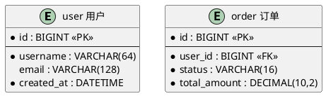
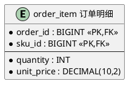
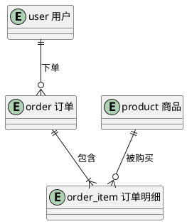
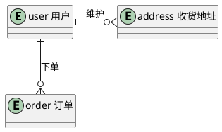
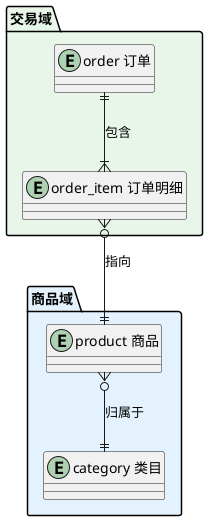
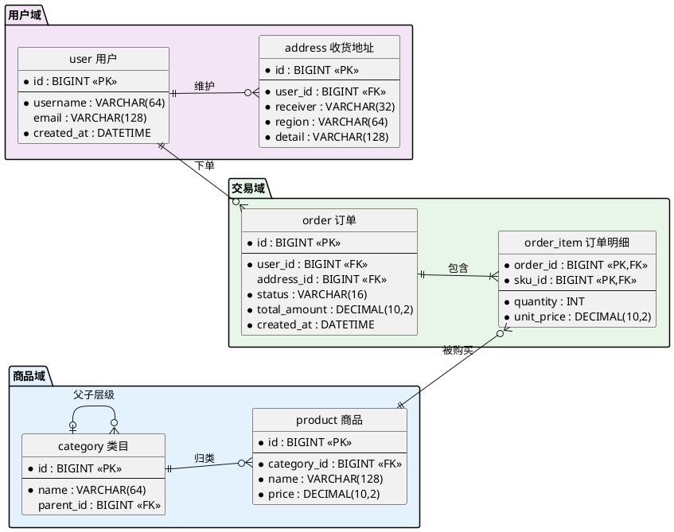
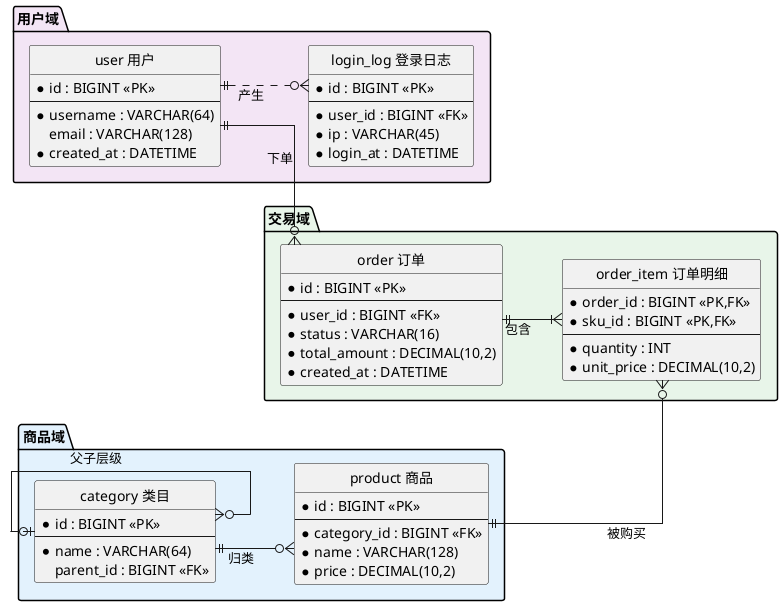

# 如何画 ER 实体关系图（Entity-Relationship Diagram）

> ER 图（实体关系图）用「实体 + 属性 + 乌鸦脚基数」描述数据库表结构与表间关系，回答"系统有哪些核心数据实体、它们各自有哪些字段、彼此之间如何关联"。是数据库设计、数据建模评审、表结构文档化的核心工具。

## ER 图的用途

ER 图回答的是"数据如何组织"：
- 数据库表结构设计（表、字段、主键/外键）
- 实体间基数关系（一对一 / 一对多 / 多对多）
- 领域数据模型评审与文档化
- 逆向展示现有库表结构

**ER 图 vs 类图的选择**：类图面向对象建模（行为、继承、接口），ER 图面向数据建模（表、键、基数）。画数据库表结构时一律用 ER 图——`entity` 元素 + 乌鸦脚记号比类图的 `class` + 菱形关联更贴切。

**定位说明**：PlantUML 官方把 ER 图归为非 UML 图，但它用 `@startuml`/`@enduml` 包裹、`entity` 语法、走 Graphviz 布局、接受 `skinparam entity` 与 `monochrome` 等 UML 样式规范——因此在本技能中按 **UML 图同套样式规范**处理（渲染脚本会按普通 UML 图注入样式），而不是按 WBS/JSON 那类原生语法专项图处理。

## 核心概念

| 概念 | PlantUML 语法 | 说明 |
|------|-------------|------|
| **图边界** | `@startuml` / `@enduml` | ER 图没有独立起止标签，与普通 UML 图一致 |
| **实体** | `entity "表名" as 别名 { ... }` | 对应一张表（或逻辑实体） |
| **标识属性（主键）** | `--` 分隔线之上的属性 | 带 `*` 前缀，构成主键；多个即复合主键 |
| **普通属性** | `--` 分隔线之下的属性 | `*` 前缀 = 必填（NOT NULL），无前缀 = 可空 |
| **属性类型** | `名称 : 类型` | 如 `username : VARCHAR(64)` |
| **基数（乌鸦脚）** | `\|` 一、`o` 零、`}` 多 | 组合成 `||` `o|` `}|` `}o` 四档 |
| **关系** | `A ||--o{ B : 标签` | 实线 `--` 标识性关系；虚线 `..` 非标识性关系 |

### 乌鸦脚记号速查

每一侧用两个符号表达「最小-最大」基数：

| 记号 | 含义 | 读法 |
|------|------|------|
| `\|\|` | 恰好一个 | one and only one |
| `o\|` | 零或一 | zero or one |
| `}\|` | 一或多 | one or many |
| `}o` | 零或多 | zero or many |

关系两端的符号**各自描述靠近自己的那个实体**在对端眼中的基数。例如 `user ||--o{ order` 读作：一个 user 对应零或多个 order，每个 order 恰好属于一个 user（`{` 是 `}` 的镜像）。

## PlantUML 语法

### 1. 实体与属性

`entity` 块内用 `--` 把属性分为两区：上面是标识属性（主键），下面是普通属性。`*` 前缀表示该属性必填：



约定俗成：主键属性旁注 `<<PK>>`、外键旁注 `<<FK>>`，以纯文本形式渲染，简单有效。

复合主键：`--` 之上放多个 `*` 属性即可：



### 2. 乌鸦脚关系

实体间用乌鸦脚记号连接，冒号后给关系命名（动词短语，说明业务含义）：



常见基数模式：
- **一对一**：`A ||--|| B`（如 user ↔ user_profile）
- **一对多（可选）**：`A ||--o{ B`（如 user ↔ order，主表侧可以没有子记录）
- **一对多（强制）**：`A ||--|{ B`（如 order ↔ order_item，订单至少有一条明细）
- **多对多**：`A }o--o{ B`——逻辑建模可用；物理建模应引入关联表（如 `student }o--o{ course` 应拆出 `enrollment` 实体），拆成两个一对多

虚线表示非标识性关系（外键不构成子表主键的一部分）：`user ||..o{ login_log`。

### 3. 方向控制

乌鸦脚连线的中间段可嵌入方向关键字（`-left-` / `-right-` / `-up-` / `-down-`），控制相对位置：



也可用 `left to right direction` 让主从链横向展开（宽表结构时更紧凑）。

### 4. 分组与隐藏边

相关实体用 `package` 按领域分组；`-[hidden]-` 隐藏边用于对齐，`together { }` 强制同级排布：



### 5. 样式

ER 图走 UML 样式规范（见 [style.md](../guide/style.md)）：渲染脚本自动注入单色/字体/缩放等 skinparam。ER 特有可选项：

```plantuml
@startuml
' 隐藏实体框左上角的 (E) 构造型圆标，画面更干净
hide circle

' 实体配色（彩色模式下按域区分）
skinparam entity {
  BackgroundColor #FFF8E1
  BorderColor #F9A825
}
@enduml
```

- 单色模式（默认）下无需任何配色，乌鸦脚记号本身即语义。
- 彩色模式建议按「域」上色（交易域一色、商品域一色），而非逐表随意上色。
- 需要正交走线时加 `skinparam linetype ortho`，交叉更少（大图尤其明显）。

## 完整示例

### 电商核心库表（7 实体 + 复合主键 + 域分组）



要点：
- 三个域用 `package` + 浅色分组，域内实体聚合、域间关系一眼可辨。
- `order_item` 用复合主键（`order_id + sku_id`），两个外键同时是主键成员——标识性关系。
- `cat |o--o{ cat` 自引用表达类目树。
- 关系标签全部用业务动词（下单/包含/归类），而非泛泛的 "has"。

## 布局与美观技巧

- **核心实体居中、维表环绕**：把关系最多的实体（如 `order`）放在声明顺序的中间位置，让从表环绕四周，减少长线穿越。
- **主从链用方向锁死**：`user ||-down-o{ order` 这类显式方向让主表恒在上方/左方，避免自动布局把主从摆反。
- **属性数量控制**：单实体属性 ≤10 个为宜；宽表（几十列）只画关键列，尾部加一行 `... 共 N 列` 说明，或用 `note right of 实体` 外置完整 DDL。
- **隐藏边对齐同层实体**：并列的维表之间加 `-[hidden]-` 让它们排成一列/一行，画面更整齐。
- **大图用正交路由**：实体 >8 个时 `skinparam linetype ortho` 能显著减少斜线交叉。
- **标签 ≤10 字符规则同样适用**：关系标签用 2~4 字动词（下单/包含/归类），表名用业务名 + 英文表名双行（`"order 订单"`）。
- **左右方向选择**：实体多、属性少 → `left to right direction` 横向链；实体少、属性多（高框）→ 默认 `top to bottom`。

## 最佳实践

- **物理建模拆多对多**：`}o--o{` 只适合概念模型；落到库表设计时必须引入关联实体（如 `order_item`），并标复合主键。
- **标识性 vs 非标识性**：外键是子表主键一部分 → 实线 `--`；仅是普通外键 → 虚线 `..`。
- **键的可见性**：每张表必须能一眼看到主键（`--` 之上）与外键（`<<FK>>` 标注），这是 ER 图的核心信息。
- **与组件图/部署图配合**：ER 图表达数据模型，组件图表达服务边界；跨图用一致的实体命名（稳定词汇），形成图集。
- **不要把 ER 画成类图**：ER 不表达方法/继承；需要表达行为时另开类图。

## 推荐测试图

下面是一张综合运用本文关键技巧的 ER 图，可作为渲染测试用例（域分组、复合主键、自引用、强制/可选基数、正交路由）：



关键点回顾：
- **实线/虚线区分标识性**：`order ||--|{ item`（外键属复合主键）用实线；`user ||..o{ log`（普通外键）用虚线。
- **复合主键**：`order_item` 的 `order_id + sku_id` 均在 `--` 之上并标 `<<PK,FK>>`。
- **自引用**：`cat |o--o{ cat` 表达类目树（一个类目可有零或多个子类目，每个子类目恰属零或一个父类目）。
- **正交路由 + 左右方向**：`skinparam linetype ortho` + `left to right direction` 让 7 实体大图的走线横平竖直、交叉最少。
- **域分组即配色**：三个 `package` 浅色分组同时承担逻辑分区与视觉配色职责，无需逐实体上色。

## 参考

- 官方文档：https://plantuml.com/zh/ie-diagram
- 样式规范：[style.md](../guide/style.md)（ER 走 UML skinparam 规范）
- 大图治理：[large-diagram-playbook.md](../guide/large-diagram-playbook.md)
