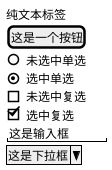
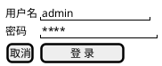
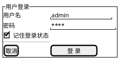
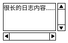
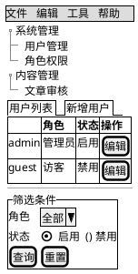
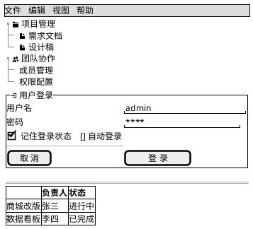

# 如何画 Salt UI 线框图（Wireframe）

> Salt（也叫 wireframe）是 PlantUML 的界面原型语法：用纯文本拼出窗口/表单的线框草图，回答"这个界面长什么样、有哪些控件、如何排布"。是需求讨论、UI 走查、接口契约确认阶段的低成本沟通工具。

## Salt 图的用途

Salt 回答的是"界面的结构与控件布局"：
- 登录页 / 表单页 / 设置页等界面线框
- 管理后台（菜单 + 导航树 + 表格 + 表单的组合布局）
- 需求评审时快速对齐界面元素，避免"文字描述各想各的"

**定位说明**：Salt 不追求高保真视觉——它故意保持手绘线框风格，让读者聚焦**布局与控件**而非配色图标。需要高保真 UI 时请用专业设计工具；Salt 的价值是"30 秒把界面结构写成文本、可进版本库"。

**渲染说明**：Salt 用 `@startsalt`/`@endsalt` 包裹，**无需 Graphviz**（PlantUML 内置渲染）。渲染脚本 [render-plantuml.sh](../../scripts/render-plantuml.sh) 已将其识别为专项图：跳过 UML 单色 skinparam，只注入字体与缩放参数，保留原生线框外观。

## 核心概念

| 概念 | PlantUML 语法 | 说明 |
|------|-------------|------|
| **图边界** | `@startsalt` / `@endsalt` | Salt 图必须包裹在这对标签中 |
| **根面板** | `{ ... }` | 整个窗口内容包在一对大括号里 |
| **行** | 换行 | 每行一个界面行 |
| **列** | `\|` 分隔 | 同一行内用竖线分列，天然对齐表单 |
| **网格线修饰符** | `{` 后紧跟 `#` / `!` / `-` / `+` | `#` 全部网格线、`!` 仅竖线、`-` 仅横线、`+` 仅外框线 |
| **分组框** | `{^"标题" ... }` | 标题嵌在边框上的容器，可嵌套 |
| **分隔线** | `..` / `==` / `~~` / `--` | 点线 / 双线 / 波浪线 / 单线 |
| **空白填充** | `.` | 独占一行，填充垂直空间（撑高度） |

## PlantUML 语法

### 1. 基础控件

| 控件 | 语法 | 备注 |
|------|------|------|
| 按钮 | `[文字]` | 方括号 |
| 输入框 | `"文字"` | 双引号；内部空格撑宽度 |
| 复选框 | `[X]` / `[]` | 选中 / 未选中 |
| 单选框 | `(X)` / `()` | 选中 / 未选中 |
| 下拉框 | `^文字^` | 尖号包裹 |
| 展开的下拉 | `^选项^^ 项1^^ 项2^` | 显示下拉列表内容 |
| 图标 | `<&图标名>` | OpenIconic 图标，如 `<&account-login>`；完整清单可用 `listopeniconic` 图查看 |
| 富文本 | `<b>` `<i>` `<color:>` | Creole 标记可用 |

### 2. 列布局（`|`）

同一行的 `|` 把内容分列——这是表单对齐的核心手段（标签列 | 输入列 | 按钮列）：

### 3. 分组框（`{^"标题"`）与分隔线

分组框把相关控件圈成带标题边框的视觉区块；`--`/`==` 等分隔线用于区内分段：

- `{^"标题"` 开分组框，`}` 收尾；可多层嵌套表达窗口 → 面板 → 分区。
- 分隔线四种：`..` 点线、`==` 双线、`~~` 波浪线、`--` 单线。
- 注意区分：`{+` 不是分组框——它是「仅画外框线」的网格修饰符（见核心概念表）。

### 4. 导航树（`{T`）

`+` 个数表示层级深度；树内还可以用 `|` 挂多列数据（树表结合）：

```plantuml
@startsalt
{
  {T
   + 系统管理
   ++ 用户管理
   ++ 角色权限
   + 内容管理
   ++ 文章审核
  }
}
@endsalt
```

- 树只有 `+` 层级记法，**没有折叠节点语法**。
- 线条变体：`{T!`（竖线）、`{T-`（横线）、`{T+`（外框线）、`{T#`（全部网格线）。
- 树表结合：`+Region | Population | Age` 让树节点携带列数据。

### 5. 表格（`{#`）

```plantuml
@startsalt
{
  {#
  . | <b>角色 | <b>状态
  admin | 管理员 | 启用
  guest | 访客 | 禁用
  }
}
@endsalt
```

`{#` 画带全部网格线的表格；行内 `|` 分列，`.` 表示空单元格，首行加 `<b>` 作表头：

- 网格线修饰符同样适用：`{!` 只画竖线、`{-` 只画横线、`{+` 只画外框。
- Salt 没有专用表头标记——把第一行当表头，用 Creole `<b>` 加粗即可。

### 6. 菜单栏与页签栏

```plantuml
@startsalt
{
  {* 文件 | 编辑 | 工具 | 帮助 }
  {/ 用户列表 | 新增用户 }
  这里是页签内容区……
}
@endsalt
```

- `{* ... }` 渲染为顶部菜单栏（`|` 分隔菜单项）；写两行可模拟展开的下拉菜单：
  `{* 文件 | 编辑` 换行 `文件 | 新建 | 打开 | 关闭 }`。
- `{/ ... }` 渲染为页签（Tab）栏；页签项可带 `<b>` 标记当前页。

### 7. 滚动面板（`{S` 系列）

表达"内容超出一屏"的区域：

- `{S`：水平 + 垂直滚动条
- `{SI`：仅垂直滚动条
- `{S-`：仅水平滚动条

## 完整示例

### 管理后台主界面（菜单 + 导航树 + 表格 + 表单）

要点：
- 顶层 `{ ... | ... }` 用一列布局把窗口切成「左树右内容」。
- 内容区再纵向叠放页签栏、网格表格、分隔线、筛选分组框。
- 控件即语义：`[编辑]` 按钮、`^全部^` 下拉、`(X)` 单选，读者一眼识别交互元素。

## 布局与美观技巧

- **用 `|` 对齐表单**：标签与输入框分列后，各行输入框左缘天然对齐，比混排整洁得多。
- **输入框宽度用空格撑**：`"admin          "` 内部空格决定输入框视觉宽度，按真实输入长度预留。
- **分组框即信息架构**：`{^"标题"` 把相关控件圈成一个视觉区块——一个界面 2~4 个分组框为宜，再多就该拆页面了。
- **复杂后台用「树 | 内容」双栏**：左侧 `{T` 导航树 + 右侧业务区，是后台原型的通用骨架。
- **表格加全网格线**：`{#` 让行列边界清晰；内容稀疏时可用 `{!`（仅竖线）减轻视觉噪音。
- **图标点睛**：按钮或菜单项上加 `<&icon>`（如 `<&account-login> 登录`、`<&cog> 设置`），少量即可——线框图堆图标反而嘈杂。可用 `listopeniconic` 图查全部图标名。
- **善用页面元素**：Salt 同样支持 `title` / `header` / `footer` / `caption` / `legend`，给原型图加上标题与图例更专业。
- **保持低保真**：不要试图用 Salt 表达配色/圆角/阴影等视觉细节；它只承诺布局与控件准确。

## 最佳实践

- **一图一屏**：一张 Salt 图对应一个界面/对话框，不要把多个页面拼进一张图。
- **控件用对类型**：单选别用复选、下拉别用输入框——控件类型本身就是交互语义。
- **文字贴近真实**：按钮写真实文案（"保存并发布"而非"按钮1"），评审时才能发现文案/流程问题。
- **与用例图/活动图配合**：用例图定义"谁用什么功能"，Salt 图定义"功能界面长什么样"，活动图定义"界面间的操作流程"——三者构成需求图集。
- **版本控制友好**：Salt 是纯文本，界面变更可直接 diff，建议与需求文档同库维护。

## 推荐测试图

下面是一张综合运用本文关键技巧的 Salt 图（已用渲染脚本实测通过）：菜单栏、双栏布局、导航树、分组框（标题嵌边框）、全网格表格（`.` 空单元格 + `<b>` 表头）、分隔线、按钮/输入/复选全控件覆盖：

关键点回顾：
- **双栏骨架**：顶层 `{ 树 | 内容 }` 一列布局切分左右栏，内容区内部再纵向叠放。
- **分组框**：`{^"用户登录"` 标题嵌在边框上，框内用 `|` 让标签列与输入列对齐，`--` 分隔输入区与按钮区。
- **表格**：`{#` 全网格线；首行 `.`（空左上角单元格）+ `<b>` 加粗作表头。
- **图标克制**：仅在导航树和分组标题处用 `<&...>` 图标点睛，保持线框的清爽感。

## 参考

- 官方文档：https://plantuml.com/zh/salt
- 渲染脚本：[render-plantuml.sh](../../scripts/render-plantuml.sh)（Salt 按专项图处理，无需 Graphviz）
