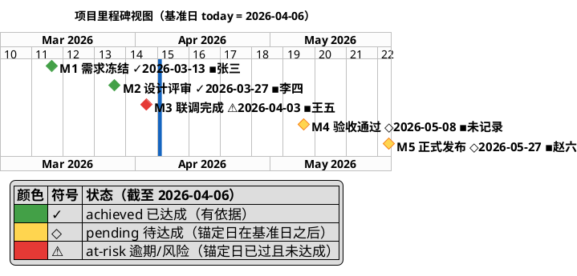

# 层参考：项目里程碑 —— 里程碑是什么、完成了哪些

对应报告 `## 项目里程碑` 节。面向外部读者回答两个问题：**项目的里程碑是什么？当前完成了哪些里程碑？** 工作流主框架见 [../SKILL.md](../SKILL.md)；跨层公共约定见 [reporting-playbook.md](reporting-playbook.md)（日期格式、里程碑配色、图说三要素等见其「跨层图表呈现公约」节）。

**边界**：本文档只写**呈现什么、怎么呈现**。里程碑的状态判定、锚定日换算、逾期天数、视图独立成图的日期侧条件，全部由 `scripts/progress-engine.py` 计算，本文档只写"取引擎哪个字段、怎么落在图与表上"——见 [consistency-rules.md](consistency-rules.md) §0.1「计算下沉」。

## 呈现要素

- **里程碑进度汇总表（强制，置于跟踪表之前）**：三行——「达成率」（`分子/分母 = 百分比%`）、「已达成 / 逾期 / 待达成（共 N）」、「最大逾期天数」。数值**逐个取进度引擎的里程碑汇总字段**，本节不做任何计算；用户明确要求的"里程碑与目标描述里加百分比、进度表格"由这张表承载。**无里程碑材料时整表不出**（写"达成率 0%"会把"没有里程碑"伪装成"一个都没达成"，见 [degradation.md](degradation.md) 第 4 节）。模板见 [progress-presentation.md](progress-presentation.md) 3.4。
- **里程碑视图（条件出图）**：仅含里程碑条目的紧凑 `@startgantt` 图（源码落 `assets/milestones.puml` 文件，**不进报告正文**；正文只放渲染图片的相对路径引用 + 图说）——每个里程碑用 `[Mn 名称 <符号><yyyy-mm-dd> ▪负责人] happens <yyyy-mm-dd>` 声明为零工期菱形节点。**是否独立成图须先按下方「独立成图判定」判断**；语法与视觉规范见「视图生成规范」。
- **里程碑跟踪表**：列固定为「编号 | 里程碑 | 锚定（yyyy-mm-dd 日期或关联工作项） | 状态（引擎 `status`：achieved / pending / at-risk / unknown-schedule） | **达成进度** | **延期天数** | 负责人 | 依据（照引引擎 `evidence`）」；表格行与视图中的 `happens` 条目一一对应、同名同锚定。**达成进度与延期天数取引擎字段** `progress_pct` / `delay_days`（引擎给出 `progress_bar` 时必须原样带上格串、未给出则只写 `NN%`），`null` 时分别写 `-（无可计数依据）` / `-`——本层不做日期相减、不做任何算式。**负责人列必填**（规范名 / `规范名（推断）` / `未记录`），取值与结构 D 一致（见 [people-encoding.md](people-encoding.md) 第 2 节）。
- **达成率与进度可视化**：跟踪表之后必出一句**达成率声明**（`已达成 X / 全部 Y（Z%）；延期 N`，数值取引擎汇总字段）。形态 A（里程碑达成率表，Markdown）**无条件必出**；是否再出一张里程碑图（本节的独立视图 或 形态 B 达成进度图）按 [people-encoding.md](people-encoding.md) 4.4 的**单一决策阶梯**判定——**至多出一张**，不并列出两张里程碑图。
- **达成叙述**：一句显式结论回答"完成了哪些、推进到几成"，**带达成率百分比**——**各计数与达成率直接取引擎 `milestones.counts` / `milestones.narrative` / `overdue[].delay_days` 等汇总字段**，如"6 个里程碑已达成 2 个（2/6 = 33.3%，M1 需求冻结、M2 首版发布），1 个逾期（M3 联调完成，逾期 3 天，关联工作已推进 70%），2 个待达成，1 个无计划日期（无法判定延期）"。句中的每个数字都能在跟踪表里逐一复核（皆为引擎字段的转录）。

## 里程碑识别与编号

- **候选类型**：关键评审、版本发布、验收节点、阶段完成点。
- **短编号**：全部里程碑按时间顺序编号 `M1`、`M2`……编号进入图内名称（`[M1 需求冻结 ✓2026-03-13 ▪张三]`）、跟踪表与 WBS 锚点标记（◆M1），是三处互查的索引；名称本体保持简洁（≤10 个汉字，符号/日期/负责人不计入长度与一致性比对）。
- **取材优先级**（主源是表单；"提交≠里程碑"红线见 [source-tiers.md](source-tiers.md) §5.4）：
  - 1（主源）：表单 `milestones[]`（`milestone_name` 必填、`planned_date` 或 `anchor_item_id` 提供锚点、`actual_date`/`achieved_evidence` 提供达成依据）；
  - 2：上下文与用户提供的外部材料中的发布/评审/验收/阶段完成节点（摄取后归集进 `milestones[]`）；
  - 3（**仅 opt-in 且已授权**）：repo 定向查询 git 标签（`git for-each-ref refs/tags`）、发布记录/CHANGELOG——**普通提交不是里程碑锚点**。
- **无锚点则不可派生（红线）**：表单 `milestones[]` 为空、上下文无发布/评审/验收节点、（opt-in 时）无标签与发布记录时，里程碑**可能根本无法派生**；此时按下方「独立成图判定」不出视图，`## 项目里程碑` 显式声明"材料未提供里程碑锚点，里程碑维度暂缺"并记入元信息。**绝不**用提交数、特性数硬造 M1/M2（详见 [source-tiers.md](source-tiers.md) §5.4）。
- 材料中没有的里程碑不得虚构；用户口述的里程碑注明"来源：用户描述"。
- **完全无里程碑材料时**（表单 `milestones[]` 为空、上下文与外部材料无发布/评审/验收节点、opt-in repo 亦无标签/发布记录）：`## 项目里程碑` 保留标题，章节体退化为「材料声明句 + 已检索来源清单」，**不出跟踪表与里程碑视图**；**绝不把普通 git 提交、版本号（如 `Cargo.toml` 的 version）、feature `Implemented` 状态、文件时间戳升格为里程碑**——升格会凭空制造不存在的发布/评审节点。合法形态与声明句模板见 [degradation.md](degradation.md) 第 4 节。

## 图元编码规范（日期 + 三态 + 负责人）

每个菱形都必须**自带日期文本**，否则读者只能靠数横轴格子推日期；状态必须**颜色 + 符号冗余编码**，保证灰度打印与色弱读者仍可辨。标签格式固定：

```
[Mn 名称 <状态符号><yyyy-mm-dd>[ ▪负责人]]
```

- 状态符号：`✓` achieved / `◇` pending / `⚠` at-risk（含逾期）。字形选择与"颜色 + 符号"冗余编码的通用规则见 `<draw-plantuml>/references/guide/style.md`「状态编码：颜色 + 符号冗余」。
- 锚定工作项结束点的里程碑，日期文本**照抄引擎 `anchor_date`**（换算由引擎完成，呈现层不自行换算），图说照引引擎 `evidence` 中的换算说明；引擎 `status=unknown-schedule` 时标签写 `未排期`，不编造日期。
- 负责人后缀 ` ▪姓名`（缺失写 ` ▪未记录`）；里程碑视图横向空间充裕，人员信息应当上图，不要只留在表里。
- 里程碑的声明/着色写法（`happens` 与 `is colored in` 两行标签串的一致性要求、别名用法）见 `<draw-plantuml>/references/howto/14-gantt-diagram.md`「里程碑」。
- 本报告采用的完整字面量表与成品示例见 [people-encoding.md](people-encoding.md) 第 1、4、7.4 节。

## 锚定与状态：数据里声明锚定，**状态由引擎判定**

- **锚定有两种写法，取值优先级是确定性的**（写进表单、装载进库）：绝对日期 `planned_date`，或 `anchor_item_id` = 功能分解树中某工作项的 ID。**两者都给时以 `planned_date` 为准**；只给 `anchor_item_id` 时由引擎按该工作项的计划完成日（无则实际完成日）换算出锚定日（换算走 SQL，呈现层不自行换算）；两者皆缺 ⇒ `unknown-schedule`。日期字面量的合法性由数据库约束保证（见 [`../schema/project.sql`](../schema/project.sql)），本节不重述格式规则；工作项名称与分解树逐字一致。
- **状态判定一律取引擎输出**（一次运行、全报告共用；调用见 [consistency-rules.md](consistency-rules.md) §0.1，语义见其 §6.1）：

  | 引擎 `status` | 语义 | 图元 | 跟踪表「状态/依据」列 |
  |---------------|------|------|------------------------|
  | `achieved` | 有达成依据（标签已打、版本已发布、验收记录存在） | 绿 `#43A047` + `✓` | 照引 `evidence`（含出处） |
  | `at-risk`（逾期） | 有锚定日、未达成、锚定日已过 | 红 `#E53935` + `⚠` | 照引 `evidence`（含 `delay_days` 天数） |
  | `at-risk`（风险） | 材料明写风险/延期（数据文件 `risk_note`） | 红 `#E53935` + `⚠` | 照引 `evidence`（引风险出处） |
  | `pending` | 有锚定日、未到期、无风险信号 | 琥珀 `#FFD54F` + `◇` | `-` |
  | `unknown-schedule` | **无计划日期**（无绝对锚定日、也无可换算锚定工作项） | 琥珀 `#FFD54F` + `◇`，**绝不上红** | 固定写「无计划日期，无法判定延期」，标签写 `未排期` |

- 本文档**不含任何日期比较或天数差算式**：逾期结论、逾期天数、锚定日换算全部来自引擎；报告只照抄字段与 `evidence` 文本。
- **诚实纪律**：引擎判为 `at-risk` 的里程碑**不得**在呈现层被改回 `pending`（不得因"材料没说延期"而把逾期节点画成琥珀色）；引擎输出与呈现出现分歧时回引擎重取，不手改状态。
- 逾期与风险共用红 `⚠`（避免图例膨胀），由跟踪表状态/依据列区分：`at-risk（逾期 3 天）` vs `at-risk（风险：上游 T-04 延期）`。状态枚举见 [data-model.md](data-model.md)（`achieved / pending / at-risk / unknown-schedule`）——**与工作项的第四态 `delayed` 是两套枚举**，只共用红色与 `⚠`，不得混写。
- **无计划日期 ≠ 逾期**：`unknown-schedule` 是诚实终态——**不得**用 git 日期等推断基线补一个"计划日"再判延期；该条目不入带日期菱形（无日期可落点），只出现在跟踪表与声明句中，并记入 `## 元信息 · 材料缺口`。
- **状态与达成进度是两条独立信息**：`◇ pending` 也可能已推进 25%、`⚠ at-risk` 也可能已推进 70%；跟踪表的「状态」列与「达成进度」列必须同时给出，不得用其中一个推断另一个。
- **图面自证（渲染后目检）**：today 蓝线左侧不应出现 `◇ pending`，右侧不应出现 `✓ achieved`；出现即回查库中数据并**重跑引擎**，不手工改判。该目检结论写进图说结论句。

## 独立成图判定（避免与甘特图重复、避免半幅留白）

里程碑视图与任务进展甘特天然重复（甘特内已复制全部菱形）。**独立成图当且仅当满足以下任一条**：

- (a) 引擎 `milestones.view.standalone_condition_a` 为 `true`（里程碑数量与首末跨度都够；数量、`span_days` 与阈值都由引擎输出，本文档不做日期比较）——"节点在时间轴上的疏密分布"本身构成信息；
- (b) 引擎 `gantt.split_recommended` 为 `true`（任务进展甘特条目过多、已按 playbook 拆为图集）——需要一张不含任务条的里程碑总览；
- (c) 用户限定受众粒度为高管/阶段级——读者只看节点、不看任务条。

**并须通过「信息增量」检查——判据是确定性的三条，任一成立即通过**（细则与唯一权威见 [people-encoding.md](people-encoding.md) 4.3）：(i) 至少一个里程碑有非空负责人；(ii) 至少一个里程碑的 `delay_days` 非空；(iii) 引擎 `gantt.schedule_material.gantt_recommended` 为 `false`。**不做主观的"有没有增量"判断。**

**不满足则不出独立视图**：`## 项目里程碑` 只保留跟踪表 + 达成叙述，并写一行指引「里程碑图元合并呈现在《任务进展》甘特图中（M1–Mn 菱形，各自带 yyyy-mm-dd 与状态符号）」；此时甘特内菱形的日期与符号是**必需**的。判定结论（出图/不出图 + 命中的条目编号）记入 `## 元信息`。

> **里程碑图至多出一张**：本节的独立视图与 people-encoding 4.4 的形态 B 达成进度图共用**同一条决策阶梯**（见 people-encoding 4.4），命中的步骤号写入元信息——同一输入两次运行必得同一张图。

## 视图生成规范（紧凑 @startgantt）

里程碑视图追求**一行时间轴上的一串带日期菱形**——不混入任务条，让读者一眼扫过全部关键节点：

1. **只写 `happens` 条目**：图内除 `Project starts`、刻度、today 线、样式外，不出现任何 `requires/lasts` 任务条。本视图一律用**引擎给出的绝对锚定日** `happens <anchor_date>` 声明（引擎已把"锚定工作项结束点"换算成绝对日期，本文档不做换算）——因为本图没有可引用的任务条；换算关系在图说照引引擎 `evidence`（如"M3 锚定 [联调对接] 结束点，按当前排期为 2026-04-03"）。任务进展层的完整甘特中仍可用原始 `happens at [...]'s end` 锚定。`unknown-schedule` 的里程碑无锚定日，**不入本视图**。
2. **标签自带日期、符号与负责人**：`[Mn 名称 ✓yyyy-mm-dd ▪姓名]`（见「图元编码规范」）。
3. **三态着色**：`<style>` 的 `milestone { }` 承担 pending 琥珀 `#FFD54F`/`#F57F17`，对 **achieved** 与 **at-risk** 逐条用 `[标签串] is colored in #43A047` / `#E53935` 覆盖（`milestone { }` 只能统一着色、以及两行标签串必须逐字一致的语法事实见 `<draw-plantuml>/references/howto/14-gantt-diagram.md`「里程碑」）。
4. **today 参照线必画**：`today is N days after start and is colored in #1565C0`，**`N` 取引擎 `gantt.today_offset_days`**（不在文档/报告里做减法，也不依赖渲染环境时钟）——线左侧的菱形应当都是 `✓`，线右侧是 `◇`/`⚠`，图面自证一致性。
5. **刻度与留白**：里程碑视图行数天生很少、成图容易细长，**不要用 zoom 撑宽**（zoom 只放大画布、不提高有效字号），偏细长时把刻度调粗（`printscale weekly` → `projectscale monthly`）。刻度/zoom 的实测矩阵、右侧留白手法与量测判据见 `<draw-plantuml>/references/howto/14-gantt-diagram.md`「刻度与 zoom 是量出来的，不是查表得的（实测）」「量测自检：三条几何判据」与「里程碑视图（紧凑）」。
6. **图例带符号列并遵守零实例退化**：`legend left` 用「颜色 | 符号 | 状态」三列；本图不存在的状态**不列**（如全部里程碑均已达成时不列 `◇`/`⚠` 行）。图例契约与自检脚本见 `<draw-plantuml>/references/guide/style.md`「图例契约」。

示例（**已实测渲染通过**，可直接套用的骨架）：



## 与任务进展层的一致性

- 里程碑视图中的全部里程碑**逐条复制**进任务进展层的甘特图（同编号、同名、同锚定、同状态色）——一致性在生成时保证，而非留待落盘前自检兜底；进展甘特中优先用原始 `happens at [...]'s end` 锚定形式。
- 跟踪表、里程碑视图、进展甘特图、WBS ◆Mn 标记四处的里程碑同编号、同名、同锚定、同状态。

## 落笔检查

- [ ] 每个里程碑可溯源；状态列取引擎 `status`，依据列文本照引引擎 `evidence`（逾期类写 `逾期 N 天`，N 取引擎 `delay_days`，未在报告里相减日期）
- [ ] 全部里程碑有 M 编号；名称简洁（≤10 汉字，符号/日期/负责人不计入）
- [ ] **每个菱形标签自带 `yyyy-mm-dd` + 状态符号 `✓/◇/⚠`**；字形合规与两行标签串一致性按 `<draw-plantuml>/references/guide/style.md`「状态编码：颜色 + 符号冗余」与 `<draw-plantuml>/references/howto/14-gantt-diagram.md`「里程碑」检查
- [ ] **里程碑进度汇总表在位**（置于跟踪表之前）：达成率（`分子/分母 = 百分比%`）、已达成 / 逾期 / 待达成、最大逾期天数三行齐全，数值均取引擎里程碑汇总字段；无里程碑材料时整表未出（未写"达成率 0%"）
- [ ] 跟踪表八列齐全（编号 | 里程碑 | 锚定 | 状态 | **达成进度** | **延期天数** | 负责人 | 依据）；负责人取值为规范名 / `规范名（推断）` / `未记录`，与结构 D 一致；达成进度/延期天数取引擎 `progress_pct` / `delay_days`，`null` 已写成 `-（无可计数依据）` / `-`，未用 0 顶替
- [ ] 已跑过 `scripts/progress-engine.py`（`--baseline` = 全报告基准日），本节所有状态/日期/天数均可在引擎输出逐字找到，**报告内无手工日期比较**；引擎判为 at-risk 的未被改回 pending；引擎 `unknown-schedule` 的里程碑已声明「无计划日期，无法判定延期」且**未上红**
- [ ] 跟踪表后有达成率声明（`已达成 X / 全部 Y（Z%）；延期 N`，数值取引擎汇总字段）+ 形态 A 达成率表；进度条格串取引擎 `progress_bar`，无该字段则只写 `NN%`
- [ ] 里程碑图按 [people-encoding.md](people-encoding.md) 4.4 的**单一决策阶梯**判定（独立视图 / 形态 B / 不出图三者互斥、**至多出一张**），命中的步骤号已记入元信息
- [ ] 视图 `happens` 条目与跟踪表逐行对应；绝对日期全部 yyyy-mm-dd
- [ ] 视图内无任务条；三态颜色 + 符号双通道编码并有图例；图例遵守零实例退化（不列图内不存在的状态）
- [ ] today 线以 `N days after start` 显式定位（`N` = 引擎 `gantt.today_offset_days`）；线左侧无 `◇`、右侧无 `✓`（否则回查库中数据并重跑引擎）
- [ ] 刻度与 zoom 已按 `<draw-plantuml>/references/howto/14-gantt-diagram.md`「量测自检：三条几何判据」量测通过（行数少时改粗刻度而非加 zoom；最右菱形标签未越过时间轴右边界）
- [ ] 独立成图判定已执行并记入元信息；不独立时本节有「合并进甘特图」指引一行
- [ ] 达成叙述给出总数 / 已达成数 / **达成率百分比** / 逾期数与最长逾期天数 / 待达成数 / 无计划日期个数（计数取引擎 `milestones.counts`），且与汇总表、《项目概览》进度摘要**同值同源同精度**
- [ ] 全部条目已复制进进展甘特图（同编号/名/锚定/状态色/符号）；WBS ◆Mn 标记一致
- [ ] 图下有图说三要素（讲了什么 / 怎么读颜色·符号·换算锚定 / 一句结论）
