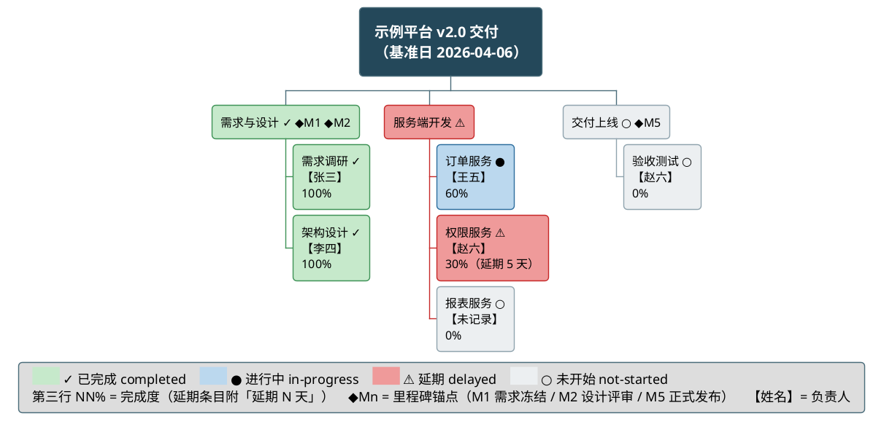
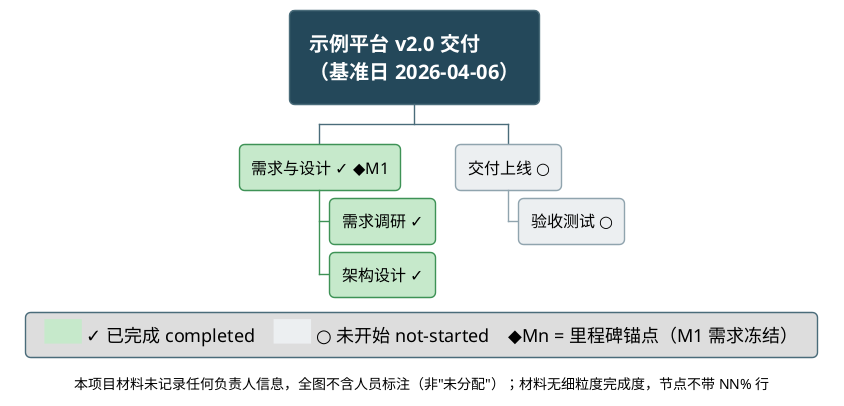
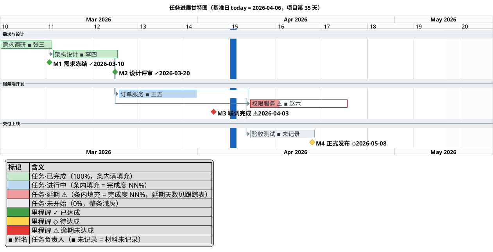
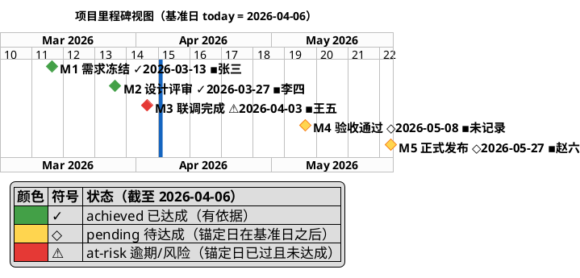
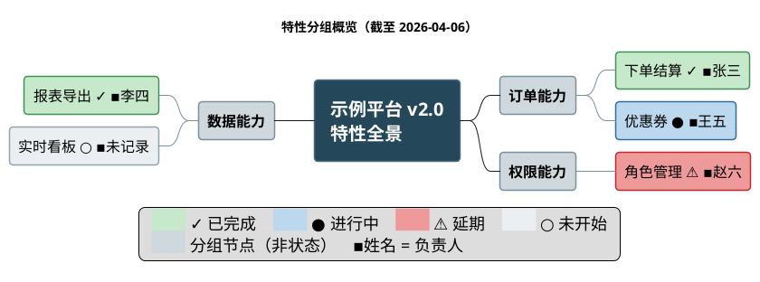
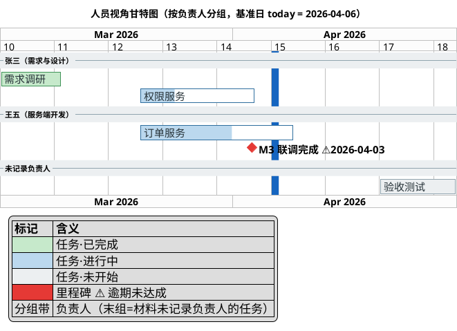
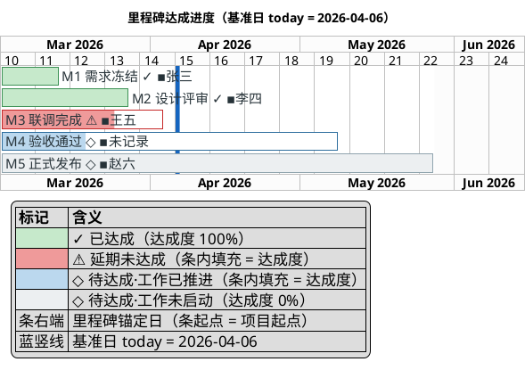

# 跨层规范：人员承载与图元编码 —— 谁负责什么，在图上必须看得见

`summarize-project` 的**跨层强制规范**：人员（负责人）在报告与各图中的承载位、缺失时的显式声明位、里程碑图元的日期与三态编码、里程碑视图的独立成图判定。工作流主框架见 [../SKILL.md](../SKILL.md)；记录层 schema 见 [data-model.md](data-model.md)；其余跨层公约见 [reporting-playbook.md](reporting-playbook.md)。

**边界（两条）**：
1. **通用绘图规则不在此**：字形与冗余编码、图例契约、版面/刻度/zoom 量测、渲染踩坑——权威出处在 draw-plantuml：`<draw-plantuml>/references/guide/style.md`、`<draw-plantuml>/references/howto/13-wbs-diagram.md`、`<draw-plantuml>/references/howto/14-gantt-diagram.md`、`<draw-plantuml>/references/howto/15-mindmap-diagram.md`。
2. **日期与进度的计算不在此**：状态判定、延期判定、天数差、进度百分比、父项聚合、today 偏移，全部由 `scripts/progress-engine.py` 完成；本文档只写**引擎输出字段如何呈现**（哪张图承载什么、什么状态配什么颜色/符号/文案），**不含任何日期比较、算式或判定步骤**。

**本文档存在的原因**：采集阶段登记了「负责人」，但如果五个呈现层面都没有人员的落点，这份数据就被静默丢弃——报告读者看不到"谁在负责"，采集也就白做。因此本文档规定：**人员是与状态、日期同级的一等呈现维度，每张图与报告正文都有强制承载位；缺失也必须显式说明，不得静默省略。**

## 1. 统一图元字面量（跨图逐字一致）

### 1.0 呈现层消费的引擎字段（判定不在呈现层）

状态、完成度、延期天数的**计算逻辑全部在进度引擎脚本里**（引擎归属见 [../SKILL.md](../SKILL.md) 工作流与 [data-model.md](data-model.md)）。本文档与报告正文只做**转录与编码**：

| 引擎字段 | 取值 | 呈现层怎么用 |
|----------|------|--------------|
| `status`（工作项） | `completed` / `in-progress` / `delayed` / `not-started`（无状态信号时为降级终态 `unknown`） | 决定四态样式类（`.done`/`.doing`/`.late`/`.todo`）、甘特 `is colored in`、状态符号 `✓ ● ⚠ ○` |
| `progress_pct` | 0–100 整数，或 `null` | 甘特 `is N% complete`；WBS 节点第三行 `NN%`；表格进度列。`null` → 走合法终态 `-（无可计数依据）`，图内不写百分比 |
| `delay_days` | 正整数，或 `null` | 延期条目的 `（延期 N 天）` 注记、跟踪表「延期天数」列；`null` 时该注记整体不出现 |
| `milestone_status` | `achieved` / `pending` / `at-risk` | 里程碑菱形的饱和色与符号 `✓ ◇ ⚠` |
| `progress_bar`（可选） | 定长 `█`/`░` 字符串 | Markdown 进度条列（见第 4.4 节）；引擎未提供该字段则只写 `NN%`，**不在文档/报告里由百分比推算格数** |

**红线（用户明确要求）**：本技能的任何文档与生成的报告正文**都不得**出现"某日期早于/晚于某日期""相差 N 天""N/M×100%"这类判定或算式。凡涉及"是否延期、延期几天、完成多少"，一律表述为**取引擎输出字段**；引擎没给的字段就走合法终态（见 [degradation.md](degradation.md) 第 3 节），不由呈现层补算。

### 1.1 图元字面量表

下表是全报告唯一合法的人员/状态/里程碑图元字面量——本表的作用是**固定本报告采用哪个字面量**（跨图逐字一致的锚点）。

| 语义 | 字面量 | 用在哪 | 示例 |
|------|--------|--------|------|
| 任务负责人（甘特） | ` ▪ 姓名`（U+25AA，前后各一空格） | 甘特条形显示名后缀 | `[订单服务 ▪ 王五] as [ORD]` |
| 任务负责人（WBS） | `\n【姓名】`（换行后第二行） | WBS 节点第二行 | `*** 订单服务 ●\n【王五】\n60% <<doing>>` |
| 特性负责人（脑图） | ` ▪姓名` | 脑图叶子节点后缀 | `*** 优惠券 ● ▪王五 <<doing>>` |
| 里程碑负责人 | ` ▪姓名` | 里程碑视图标签末尾 | `[M1 需求冻结 ✓2026-03-13 ▪张三]` |
| 负责人缺失 | `▪未记录` / `【未记录】` | 同上各处 | `[权限服务 ▪ 未记录] as [AUTH]` |
| 工作项 completed | `✓`（U+2713）+ 浅绿 `#C6E9CB`/`#3E9256` | WBS/脑图节点标题、甘特条（`is 100% complete`） | `*** 需求调研 ✓\n【张三】\n100% <<done>>` |
| 工作项 in-progress | `●`（U+25CF）+ 浅蓝 `#BBD8EE`/`#2E6E9E` | 同上（甘特配 `is N% complete`） | `*** 订单服务 ●\n【王五】\n60% <<doing>>` |
| 工作项 delayed（延期） | `⚠`（U+26A0）+ 浅红 `#EF9A9A`/`#C62828` | 同上；WBS 第三行可附 `（延期 N 天）` | `*** 权限服务 ⚠\n【赵六】\n30%（延期 5 天） <<late>>` |
| 工作项 not-started | `○`（U+25CB）+ 浅灰 `#ECEFF1`/`#90A4AE` | 同上（甘特不写 complete 子句） | `*** 验收测试 ○\n【赵六】\n0% <<todo>>` |
| 工作项完成度 | `NN%`（WBS 第三行）/ `is N% complete`（甘特） | WBS 节点第三行、甘特条内填充 | `[ORD] is 60% complete and is colored in #BBD8EE/#2E6E9E` |
| 里程碑 achieved | `✓`（U+2713）+ 饱和绿 `#43A047` | 里程碑标签、甘特菱形 | `[M1 需求冻结 ✓2026-03-13]` |
| 里程碑 pending | `◇`（U+25C7）+ 琥珀 `#FFD54F` | 同上 | `[M4 验收通过 ◇2026-05-08]` |
| 里程碑 at-risk/逾期 | `⚠`（U+26A0）+ 饱和红 `#E53935` | 同上 | `[M3 联调完成 ⚠2026-04-03]` |
| WBS 里程碑锚点 | `◆Mn`（U+25C6） | WBS 节点标题行**最末尾**（状态符号在前、`◆Mn` 在后） | `** 需求与设计 ✓ ◆M1 ◆M2` |

> 字形选择（为何用 `✓` U+2713 而非 `✔` U+2714、为何禁用 emoji、可用字形白名单 `✓◆◇●○▲■★☆⚠`）与"颜色 + 符号"冗余编码的通用规则见 `<draw-plantuml>/references/guide/style.md`「状态编码：颜色 + 符号冗余」；本表只固定本报告采用哪个字面量。

**长度与一致性比对纪律**：状态符号、`NN%`、`（延期 N 天）`、`【负责人】`、`◆Mn` 均为**附加标注**，不计入节点名 ≤12 汉字 / 里程碑名 ≤10 汉字的长度上限，也不参与跨图"逐字一致"比对（只比对名称本体）——与里程碑标签"日期与符号不计入比对"是同一条规则。

### 1.2 四态色板与两套符号体系如何并存

本报告有两组状态编码：**工作项四态**（WBS 节点 / 甘特条 / 脑图节点）与**里程碑三态**（菱形）。二者并存的三条规则：

1. **深浅分工**：工作项图元内部要放深色文字，一律用浅填充（`#C6E9CB` / `#BBD8EE` / `#EF9A9A` / `#ECEFF1`）；里程碑菱形是小图元、须高饱和才辨识（`#43A047` / `#FFD54F` / `#E53935`）。延期态沿用既有分工——工作项浅红 `#EF9A9A` ↔ 里程碑 at-risk 饱和红 `#E53935`，与 completed 浅绿 ↔ achieved 饱和绿完全同构，**不引入新的配色逻辑**（色板全表见 [reporting-playbook.md](reporting-playbook.md) §1.1）。
2. **符号共用同义、专属不混用**：`✓`（完成/达成）与 `⚠`（落后于计划）两套共用且语义一致——读者只需记一次；`◇` 专属里程碑（菱形形状本身即里程碑），工作项"未开始"改用 `○`，与 `●`（已动工）构成空心↔实心对比；`◆` 只用于 WBS 的里程碑锚点 `◆Mn`（永远带 Mn 后缀，不会与 `●` 混读）。
3. **符号数量的取舍**：**WBS/脑图四态全部带符号，甘特只给延期态加 `⚠`**。理由——甘特条自带"条内填充比例"这条几何通道（满填充 = 完成、部分 = 进行中、无填充 = 未开始），色相之外已有第二通道，只有"进行中 vs 延期"这一对无法靠填充区分，故仅补 `⚠`；WBS/脑图节点没有几何通道，只有色块，灰度打印下浅绿/浅红/浅灰亮度接近，因此四态必须各带符号。

**零实例退化优先**：项目没有延期条目 → `<style>` 不定义 `.late`、图例不列延期行；同理无 in-progress 条目就不定义 `.doing`。图例契约见第 5 节。

## 2. 人员承载位（三层，逐层强制）

### 2.1 记录层：负责人列不得留空

见 [data-model.md](data-model.md) 结构 B/C/D：任务与里程碑的「负责人」字段为**必填**，取值只能是规范名、`规范名（推断）` 或 `未记录`。

### 2.2 图内承载位（四张图各有落点）

| 图 | 人员落点 | 强制程度 |
|----|----------|----------|
| WBS 工作分解图 | **任务级及以下节点**第二行 `【姓名】` | 项目存在任一人员数据时强制；阶段节点不标（避免与子节点重复） |
| 任务进展甘特图 | 条形显示名后缀 ` ▪ 姓名` | 同上强制 |
| 里程碑视图 | 标签末尾 ` ▪姓名` | 同上强制 |
| 特性概览脑图 | 叶子节点后缀 ` ▪姓名` | 可选（特性负责人常无材料依据；有则标） |

**部分缺失（项目有人员数据、个别条目没有）**：该条目写 `▪未记录` / `【未记录】`，**不得整段省略**——省略会让读者把"没采到"误读为"没人负责"或"与上一条同人"。

**全量缺失（项目完全没有人员数据）**：全图不带人员标注，同时在图内加 `caption` 一句显式声明（WBS/脑图支持 `caption`，实测通过）：

```
caption 本项目材料未记录任何负责人信息，全图不含人员标注（非"未分配"）
```

甘特图不使用 `caption` 时，用 `legend` 内一行或图说首句承担同一声明。

### 2.3 报告正文承载位：`### 人员与分工` 小节

位置固定在 `## 功能分解` 节内、WBS 图说之后（人员与工作包同层引入，后续里程碑/甘特直接复用同名）。结构固定：

````markdown
### 人员与分工

**人员维度覆盖率：已记录负责人的条目 6 / 全部条目 9（67%），其中 2 条为 git 推断。**（本小节整块是**格式示例**，数值与姓名随项目而变、一律取引擎 `people.coverage_formula` 与 `people.roster`）

| 规范名 | 角色 | 负责条目 | 来源 |
|--------|------|----------|------|
| 张三 | 未记录 | T-01, T-05, M1 | specs/001-cli/tasks.md#L42 |
| 李四 | 发布负责人 | T-02, M2 | docs/roadmap.md#Q1 |
| 未记录 | - | T-07, T-08, M4 | —（三级来源均无数据） |
````

- **首句必须是覆盖率声明**（`已记录 X / 全部 Y（Z%）`），这是防止人员数据被静默丢弃的关键闸门；含推断时补一句推断条数。
- **最后一行固定为 `未记录` 汇总行**（若存在无负责人的条目），列出这些条目 ID——让"缺口"本身成为可见信息。
- **全量缺失时小节仍然保留**，正文写：「本项目材料未记录任何负责人信息。已检索：表单 `people[]` 与条目 `owner_id`、外部文档的指派人字段、（仅 opt-in 且已授权时）`git shortlog -sne`。」并在 `## 元信息` 记一条缺口。git 作者的处置见 2.4。
- **隐私收敛（对外分发默认）**：报告呈现的人员表**默认不含邮箱**（结构 D 的「别名/邮箱」列在报告中折叠为 `-`）；仅当同名歧义必须靠别名区分时，才呈现非邮箱形式的别名。邮箱只留在记录层，不进对外报告。
- 名称口径：报告各处（WBS、甘特、里程碑、表格、叙述）一律用结构 D 的**规范名**，逐字一致；推断负责人在**表格与元信息**中带 `（推断）`，图内标注**不带**该后缀（图内保持简洁，推断信息由表格与图说承担）。

### 2.4 git 作者 → 负责人的确定性裁决（消除"标注该作者 vs 全图未记录"的二义）

**问题**：opt-in 仓的 `git shortlog` 能给出作者，但"提交了代码"**不等于**"负责这个工作项"。此前把"标注该作者"与"全图未记录"并列为两个选项、没有 tie-breaker，导致**同一项目两次运行的人员呈现不同**。下表是**唯一裁决规则**，按行匹配、无自由裁量：

| 前提（互斥，由事实唯一确定） | 人员数据落到哪 | 图内标注 | `### 人员与分工` 首句 |
|------------------------------|----------------|----------|------------------------|
| ① 表单未声明 `project.repos[]`，或该仓 `derive_fields` **未授权** `people.owner_name` | **不查 git**；全项目负责人 = `未记录` | 全图不标 + `caption` 声明 | 覆盖率 `0 / Y（0%）` + 已检索来源（含"未授权 git 作者推断"） |
| ② 已授权，`git shortlog -sne --no-merges` 得到**恰好 1 个**作者 | 该作者写入 `people[]` **一行**（`（推断）` + `inferred_from: repo:<repo_id> git:shortlog`），作为**项目级名册**；**不回填**任何条目的 `owner_id` | 全图**不标**人员 + `caption` 声明「材料仅记录到项目级单一作者（推断），未记录条目级负责人」 | 覆盖率仍 `0 / Y（0%）`（条目级为 0），并补一句"项目级作者：<规范名>（推断）" |
| ③ 已授权，得到 **≥2 个**作者，且**未**授权路径级查询 | 全部作者写入 `people[]` 作为**项目级名册**（各带 `（推断）`）；**不回填**条目 `owner_id` | 同 ② | 同 ②（列出全部项目级作者） |
| ④ 已授权，且**路径级查询也在授权范围内**（`git log --format='%an' -- <限定路径>`），且该路径与**某个已声明工作项**一一对应 | 只对**这些**工作项回填 `owner_id`（`（推断）`，`inferred_from` 写明路径与命令） | 这些条目正常标注 `【姓名】`/` ▪ 姓名`，其余条目 `【未记录】` | 覆盖率按引擎 `people.coverage_formula` 正常呈现，并注明推断条数 |

**三条配套纪律**：

1. **"项目级名册"与"条目级负责人"是两个不同维度**：项目级作者进 `people[]` 与人员表（供读者知道"谁在写代码"），**不**进图元、**不**计入人员维度覆盖率的分子——覆盖率的分子恒为"有 `owner_id` 的条目数"（引擎口径）。
2. **不得靠提交量排序推负责人**：提交最多的人不等于负责人。②③ 行一律只作名册，不做归属。
3. **路径 ↔ 工作项的对应关系必须来自材料**（表单里该工作项明写了落点路径，或 `derive_fields` 明确授权到该路径），**不得**由执行器凭模块名相似度指派——否则 ④ 行退化为 ③ 行。

## 3. 甘特图人员编码：负责人写进条形显示名

PlantUML 甘特原生有资源语法 `[任务] on {张三}`。**本技能默认不用它**，改用条形显示名后缀 ` ▪ 姓名`。理由（A/B 实测见 `<draw-plantuml>/references/howto/14-gantt-diagram.md`「实测结论：`on {}` 不改排期，但资源泳道极吃版面」）：

- **资源名不会画在条形上**——本报告要的是"读者一眼看见谁负责"，`on {}` 帮不上这个忙；
- **代价是底部资源盒**：资源盒吃掉成图高度的 **30%~50%**（任务行越少占比越高），且打印占用率数字，外部读者易读作"严重超载"告警；
- （`on {}` 本身**不改写** `starts`/`ends` 定位——两侧条形 x/width 完全一致，所以它不是排期风险，只是版面与表达力问题。）

**默认做法**：人员只进**显示名**。

```
[订单服务 ▪ 王五] as [ORD] starts at [ARCH]'s end and requires 20 days
[ORD] is 60% complete and is colored in #BBD8EE/#2E6E9E
```

- 显示名带人员，`as [别名]` 供后续引用——**后续所有引用（依赖、里程碑锚定、着色、百分比）一律用别名**，避免重复长串中文；
- 人名拼进标签会让最右标签越过时间轴右边界，处置（缩短标签、或用几乎无色的着色区间把时间轴向右延长）见 `<draw-plantuml>/references/howto/14-gantt-diagram.md`「量测自检：三条几何判据」；
- 需要压缩标签时，缩短的是**任务名**（≤12 汉字规则），不是删人名。

**例外（仅当用户明确要求看人员负载分布）**：才允许 `on {姓名}`，此时**必须**同时满足：① 图头写 `hide resources footbox`（除非用户就是要看占用率）；② 每根条形仍写显式 `starts <yyyy-mm-dd>`（保持条形位置由记录层日期唯一决定）；③ 图说说明占用率数字的含义。

**替代方案（人员视角需求更强时）**：改用「人员视角甘特」——把 `-- 阶段名 --` 分隔带换成 `-- 姓名（主要阶段）--`，任务按负责人分组，末组固定为 `-- 未记录负责人 --`。这是同一份记录层数据的另一种排布，不引入资源语义（示例见第 7.6 节）。默认仍以阶段分组；人员分组是**附加**图或替代排布，二者不得同时省略阶段顺序信息（用人员分组时，阶段信息回落到图说）。

## 4. 里程碑图元编码：日期 + 三态 + 进度可视化（数值取引擎字段）

### 4.1 每个菱形标签必须自带日期

里程碑标签格式固定为：

```
[Mn 名称 <状态符号><yyyy-mm-dd>[ ▪负责人]]
```

例：`[M1 需求冻结 ✓2026-03-13 ▪张三]`、`[M3 联调完成 ⚠2026-04-03 ▪王五]`、`[M4 验收通过 ◇2026-05-08 ▪未记录]`。

- **日期强制**：菱形只有位置没有日期文本时，读者必须靠数横轴格子推日期——里程碑视图与甘特图中的每个菱形都必须带 `yyyy-mm-dd`。标签里的日期**一律照抄引擎的 `anchor_date`**：锚定工作项结束点的里程碑，其绝对日期由引擎按当前排期换算（文档不做换算），图说照引引擎 `evidence` 中的换算说明（如"M3 锚定 [联调对接] 结束点，按当前排期为 2026-04-03"）。引擎 `status=unknown-schedule`（无计划日期）时，标签写 `未排期` 而非任何日期。
- 名称本体仍守 ≤10 汉字；日期与符号、负责人不计入名称长度比对（一致性只比对 `Mn 名称` 部分）。
- 里程碑的声明/着色/引用写法（`happens` 与 `is colored in` 两行标签串的一致性要求、别名用法、只放 `happens` 的紧凑视图约束）见 `<draw-plantuml>/references/howto/14-gantt-diagram.md`「里程碑」。

### 4.2 三态与逾期：状态**取自引擎输出**，本节只管怎么呈现

**判定不在本文档**：里程碑的状态、锚定日、逾期天数一律由 `scripts/progress-engine.py` 计算（一次运行、全报告共用）：

```bash
python3 ${SKILL_HOME}/scripts/progress-engine.py \
  --db <交付目录>/data/project.db --baseline <D0> --out <交付目录>/data/engine-out.json
```

取用字段（`items[]` 中 `type=milestone` 的条目）：`status`、`anchor_date`、`delay_days`、`evidence`、`schedule_status`。**本文档不重述任何日期比较、天数差或判定步骤**——语义与字段定义见 [consistency-rules.md](consistency-rules.md) §6。呈现层只做字段 → 图元的映射：

| 引擎 `status` | 语义（一句话） | 颜色 | 符号 | 标签日期文本 | 跟踪表「依据」列写法 |
|---------------|----------------|------|------|--------------|----------------------|
| `achieved` | 已达成（有达成依据） | 绿 `#43A047` | `✓` | `anchor_date` | 直接引 `evidence`（含达成出处；晚于锚定日时引擎已给出晚了几天） |
| `at-risk` 且 `delay_days` 非空（逾期类） | 逾期未达成 | 红 `#E53935` | `⚠` | `anchor_date` | `逾期 N 天`（N = 引擎 `delay_days`），并附引擎 `evidence` 中的基准日与锚定日两个字面量 |
| `at-risk` 且 `delay_days` 为空（风险类） | 材料明写风险 | 红 `#E53935` | `⚠` | `anchor_date` | 风险出处（引擎 `evidence` 给出的风险信号来源） |
| `pending` | 待达成（锚定日尚未到） | 琥珀 `#FFD54F` | `◇` | `anchor_date` | `-` |
| `unknown-schedule` | **无计划日期，无法判定延期** | 琥珀 `#FFD54F`（**绝不上红**） | `◇` | 写 `未排期`（**不编造日期**） | 固定写 `无计划日期，无法判定延期` |

- **`unknown-schedule` 是诚实终态，不是逾期**：材料没有计划完成日时，引擎输出 `status=unknown-schedule`、`delay_days=null`；本报告在跟踪表依据列、图说与 `## 元信息 · 材料缺口` 三处显式声明「无计划日期，无法判定延期」，**不得**用 git 日期等推断基线把它判成逾期，也不得上红色 `⚠`。可直接引用引擎 `diagnostics.declarations` 中的现成声明句。
- **逾期与风险共用红 `⚠`**（避免图例膨胀到四色），二者由跟踪表「状态/依据」列区分：`at-risk（逾期 3 天）` vs `at-risk（风险：上游 T-04 延期）`——依据文本直接来自引擎 `evidence`，不在文档里另行组织算式。
- 状态枚举以 [data-model.md](data-model.md) 为准；`unknown-schedule` 与三态并列，是"无从判定"而非"待达成"的诚实标记。**工作项的 `delayed` 是另一套枚举，不要与里程碑 `at-risk` 混写**（二者只共用红色与 `⚠`）。

**自证一致性（渲染后目检，非日期计算）**：today 蓝线左侧不应出现 `◇ pending` 菱形，右侧不应出现 `✓ achieved`；出现即回查引擎输入（锚定日/达成依据录错），**不在报告里手工改判**、不在图上手改颜色，这条目检结论写进图说结论句。`unknown-schedule` 菱形不入时间轴（无日期可落点），只在跟踪表与声明句中出现。

### 4.3 里程碑视图是否值得独立成图（取舍规则）

里程碑视图与任务进展甘特天然重复（甘特内已有全部菱形）。**独立成图当且仅当满足以下任一条**：

- (a) 引擎 `milestones.view.standalone_condition_a` 为 `true`——即里程碑数量与首末跨度都够（数量、跨度天数与阈值由引擎算出并一并输出，本文档不做日期比较）；此时"节点在时间轴上的疏密分布"本身是信息；
- (b) 引擎 `gantt.split_recommended` 为 `true`（任务进展甘特条目过多、已按 playbook 拆为图集）——需要一张不含任务条的里程碑总览；
- (c) 用户限定受众粒度为高管/阶段级——读者只看节点、不看任务条。

**另需通过「信息增量」检查——判据是确定性的三条，任一成立即通过**（不由执行器主观判断"有没有增量"）：

- (i) 至少一个里程碑有非空负责人（引擎里程碑条目的 `owner_name` 非空）；
- (ii) 至少一个里程碑的 `delay_days` 非空；
- (iii) 引擎 `gantt.schedule_material.gantt_recommended` 为 `false`（甘特不出图 ⇒ 没有任务条可承载菱形，独立视图是唯一落点）。

**不满足则不出独立视图**：`## 项目里程碑` 节只保留跟踪表 + 达成叙述，并写一行指引「里程碑图元合并呈现在《任务进展》甘特图中（M1–Mn 菱形，各自带 yyyy-mm-dd 与状态符号）」——此时甘特内菱形的日期文本与三态符号是**必需**的，不能省。

**判定顺序固定**：先判 (a)/(b)/(c) 任一成立 → 再判 (i)/(ii)/(iii) 任一成立 → 两级都过才出独立视图。判定结论（出/不出 + 命中的是哪几条）写入 `## 元信息`，使同一输入两次运行必得同一结论。

**版面**：独立视图是扁平时间带、行数天生很少，**不要用 zoom 撑宽**（zoom 只放大画布、不提高有效字号）；成图偏细长时把刻度调粗（`printscale weekly` → `projectscale monthly`）。实测矩阵与判据见 `<draw-plantuml>/references/howto/14-gantt-diagram.md`「刻度与 zoom 是量出来的，不是查表得的（实测）」与「里程碑视图（紧凑）」。

### 4.4 里程碑/目标进度可视化（百分比 + 表格 + 进度图）

里程碑与目标不只有"达成 / 未达成"这一位信息——读者还要看**推进到什么程度**。本节给出两种可落地形态；**数值一律取引擎字段**（`milestone_status` / `progress_pct` / `delay_days`，以及 `progress_bar`——**引擎给出则必须原样带上、未给出则只写 `NN%`**），本节不含任何计算规则。

#### 形态 A：里程碑达成率表（Markdown，确定性，默认必出）

放在 `## 项目里程碑` 节的跟踪表之后（或与跟踪表合并列）；首行是一句**达成率声明**，其分子/分母取引擎输出的汇总字段，报告内不做除法：

````markdown
**里程碑达成率：已达成 2 / 全部 5（40%）；延期 1（M3，延期 3 天）。**

| 编号 | 里程碑 | 锚定 | 状态 | 达成进度 | 延期天数 | 负责人 |
|------|--------|------|------|----------|----------|--------|
| M1 | 需求冻结 | 2026-03-13 | ✓ achieved | `██████████` 100% | - | 张三 |
| M2 | 设计评审 | 2026-03-27 | ✓ achieved | `██████████` 100% | - | 李四 |
| M3 | 联调完成 | 2026-04-03 | ⚠ at-risk | `███████░░░` 70% | 3 | 王五 |
| M4 | 验收通过 | 2026-05-08 | ◇ pending | `███░░░░░░░` 25% | - | 未记录 |
| M5 | 正式发布 | 2026-05-27 | ◇ pending | `░░░░░░░░░░` 0% | - | 赵六 |
````

- **进度条列的格子串取引擎 `progress_bar` 字段**（定长，默认 10 格 `█` U+2588 / `░` U+2591）；引擎未提供该字段时该列只写 `NN%`——**不允许**在报告里由百分比推算格数。
- 「达成进度」= 该里程碑所锚定工作项的完成度（引擎 `progress_pct`），与「状态」是两条独立信息：`◇ pending` 也可能已推进 25%，`⚠ at-risk` 也可能已推进 70%——两列并排正是本形态的信息增量。
- 进度条使用的 `█`/`░` 是**纯 Markdown 文本**，不进任何 PlantUML 图元，因此不受 draw-plantuml 字形白名单约束；反之这两个字符**不得**用在图内（图内一律用白名单符号 + 色块）。
- 无 `progress_pct` 数据（引擎给 `null`）→ 该行进度列写 `-（无可计数依据）`，并在图说/元信息声明；**不得**用 0% 冒充"未推进"。

#### 形态 B：里程碑达成进度图（PlantUML，条件出图）

一根条 = 一个里程碑的**达成窗口**（项目起点 → 锚定日），条内填充 = 引擎 `progress_pct`，条色 = 该里程碑当前状态色（工作项四态色板，浅色），标签自带 `Mn 名称 + 状态符号 + ▪负责人`：读者一眼看到"每个节点排在什么时候、推进到几成、有没有落在 today 线之后"。完整实测示例见第 7.7 节。

- **里程碑图的出图决策是一条单一阶梯（确定性，至多出一张）**——按顺序判，命中即止：
  1. 按 4.3 判定**出独立里程碑视图** ⇒ 出里程碑视图，**不出**形态 B；进度信息由形态 A 的表格承担。
  2. 否则，若「里程碑数 ≥3 **且** 至少一个里程碑的 `progress_pct` 非空」 ⇒ 出**形态 B** 达成进度图。
  3. 否则 ⇒ **不出任何里程碑图**，只出形态 A（表格）+ 达成叙述 + 合并进甘特的指引一行。
- 该阶梯**不接受"用户要求"以外的变量**：用户显式要求"里程碑带进度图表"时，等价于把第 2 步的数量条件放宽为"≥1 个里程碑且 `progress_pct` 非空"，其余不变（这一放宽须记入 `## 元信息`）。
- 命中的步骤号写入 `## 元信息 · 里程碑视图独立成图判定`，保证同一输入两次运行出同一张图。**二图并列属重复出图，任何情况下都不允许。**
- 两种形态的分工：达成进度图是**进度视角**（长度 = 窗口、填充 = 完成度），里程碑视图是**节点视角**（一串菱形）。
- **着色纪律**：条色取工作项四态色板浅色（`#C6E9CB` / `#BBD8EE` / `#EF9A9A` / `#ECEFF1`），符号取里程碑三态（`✓ ◇ ⚠`）——颜色回答"推进得怎么样"、符号回答"节点是否达成"，图例必须把这两条通道分开写明。`progress_pct = 0` 的条**不写** `is N% complete` 子句（写了会得到一根空白条），直接整条浅灰着色，与甘特"未开始条"约定一致。

## 5. 图例契约（遵循 draw-plantuml）

图例的通用契约——**零实例退化 / 双向完备 / 单编码退化 / 色块与声明同字面量**，以及落盘前必跑的确定性自检脚本——见 `<draw-plantuml>/references/guide/style.md`「图例契约」，本技能不再重述。

**本报告特有的一条**：**人员图例行仅在图内确有人员标注时出现**——图内至少一个节点/条形带人员标注 → 列 `【姓名】= 负责人，【未记录】= 材料未记录`（或甘特的 ` ▪ 姓名` 说明行）；全图无人员标注 → 不列该行，改由 `caption` 承担声明（见 2.2）。

## 6. WBS / 脑图 / 里程碑视图的状态编码（与甘特同色板）

**报告级要求**：三张图历史上常画成灰白单色——**本技能不允许**：只要记录层有状态数据，四张图（WBS、特性概览脑图、里程碑视图、进展甘特）全部按 playbook 的统一四态色板着色。

本报告的色板映射（哪张图用哪套）：

- **WBS**：`<style>` 定义 `.done/.doing/.late/.todo` 四类（色值取自 playbook §1.1 色板），按每个条目的**引擎 `status`** 给**任务级及以下**节点打标。每个任务级节点是**三行**结构：
  1. 第一行 = 简洁标题 + 状态符号（`✓`/`●`/`⚠`/`○`）+（若被里程碑锚定）` ◆Mn`；
  2. 第二行 = `【负责人】`；
  3. 第三行 = `NN%` 完成度（引擎 `progress_pct`），延期条目追加 `（延期 N 天）`（引擎 `delay_days`）。
  `progress_pct` 为 `null` 时**整行不写**（不写 `0%`——那是断言"未推进"），并在 `caption`/图说声明该维度缺失。
  阶段（非叶子）节点只打状态类 + 状态符号，不带 `【】` 与 `NN%`（避免与子节点重复）；**阶段的 `status`（含 `delayed`）用引擎已聚合好的输出**（聚合在引擎内完成，本文档不重述真值表、也不在呈现层现算聚合），语义见 [consistency-rules.md](consistency-rules.md) §2，通用绘图侧的同一约束见 `<draw-plantuml>/references/howto/13-wbs-diagram.md`「父节点状态由子节点聚合时，聚合规则必须覆盖混合态」。
- **特性概览脑图**：同样四类 + 一个中性 `.group` 类（`#CFD8DC`/`#78909C`）给分组节点用；叶子节点在名称后依次接状态符号与 ` ▪姓名`；根节点不打任何状态类（保留 `rootNode` 深底白字）。分组节点为何必须用中性色（而非状态色）见 `<draw-plantuml>/references/howto/15-mindmap-diagram.md`「节点的四类语义角色」。
- **里程碑视图**：用里程碑三态（不是工作项四态）——pending 由 `<style>` 的 `milestone { }` 默认琥珀承担，achieved 绿、at-risk 红逐条 `is colored in` 覆盖（`milestone { }` 只能统一着色、非默认态需逐条覆盖的语法事实见 `<draw-plantuml>/references/howto/14-gantt-diagram.md`「里程碑」）。
- **零实例退化**：图内没有某一态的条目 → 不定义该样式类、图例不列该行（无延期条目就没有 `.late`）。
- **状态数据整体缺失**时：整图不打状态类（全部默认色），并用 `caption` 声明"材料未记录状态信息"；**禁止**只给部分节点着色而其余留白（会造成"未着色=某种状态"的误读）。

## 7. 实测验证的完整示例（可直接套用）

以下示例均已用 `<draw-plantuml>/scripts/render-plantuml.sh` 渲染验证（零退出 + SVG 含 `<svg` 根元素 + 目检无缺字/无裁切）。它们是**本报告的成品模板**（图元字面量、人员承载位、里程碑编码、图例结构）。

> 示例中的 `printscale` / `zoom` 取值只对这几份示例数据成立；套到真实项目后必须按 `<draw-plantuml>/references/howto/14-gantt-diagram.md`「量测自检：三条几何判据」重新量测调参。

### 7.1 WBS：四态（含延期）+ 状态符号 + 人员 + 完成度 + 里程碑锚点 + 图例

（三行节点：`标题 + 状态符号 [+ ◆Mn]` / `【负责人】` / `NN%[（延期 N 天）]`；实测 1.94:1、最小有效字号 18.8px，长宽比与可读性判据均通过。）



### 7.2 WBS 降级形态：无人员数据 + 无完成度 + 图例零实例退化

（本项目无人员数据 → 不带 `【】` 标注、图例无人员行、`caption` 显式声明；引擎 `progress_pct` 全为 `null` → 节点不带 `NN%` 第三行；图内没有 in-progress 与 delayed 条目 → `<style>` 不定义 `.doing`/`.late`、图例不列这两行。状态符号 `✓`/`○` 仍保留——灰度打印下它们是唯一可读通道。实测长宽比与可读性判据均通过。）



### 7.3 任务进展甘特：四态完成度（颜色 + `is N% complete` 双通道）+ 延期条 + 人员后缀 + 里程碑三态 + today + 依赖 + 图例

（延期条 = `#EF9A9A/#C62828` + 标签 `⚠` + 保留 `is N% complete`；末行 `2026-05-09 to 2026-05-15 are colored in #FCFCFC` 是给最右里程碑标签留白的贴白区间——实测把「最右标签越界 11.6%」修正为 −5.0%，同时最小有效字号 12.2px、长宽比 1.87:1，三条几何判据全过。）



### 7.4 里程碑视图：日期 + 三态符号色 + 负责人 + today



### 7.5 特性概览脑图：四态色 + 状态符号 + 分组中性色 + 人员 + 图例

（图例拆成两行、**每行各自闭合 `<size:18>`**——实测 `<size:>` 不跨行生效，跨行写会把 `</size>` 当字面量画进图里；拆行后长宽比由 3.48:1 收到 2.66:1，仍偏宽，真实项目按量测再调。）



### 7.6 可选：人员视角甘特（按负责人分组）



> **人员分组时任务名不再带 ` ▪ 姓名` 后缀**（分组带已承载人员，重复标注是冗余噪声）；此时一致性比对的是"分组带姓名 = 结构 D 规范名 = WBS `【…】`"。

> 人员视角甘特的**四态编码与阶段视角完全相同**：延期条同样 `#EF9A9A/#C62828` + 标签 `⚠` + `is N% complete`；本示例数据中无延期条目，故按零实例退化未出现该色与该图例行。

### 7.7 里程碑达成进度图（形态 B，条 = 达成窗口、填充 = 达成度）

对应第 4.4 节形态 B。一根条 = 一个里程碑的达成窗口（项目起点 → 锚定日），条内填充 = 引擎 `progress_pct`，
条色 = 工作项四态浅色（回答"推进得怎么样"），标签符号 = 里程碑三态 `✓ ◇ ⚠`（回答"节点是否达成"）。
读者只需看三件事：条右端在 today 蓝线左边还是右边、条内填充有多满、标签符号是哪一个。

（实测：`printscale weekly` **不加 zoom**，长宽比 1.36:1、最小有效字号 33.2px、最右标签未越界，三条几何判据全过；
行数少的图**不要用 zoom 撑宽**，右侧留白靠贴白区间 `2026-05-28 to 2026-06-14 are colored in #FCFCFC`。
`progress_pct = 0` 的 M5 **不写** `is N% complete`，整条浅灰——写 `is 0% complete` 会得到一根空白条，读者会误读为"没有这根条"。）



**配套图说三要素（模板）**：

- **是什么**：全部 5 个里程碑截至 2026-04-06 的达成窗口与达成度（数值取自进度引擎输出，不在报告内计算）。
- **怎么读**：条右端 = 锚定日；条内深色填充 = 该里程碑关联工作项的完成度；浅绿 `✓` 已达成、浅红 `⚠` 延期未达成、浅蓝 `◇` 待达成且已推进、浅灰 `◇` 待达成且未启动；蓝竖线 = 基准日。
- **结论**：M1/M2 已达成，M3 锚定日已在基准日之前且仍差 30% 未完（引擎判为延期 3 天），M4/M5 尚在基准日之后。

### 7.8 渲染踩坑清单（见 draw-plantuml）

通用渲染踩坑（`✔` 字形、`on {}` 资源盒、着色区间、里程碑刻度与 zoom、别名引用、里程碑两行标签等）见 `<draw-plantuml>/references/howto/13-wbs-diagram.md`、`<draw-plantuml>/references/howto/14-gantt-diagram.md` 与 `<draw-plantuml>/references/guide/style.md`。

## 8. 落笔检查（人员与图元维度）

- [ ] 记录层结构 B/C 的负责人列无空白；结构 D 与之互为镜像
- [ ] `### 人员与分工` 小节存在，首句为覆盖率声明（`已记录 X / 全部 Y（Z%）`）；有缺口时含 `未记录` 汇总行
- [ ] 报告呈现的人员表不含邮箱（隐私收敛）
- [ ] WBS 任务级节点、甘特条形、里程碑标签三处均有人员标注；部分缺失写 `未记录`，全量缺失有 `caption`/图说声明
- [ ] 人员名称四处逐字一致：结构 D 规范名 = WBS `【…】` = 甘特 ` ▪ 姓名` = 里程碑 ` ▪姓名`（推断后缀 `（推断）` 只出现在表格与元信息）
- [ ] 甘特未使用 `on {}`（除用户明确要求负载视图，且已按第 3 节例外条件处理）
- [ ] 每个里程碑菱形标签自带 `yyyy-mm-dd` + 三态符号（`✓`/`◇`/`⚠`），日期照抄引擎 `anchor_date`；字形合规按 `<draw-plantuml>/references/guide/style.md`「状态编码：颜色 + 符号冗余」检查
- [ ] 已跑过 `scripts/progress-engine.py`（同一 `--baseline` 与全报告基准日一致）；图内颜色/符号与跟踪表状态列逐条等于引擎 `status`，依据列文本取自引擎 `delay_days` / `evidence`（逾期写 `逾期 N 天`），**报告内无任何手工日期比较或天数差计算**
- [ ] 引擎 `status=unknown-schedule` 的里程碑：标签写 `未排期`、颜色为琥珀（**未上红**），依据列与图说写「无计划日期，无法判定延期」，并已记入 `## 元信息 · 材料缺口`
- [ ] today 蓝线左侧无 `◇ pending`、右侧无 `✓ achieved`（否则回查锚定日或达成依据）
- [ ] WBS / 脑图 / 里程碑视图均已按统一**四态**色板着色（不是灰白单色）；脑图分组节点用中性 `.group` 色
- [ ] 工作项四态编码齐备：每个任务级 WBS/脑图节点带状态符号（`✓`/`●`/`⚠`/`○`）；`status = delayed` 的条目在 WBS（`.late` `#EF9A9A`）与甘特（`#EF9A9A/#C62828` + 标签 `⚠`）两处同时着色标注
- [ ] 完成度双通道齐备：甘特 in-progress/delayed 条均有 `is N% complete`，WBS 任务级节点均有 `NN%` 第三行；`progress_pct` 为 `null` 的条目**整行不写**（不用 `0%` 冒充）并已声明
- [ ] 四态零实例退化已执行：无延期条目时未定义 `.late`、图例未列该行；`#EF9A9A` 未出现在任何图内
- [ ] 里程碑进度已呈现（第 4.4 节）：达成率声明 + 达成率表（进度条格串取引擎 `progress_bar`，无该字段则只写 `NN%`）；里程碑图按 4.4 的**单一决策阶梯**出图（**至多一张**），命中的步骤号已记入 `## 元信息`
- [ ] 人员标注的落法按 2.4 的确定性裁决执行（未授权 / 单作者 / 多作者 / 路径级授权四行之一），**未**在"标注该作者"与"全图未记录"之间自行取舍
- [ ] 图例双向对齐：已按 `<draw-plantuml>/references/guide/style.md`「图例契约」的自检脚本逐图执行并判读通过；人员图例行仅在图内确有人员标注时出现
- [ ] 里程碑视图的独立成图判定已按 4.3 执行；不独立时 `## 项目里程碑` 有合并指引一行
