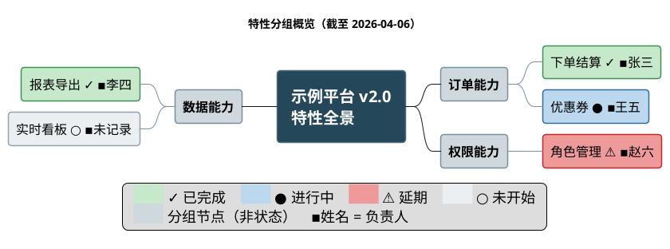

# 层参考：需求与特性 —— 项目要交付哪些能力

对应报告 `## 需求与特性` 节。面向外部读者回答：**项目包含哪些需求与特性？各自处于什么状态？** 工作流主框架见 [../SKILL.md](../SKILL.md)；跨层公共约定见 [reporting-playbook.md](reporting-playbook.md)（日期格式、图说三要素等图表公约见其「跨层图表呈现公约」节）。

## 呈现要素

- **开篇量化句（强制）**：章节首句给出特性维度的量化现状——特性总数、三态计数、特性维度完成度（`分子/分母 = 百分比%`）。数值**逐个取进度引擎输出字段**（计数取汇总的分布计数、完成度取特性口径聚合），本节不做任何计算；模板见 [progress-presentation.md](progress-presentation.md) 3.2。
- **特性清单表格（主体）**：列固定为「特性 | 来源 | 状态 | **进度%** |」；状态口径与全报告一致（completed / in-progress / not-started），状态词按 [progress-presentation.md](progress-presentation.md) §4.2 由引擎状态枚举查表得出；**「进度%」列取引擎的条目进度字段**，字段为空值的行写 `-（无可计数依据）`（不写 `0%`、不删列）。有特性负责人材料时增列「负责人」，取值与结构 D 规范名一致。
- **特性概览图（条件出图、为辅）**：出图与否按下方「概览图出图判据」**确定性判定**（不是"看情况"）；出图时以 `@startmindmap` 呈现分组结构（源码落 `assets/features.puml` 文件，**不进报告正文**；正文只放渲染图片的相对路径引用 + 图说），不出图时只用表格、不强行画图。

### 概览图出图判据（确定性，两条**同时**成立才出图）

1. **数量条件**：进入特性表的行数 **≥8**（取引擎特性口径的条目数，不自行数表）；
2. **分组条件**：材料提供了**可指认的分组依据**——表单 `features[]` 里明写的分组/主题字段值，或用户提供材料/上下文里明写的特性分组。

- 两条**任一不成立 ⇒ 不出图**，只保留特性表；判定结论（出/不出 + 不出的原因是哪一条）记入 `## 元信息`。
- **执行器不得自行发明主题分组**：凭特性名相似度"看起来能分成三组"**不构成**分组依据（那是临场判断，两次运行会分出不同的组）。材料没给分组就是没给——按不出图处理，或在表格里保留材料原有的顺序。
- 分组依据来自推断（如材料给的是层级路径、由装载器推出分组）时，同样要在 `inferred_fields` 留痕并在图说注明"分组依据 = <出处>（推断）"。

## 图形编码规范（脑图也要带状态与人员，不做灰白单色图）

特性概览图一旦出图，就必须承载状态（与其他图同色板）而不是一张纯结构灰图：

1. **状态用样式类 + 状态符号**：`<style> mindmapDiagram { }` 内定义 `.done/.doing/.late/.todo` 四类，色值取自 playbook §1.1 统一四态色板；给**叶子特性节点**打标，并在特性名后追加状态符号 `✓`（已完成）/ `●`（进行中）/ `⚠`（延期）/ `○`（未开始）——脑图节点与 WBS 一样没有"填充比例"通道，颜色必须有符号冗余。特性的 `status` 取引擎输出字段（含 `delayed`），呈现层不做判定；图内零实例的态不定义样式类、图例不列该行。
2. **分组节点用中性色**：分组（主题）节点用 `.group`（`#CFD8DC`/`#78909C`）——**不得**使用四态状态色，否则读者会把分组读成状态。根节点不打任何状态类，保留 `rootNode` 深底白字。
3. **负责人后缀（确定性）**：**项目存在任一特性负责人材料**时，每个叶子节点都写后缀——有值写 ` ▪姓名`、该条缺失写 ` ▪未记录`（**不得整段省略**）；**项目完全没有特性负责人材料**时全图不标后缀，并在图说（或 `caption`）显式声明。名称与结构 D 规范名逐字一致。git 作者的处置见 [people-encoding.md](people-encoding.md) 2.4。
4. **左右分置**：用 `left side` 让分支在根节点两侧均衡展开，避免单侧竖长。
5. **图例必配 + 零实例退化**：`legend bottom` 横排列出图内实际出现的状态色 + 分组色（+ 人员说明行）；图内零实例的状态不列。契约与自检脚本见 `<draw-plantuml>/references/guide/style.md`「图例契约」。

示例（**已实测渲染通过**）：

## 取材优先级（表单主源 → 上下文 → opt-in repo 佐证）

本层的主源是**表单 `features[]`**（`feature_id` / `feature_name` / `status` / `source`，见 [required-info.md](required-info.md)）：

| 优先级 | 信息源 |
|--------|--------|
| 1（主源） | 表单 `features[]`（状态取 `status` 原文字面量，映射由引擎执行） |
| 2 | 上下文与用户提供的需求文档 / 产品功能清单 / issue-PR 导出（摄取后归集进 `features[]`） |
| 3（仅 opt-in） | 已授权 `features[].status` 时的 repo 定向佐证：记忆级特性索引状态列 → 构建/CI 证据分级（见 [source-tiers.md](source-tiers.md) §1.1、§6）；CLI 子命令只作**能力点佐证**，不新增特性行 |

`features[]` 整组为空 → 章节按 [degradation.md](degradation.md) §2.3 退化为「材料声明 + 已检索来源」，不画脑图。

## 组织规则

- **逐行溯源**：表格每一行注明来源（文件或文档章节）；无来源的特性不得出现。
- **状态映射**：语义以 [consistency-rules.md](consistency-rules.md) §1.1 为准（`Implemented`/`Ready for Review`→in-progress、`Completed`→completed、`Draft`/`Planned`→not-started；项目宪章定义不同则以其为准）；**映射的执行在引擎内**——把表单 `features[].status` 的原文字面量写进引擎输入，特性表与脑图的状态取引擎 `items[].status`（宪章口径不同则用输入的 `status_map` 覆盖，未映射字面量由引擎 fail-loud 列出）。外部材料同理：写原文，附映射表进元信息。**延期（`delayed`）不来自源状态字面量**，而是引擎结合排期字段判定后输出的第四态（见 [people-encoding.md](people-encoding.md) 第 1.0 节）。
- **冲突处理**：特性索引与 spec 状态不一致时，以更新日期较新的材料为准，并在叙述中注明冲突。
- **命名一致**：特性名称与项目概览叙述、功能分解树中的对应分支逐字一致。
- **业务语言**：特性名对外部读者可读，不用内部代号。

## 落笔检查

- [ ] 表格四列齐全（特性 | 来源 | 状态 | 进度%），每行有来源出处；有人员材料时另有负责人列
- [ ] **开篇量化句在位**：特性总数 + 三态计数 + 特性维度完成度（`分子/分母 = 百分比%`），数值均取引擎输出字段，本节无算式
- [ ] 「进度%」列逐行取引擎条目字段；空值写 `-（无可计数依据）`（非 `0%`），列未被删除
- [ ] 同一特性的进度与《功能分解》中对应工作项的进度**同值同源**（若该特性同时是工作项）
- [ ] 状态口径与其他章节一致（工作项四态 `completed / in-progress / delayed / not-started`，取值来自引擎 `status` 字段）
- [ ] **概览图出图与否按「概览图出图判据」两条判定**（行数 ≥8 且材料给了分组依据），判定结论已记入 `## 元信息`；分组依据来自材料/推断留痕，**未**由执行器自行发明主题分组
- [ ] 概览图（若有）分组与表格条目一致，无孤儿特性
- [ ] 概览图（若有）已按统一四态色板着色（非灰白单色）且叶子节点带状态符号；分组节点用中性 `.group` 色、根节点不打状态类；零实例的态未定义样式类、图例未列该行
- [ ] 概览图（若有）负责人后缀与结构 D 规范名一致；整体缺失时图说已声明
- [ ] 概览图（若有）配 `legend bottom` 且遵守零实例退化；已按 `<draw-plantuml>/references/guide/style.md`「图例契约」的自检脚本比对通过
- [ ] 材料冲突已注明
