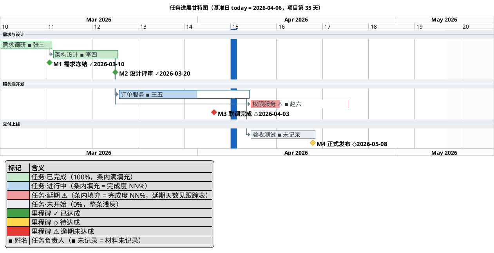

# 层参考：任务进展与整体进度安排 —— 每个任务什么状态、整体怎么排期

对应报告 `## 任务进展` 节。面向外部读者回答两个问题：**每个任务当前的状态是什么？项目的整体进度安排是怎样的？** 工作流主框架见 [../SKILL.md](../SKILL.md)；跨层公共约定见 [reporting-playbook.md](reporting-playbook.md)（四态色板、日期格式、图说三要素等见其「跨层图表呈现公约」节）。

**边界**：本文档只写**呈现什么、怎么呈现**。**一切日期与进度计算**（状态判定、进度%、工期、延期天数、today 偏移、甘特出图判据）由 `scripts/progress-engine.py` 独家完成，本文档只写"取引擎哪个字段、怎么落在图上"——见 [consistency-rules.md](consistency-rules.md) §0.1「计算下沉」。

## 呈现要素

- **进展甘特图**：`@startgantt`（源码落 `assets/gantt.puml` 文件，**不进报告正文**；正文只放渲染图片的相对路径引用 + 图说），遵循 draw-plantuml 的 `references/howto/14-gantt-diagram.md` 与下方「图形编码规范」——同时编码**任务（条）+ 阶段（分隔带）+ 人员（条形显示名后缀）+ 里程碑（菱形）+ 四态状态（颜色，含延期）+ 完成度（`is N% complete` 条内填充）+ 当前日期（today 线）+ 依赖（虚线箭头）**。
- **`### 进度叙述` 小节（强制，紧随甘特图说）**：四段固定内容——① **整体句**（整体完成度 `分子/分母 = 百分比%` + 分母口径 + 排期判断句 + 当前所处阶段）；② **分阶段进度表**「阶段 | 起止 | 状态 | 进度% | 逾期天数」；③ **完成度分布**（已完成 / 进行中 / 未开始<、状态未知><、本轮延后> 计数与总数）；④ **逾期**（逾期条目数与最长逾期天数；无逾期写"基准日左侧无未完成条目"）。数值**逐个取进度引擎字段**（项目级汇总 + 分组聚合），本小节不做任何计算；模板见 [progress-presentation.md](progress-presentation.md) 3.5。这是"项目整体进度安排"的文字答案，与甘特图互为印证且**同字段同值**。
  - **甘特不出图时本小节仍保留**（降级形态见 [degradation.md](degradation.md) 第 5 节）：整体句改为"进度未量化，仅报状态计数：…"，分阶段表的进度与逾期列写 `-（无可计数依据）` / `-`，并配段首材料声明句。

## 图形编码规范（任务 + 人员 + 里程碑，一张图讲全）

1. **阶段用分隔带分组**：每个阶段一条 `-- 阶段名 --`；阶段顺序与 WBS 顶层从左到右顺序一致。任务条按阶段分组罗列，长任务名用 `as [别名]` 简化后续引用。
2. **四态用统一色板着色 + 完成度双通道**（与 WBS 同色板，见 playbook §1.1）。每根条的 `status` / `progress_pct` / `delay_days`
   **一律取进度引擎输出字段**（字段清单见 [people-encoding.md](people-encoding.md) 第 1.0 节，空值降级见 [progress-presentation.md](progress-presentation.md) 第 6 节）；本文档与报告正文不做日期比较、不算天数差：
   - `completed` → `is 100% complete and is colored in #C6E9CB/#3E9256`（满填充）
   - `in-progress` → `is N% complete and is colored in #BBD8EE/#2E6E9E`（N = `progress_pct`）
   - `delayed`（延期）→ `is N% complete and is colored in #EF9A9A/#C62828`，**且条形显示名加 `⚠` 标识**
   - `not-started` → `is colored in #ECEFF1/#90A4AE`（**不写** complete 子句；写 `is 0% complete` 会得到一根空白条，读者会误读为"没有这根条"）
   两条通道各自回答一个问题：**颜色 = 处于哪一态**，**条内填充比例 = 推进到几成**。四态中只有"进行中 vs 延期"无法靠填充区分，
   因此**甘特只给延期条补 `⚠` 符号**，另三态不加符号（避免每根条都挂符号的视觉噪声；WBS 因为没有填充通道才四态全带符号）。
   `progress_pct` 为 `null` 时整条不写 complete 子句，并在图说声明"该条完成度无可计数依据"——**不得**用 0% 或 50% 顶替。
   任务与图例**引用完全相同的十六进制字面量**，避免色名/十六进制混写造成的细微不一致。
   - **延期天数的落点（确定性规则）**：`delay_days` **一律**进任务记录表与图说（形如 `⚠ <任务名> 延期 N 天`），**默认不进条形标签**——标签越长越容易越过时间轴右边界。
     **唯一例外**：用户**显式要求**把延期天数画在条上时才写成 `[<任务名> ⚠延期 N 天 ▪ <姓名>]`，且必须同时满足「条目数 ≤10」与「量测三条几何判据通过」；两个条件任一不满足即退回默认写法。**不得**在无用户要求时自行选用长标签（否则两次运行的图不同）。
   - **延期不改条形位置**：条形起止只由记录层的计划日期决定，延期态只改颜色与标识——绝不为了"看起来延期"把条形右端拉到 today 之后。
     "计划窗口 vs 实际进度"的落差由 today 线与条内填充前沿的相对位置呈现（见下方「当前日期参照线」）。
3. **负责人写进条形显示名（强制承载位，不用资源语法）**：任务写 `[任务名 ▪ 姓名] as [别名] …`，人员随条形显示；缺失写 ` ▪ 未记录`，**不得整段省略**。名称与 WBS `【…】` 第二行逐字一致。
   - **不用 `on {资源}`**：资源语法**不会把人名画在条形上**（读者看不到负责人），而它带来的底部资源盒会吃掉 30%~50% 的图高（A/B 实测见 `<draw-plantuml>/references/howto/14-gantt-diagram.md`「实测结论：`on {}` 不改排期，但资源泳道极吃版面」）。本报告的处置见 [people-encoding.md](people-encoding.md) 第 3 节。
   - **例外**：用户明确要求看人员负载分布时才用 `on {}`，且必须同时满足——图头 `hide resources footbox`（除非用户就是要看占用率）、每根条形保留显式 `starts <yyyy-mm-dd>`、图说解释占用率数字含义。
   - **替代排布**：人员视角需求更强时，把 `-- 阶段名 --` 换成 `-- 姓名（主要阶段）--` 按负责人分组，末组固定 `-- 未记录负责人 --`（示例见 [people-encoding.md](people-encoding.md) 7.6）；此时任务名不再带 ` ▪ 姓名` 后缀，阶段信息回落到图说。默认仍以阶段分组。
4. **里程碑逐条复制自里程碑层，标签自带日期与符号**：同编号同名，标签形如 `[M2 设计评审 ✓2026-03-20]`（`✓` achieved / `◇` pending / `⚠` at-risk-逾期，字形规则见 `<draw-plantuml>/references/guide/style.md`「状态编码：颜色 + 符号冗余」）；锚定优先用原始形式 `happens at [别名]'s end`，绝对日期锚定写 `happens yyyy-mm-dd`；achieved 逐条覆盖为绿 `is colored in #43A047`、at-risk 覆盖为红 `#E53935`。里程碑的声明/着色写法（含两行标签串一致性）见 `<draw-plantuml>/references/howto/14-gantt-diagram.md`「里程碑」。**状态、锚定日与符号一律照抄引擎输出**（与里程碑层同一次运行，字段 `status` / `anchor_date` / `delay_days`；判定语义见 [consistency-rules.md](consistency-rules.md) §6）；引擎 `status=unknown-schedule` 的里程碑**无日期、不入时间轴**，只在跟踪表与声明句中出现。
5. **日期一律 yyyy-mm-dd（呈现形态）**：`Project starts yyyy-mm-dd`、一切绝对起止日期、title 中的基准日、图说与叙述中的日期，全部 `yyyy-mm-dd`（PlantUML 接受该格式）——图源里的日期都是**照抄引擎输出字段**，其字面量合法性在入库时已由数据库约束把关（见 [`../schema/project.sql`](../schema/project.sql)），本节不重述输入侧格式规则。
6. **today 参照线**：`today is N days after start and is colored in #1565C0`（饱和深蓝，浅色在白底不可见）——**`N` 取引擎 `gantt.today_offset_days`**（不在报告里做减法，也不依赖渲染环境时钟）；`title` 直接用引擎 `gantt.title_baseline` 串（如 `…（基准日 today = 2026-04-06，项目第 35 天）`），让蓝线自解释。
7. **依赖用低调虚线**：跨阶段依赖写 `[A] -[dotted]-> [B]`（可带色 `-[#607D8B,dotted]->`），不与实心任务条抢视觉。依赖箭头的通用坑位（`<style>` 的 `arrow { }` 内不能写 `LineStyle`、`starts at [X]'s end` 的前向引用限制、**箭头可能改写排期**因而需 A/B 复核）见 `<draw-plantuml>/references/howto/14-gantt-diagram.md`「布局与美观技巧」；本报告要求条形位置只由记录层日期决定，故画箭头后必须复核排期未被改写。
8. **刻度匹配周期（起点取值是穷尽且不重叠的区间，不留"看情况"）**：项目跨度天数 `D`（取引擎时间轴首末日期之差）——
   `D ≤ 21` → `printscale daily`；`22 ≤ D ≤ 120` → `printscale weekly`；`D > 120` → `projectscale monthly`。
   这是**起点值**；最终取值**按本图量测调参**，调参方向也是固定的：**有效字号不足 → 改粗一档刻度**（daily→weekly→monthly），**长宽比失衡 → 调 zoom**（zoom 只拉长宽比，不提高有效字号；字太小不能靠 zoom 解决，要改粗刻度或拆图）。实测矩阵与判据见 `<draw-plantuml>/references/howto/14-gantt-diagram.md`「刻度与 zoom 是量出来的，不是查表得的（实测）」。有明确工作日历依据时声明 `saturday/sunday are closed`；材料无依据时不虚构假日。
9. **图例必配、含人员行、零实例退化**：`legend left`（嵌入甘特左下天然空白）列出图内实际出现的四态色（含延期 `#EF9A9A`）+ 里程碑三态色 + 人员标注说明行（` ▪ 姓名` = 任务负责人）；**每行同时写清"色块 + 该态的填充语义"**（如 `任务·延期 ⚠（条内填充 = 完成度 NN%，延期天数见跟踪表）`），让读者一次建立颜色与填充两条通道的对应；色块与任务条同字面量；图内零实例的状态**不列**（无延期条目就不列延期行），全图无人员标注时不列人员行（改由图说首句声明）。图例契约与自检脚本见 `<draw-plantuml>/references/guide/style.md`「图例契约」。

骨架示例（**已实测渲染通过**：四态含延期条 + 完成度双通道 + 人员后缀 + 里程碑日期与符号 + today + 依赖 + 图例，日期均为 yyyy-mm-dd；量测结果最小有效字号 12.2px、长宽比 1.87:1、最右标签未越界，三条几何判据全过）：



> **引用纪律**：条形显示名带了人员后缀，后续所有引用（依赖、里程碑锚定、着色、百分比）**一律用 `as [别名]` 的别名**——写显示名会因一字之差报 `Some diagram description contains errors`。

## 进度与状态：**取引擎输出，不在本文档推断**

条目状态、进度百分比、工期、延期天数一律由 `scripts/progress-engine.py` 一次算出（判定语义见 [consistency-rules.md](consistency-rules.md) §1/§2/§6，调用方式见其 §0.1）。下表描述的是"材料信号 → 状态"的判定语义（判定与百分比计算在引擎内实现）；**呈现层只引用引擎输出的状态枚举与进度百分比字段**，不在本文档或报告中做任何换算：

| 材料信号 | 引擎给出的状态 | 呈现层取值 |
|----------|----------------|------------|
| 任务清单勾选完成 / 规格状态 Completed / 已发布上线 | completed | 进度取引擎字段（按定义为满值） |
| 进行中分支、部分完成清单 / 规格状态 Implemented·Ready for Review | in-progress | 进度取引擎字段（有可计数依据才有数值，否则为空值 → 写 `-（无可计数依据）`、甘特条不写百分比子句） |
| 未启动、无痕迹 / 规格状态 Draft·Planned | not-started | 进度取引擎字段（按定义为零值） |
| 上述任一态 + 排期已落后（由引擎判定并输出 `delayed` + `delay_days`） | **delayed** | 呈现层直接取 `status`；`progress_pct` 照常呈现（延期不等于零进度） |

> **状态与延期由引擎判定**：`delayed` 与 `delay_days` 是引擎输出字段，呈现层只做"字段 → 颜色/符号/百分比"的转录——
> 本文档、图说与报告正文**都不写**"计划结束日早于基准日""相差 N 天"这类判定或算式。

```bash
python3 ${SKILL_HOME}/scripts/progress-engine.py \
  --db <交付目录>/data/project.db --baseline <D0> --out <交付目录>/data/engine-out.json --summary
```

甘特与叙述取用的字段：

| 呈现需要 | 引擎字段 | 呈现写法 |
|----------|----------|----------|
| 条形三态着色 | `items[].status` | completed → `#C6E9CB/#3E9256`；in-progress → `#BBD8EE/#2E6E9E`；not-started → `#ECEFF1/#90A4AE` |
| 条内完成比例 | `items[].progress_pct` | 非 `null` → `is <progress_pct>% complete`；`null` → **不写** complete 子句 |
| 进度算式（叙述/图说/表格） | `items[].progress_formula`、`project.progress.formula` + `basis` | **逐字照抄**（自带分子分母），口径名照抄 `basis` |
| 条形起止与工期 | `items[].planned_start` / `planned_end` / `duration_days` | `starts <planned_start> and requires <duration_days> days`（或以 `planned_end` 收口） |
| 阶段条/分隔带日期 | 父项的 `planned_start`/`planned_end`（`dates_derived=true` 时为子项包络） | 图说注明该阶段日期由子项包络推出 |
| 逾期条目数与明细 | `project.counts.delayed`、`project.delayed_items[].delay_days` | 图说写「基准日左侧仍有 N 条未完成条目（逾期）」；`N=0` 写「today 线左侧无未完成条目，进度贴合计划」 |
| 无计划日期的条目 | `project.counts.unknown_schedule`、`items[].schedule_status="unknown-schedule"` | 不入时间轴、**不计入逾期数**，显式声明「无计划日期，无法判定延期」（可引 `diagnostics.declarations`） |
| today 参照线 | `gantt.today_offset_days`、`gantt.title_baseline` | `today is <today_offset_days> days after start and is colored in #1565C0`；`title` 用 `title_baseline` 串 |
| 甘特是否出图 | `gantt.schedule_material.gantt_recommended` + `reason` | `false` → 按 [degradation.md](degradation.md) 第 5 节退化，声明句引 `reason` |
| 图集拆分建议 | `gantt.split_recommended` | `true` → 按 playbook 第 4 节拆图集 |

**语义边线（仍然有效，但不再由本文档做算术）**：

- **状态口径以表单为主源**：表单 `work_items[].status`（原文字面量）+ `checks`（勾选计数）直接进引擎输入，映射由引擎执行（项目自有口径用 `status_map` 覆盖）。仅在 repo opt-in 且该字段被 `derive_fields` 授权时，才按 [source-tiers.md](source-tiers.md) §1.1 做定向佐证。
- **repo 佐证判 completed 须引用证据强度**（仅 opt-in 情形，[source-tiers.md](source-tiers.md) §6）：只有「代码存在」这一级**不足以**判 completed。这条约束作用在**喂给引擎的 `status`/`checks`** 上，不是事后调数字。
- **表单无可计数依据则无细粒度进度**：`checks` 与 `progress_pct` 皆空时引擎输出 `progress_pct = null`，进度列记 `-（无可计数依据）`，并在 `## 元信息` 声明「表单未提供细粒度进度依据」；**不得**凭提交数/代码行硬凑百分比。
- 推断依据写入报告叙述或图注；无依据的状态不标注。
- **退化情形**：项目未开始（全部 not-started）或全部完成（全部 completed）时图表仍须正常渲染，叙述中显式说明整体状态。**排期材料不足时**（引擎 `gantt.schedule_material.gantt_recommended=false`，含"仅有 git 提交且材料过弱"——提交数与跨度天数的判定由引擎完成，本文档不写阈值比较）**甘特不出图**：`## 任务进展` 退化为「材料声明句 + 复用 WBS + 特性/任务状态表 + 整体状态叙述」，git 提交日期仅作项目整体活跃区间推断（标 `（推断）`）、**不得**当作任务 `starts/ends`；替代形态见 [degradation.md](degradation.md) 第 5 节。

## 当前日期参照线

- 项目进行期（同时存在 completed 与 not-started/in-progress）时，甘特图必须标出当前日期参照线。
- `today` **必须**以 `today is N days after start` 相对项目起点显式定位，其中 **`N` 取引擎 `gantt.today_offset_days`**（不在报告里做减法，也不依赖渲染环境时钟）；着色用饱和深蓝 `#1565C0` 保证白底可见，`title` 直接用引擎 `gantt.title_baseline` 串（自带基准日与项目第几天）。
- **today 线省略的唯一条件（确定性）**：引擎 `project.status_counts` 里 `in-progress` 与 `delayed` 两桶**都为 0**（即项目全部完成或全部未开始）⇒ 省略 today 线，并在叙述中说明整体状态；**否则一律必画**。不由执行器凭"看起来不需要"决定。
- **today 线与进度前沿的关系（呈现层的读图约定）**：today 蓝线是图上唯一的时间基准；每根 in-progress / delayed 条的**条内填充前沿**与蓝线的相对位置，就是读者判断"这条是否跟得上计划"的视觉线索（填充前沿明显落在蓝线左侧 = 落后）。本技能对此只有两条**呈现**要求：① 蓝线必须可见且 title 注明基准日；② 每根 in-progress / delayed 条必须带 `is N% complete`，否则该通道为空、读者无从比对。**是否延期、延期几天由引擎判定**（`status` / `delay_days`），图说只陈述结论（如"1 条延期：权限服务，延期 5 天"），不在文档或报告里做日期比较与天数差计算。

## 时间信息的估计默认与假设标注

材料缺少日期/工期时的处理顺序（所有落值都写进**表单并装载进数据库**，由引擎算出 `duration_days` 与排期判定；报告不做工期计算）：

1. **有锚点用锚点**：git 标签、发布日期、规格创建日期、迭代周期都可作为锚点，落成条目的 `planned_start`/`planned_end`。
2. **相对排期**：只知先后顺序时，用相对依赖排期（B 在 A 结束后开始），不给绝对日期——此时该条目在引擎里落 `unknown-schedule`（无计划完成日），图上按相对次序绘制并在图说声明"仅表先后次序"。
3. **必须估计时**：按同类任务的常规工期给出**估计的计划日期**写进数据文件，并在报告 `## 元信息` 中**逐条显式标注**为估计假设（assumptions），格式：「假设：<工作项> 计划完成日估计为 <yyyy-mm-dd>（材料未提供）」；引擎输出的 `duration_days` 与延期结论随之而来，报告只引用。
4. **猜测会误导时**：转为最多一轮澄清提问（≤4 问），不静默落笔。

> **降级边界**：上述"带标注的估计"只适用于**甘特已在出图**（引擎 `gantt_recommended=true`、仅个别条目缺日期）的情形。若全项目无任何排期锚点（引擎 `gantt_recommended=false`），则不进入估计路径——按 [degradation.md](degradation.md) 第 3、5 节走"工期合法终态 `未排期` + 甘特不出图"，**不得**为撑出一张甘特而批量虚构日期。

## 依赖关系

- 工作项间先后依赖按材料呈现；无依据时不虚构依赖。

## 落笔检查

- [ ] 甘特条目与功能分解树带时间信息的叶子一一对应，无孤儿条目；阶段分隔带顺序与 WBS 一致
- [ ] 四态着色使用统一色板（同 WBS）；`is N% complete` 的 N 与图说算式**逐字取自引擎** `progress_pct` / `progress_formula`，in-progress / delayed 条目均有 `is N% complete` 及依据；引擎给 `null` 的条目不写 complete 子句、进度列写 `-（无可计数依据）`（未用 0% 顶替且已声明）；not-started 条未写 complete 子句；图例色块与任务条同字面量
- [ ] `status = delayed` 的条形为 `#EF9A9A/#C62828` 且显示名带 `⚠`；延期天数已落在任务记录表/图说（取引擎 `delay_days`）
- [ ] 延期条的起止仍由记录层计划日期决定（未为"显得延期"改动条形位置）
- [ ] 已跑过 `scripts/progress-engine.py`（`--baseline` = 全报告基准日），本节所有日期、天数、百分比均可在引擎输出中逐字找到；**报告内无任何手工日期比较或算式**
- [ ] 引擎 `schedule_status = unknown-schedule` 的条目：未计入逾期数、未上逾期色，且已声明「无计划日期，无法判定延期」
- [ ] 负责人以条形显示名后缀 ` ▪ 姓名` 承载，与 WBS `【…】` 逐字一致；缺失写 ` ▪ 未记录`（不省略）；未使用 `on {}`（除按例外条件启用的负载视图）
- [ ] 所有绝对日期（Project starts、起止、title 基准日、叙述）均为 yyyy-mm-dd
- [ ] `today` 相对项目起点显式定位、饱和深蓝着色、title 注明基准日；进行期项目有参照线
- [ ] 里程碑条目与里程碑层同编号同名同锚定同状态色；**每个菱形标签带 yyyy-mm-dd + `✓/◇/⚠`**；依赖为 `-[dotted]->` 虚线且无前向引用；条目引用一律用别名
- [ ] 图例含人员说明行、每行写清填充语义，且遵守零实例退化（无延期条目不列延期行）；已按 `<draw-plantuml>/references/guide/style.md`「图例契约」的自检脚本比对通过
- [ ] 刻度与 zoom 已按 `<draw-plantuml>/references/howto/14-gantt-diagram.md`「量测自检：三条几何判据」量测通过
- [ ] 估计性时间已在 `## 元信息` 逐条标注为假设
- [ ] **`### 进度叙述` 小节在位**：整体句（完成度 + 分母口径 + 排期判断 + 当前阶段）、分阶段进度表、完成度分布、逾期条目数四段齐全；甘特不出图时该小节仍保留并配材料声明句
- [ ] 进度叙述与分阶段表的数值逐个取引擎字段，本节无除法算式、无日期比较、无自算天数；与甘特图说结论句、《项目概览》进度摘要、《功能分解》阶段聚合表**同值同源同精度**
- [ ] 图下有图说三要素（讲了什么 / 怎么读颜色·填充·蓝线·菱形 / 一句结论）
