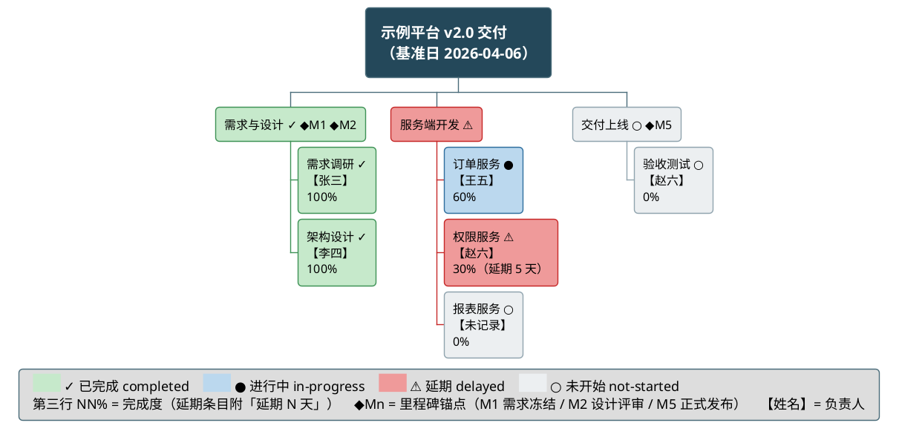

# 层参考：功能分解 —— 项目包含哪些任务

对应报告 `## 功能分解` 节。面向外部读者回答：**项目的工作被分解为哪些阶段与任务？** 本层产出的**单一功能分解树**是里程碑层与任务进展层的唯一数据源。工作流主框架见 [../SKILL.md](../SKILL.md)；跨层公共约定见 [reporting-playbook.md](reporting-playbook.md)（四态配色、日期格式、图说三要素等图表公约见其「跨层图表呈现公约」节）。

## 呈现要素

- **WBS 工作分解图**：`@startwbs` 渲染分解树（源码落 `assets/wbs.puml` 文件，**不进报告正文**；正文只放渲染图片的相对路径引用 + 图说），遵循 draw-plantuml 的 `references/howto/13-wbs-diagram.md`，并按下方「图形编码规范」把**任务 + 负责人 + 四态状态（含延期）+ 完成度 + 里程碑**编码进图。
- **配套图说**：图下一段详实说明（讲了什么、怎么读颜色/符号、一句当前结论），见 playbook「图题与图说」。**结论句必须带进度**——本图范围的完成度（`分子/分母 = 百分比%`）与逾期条目数，数值取进度引擎字段，与下方 `### 工作项进度` 表同值。
- **`### 工作项进度` 小节（强制）**：紧随图说之后、`### 人员与分工` **之前**。两段表格：① **阶段级聚合**「阶段 | 状态 | 进度% | 已完成/共计 | 逾期天数」；② **工作项级**「ID | 工作项 | 所属阶段 | 状态 | 进度% | 计划起止 | 逾期天数 | 依据」。进度%、分子分母、逾期天数**逐格取引擎的分组/条目字段**（阶段聚合口径由引擎实现），空值写 `-（无可计数依据）`；本小节不做任何计算。模板见 [progress-presentation.md](progress-presentation.md) 3.3。
- **`### 人员与分工` 小节（强制）**：紧随 `### 工作项进度` 之后，首句为人员维度覆盖率声明 + 「规范名 | 角色 | 负责条目 | 来源」表格。人员数据是 WBS 的同源信息，必须在本节落地，不得只留在图里或被丢弃。格式见 [people-encoding.md](people-encoding.md) 第 2.3 节。

## 分解深度规则

- **深度（确定性）**：阶段（phase）→ 任务（task）→ 子任务（sub-task）。**材料提供了子任务层（表单里有可归属到某工作项之下的更细条目）⇒ 画三级；没有 ⇒ 画两级**，不为凑深度虚构子任务、也不因图偏大而丢掉已有的子任务层（超限走图集拆分）。至少覆盖 阶段 → 任务 两级；无阶段材料时按下方「深度降级」处理。
- **叶子即工作包**：叶子节点是可分配、可估算的最小单位；粒度以"一句话能说清交付物"为准。每个叶子在**数据库**里对应一行（阶段落 `phases` 表、工作项落 `work_items` 表、特性落 `features` 表，层级由 `phase_id` 外键承载），ID 的唯一性由数据库保证；状态与进度由引擎算出。
- **命名规范**：节点标题**简洁**——业务语言名词/动词短语，≤12 个汉字（或 ≤5 个英文单词），细节留给图说与表格，不塞进节点；不用内部代号；同一工作项在 WBS、甘特图、里程碑视图、叙述中**逐字一致**（负责人/里程碑标记等附加行不计入名称一致性比对，只比对第一行标题）。
- **数量控制**：单图节点 ≤15 时一图呈现；超出按 playbook「大项目图集拆分」节拆分为概览图 + 阶段下钻子图。
- **无层级材料时的深度降级（顶层分支的选择是确定性的）**：表单 `phases[]` 为空**且**工作项都没有 `phase_id`（即没有 阶段→任务→子任务 的层级材料）时，按下列顺序取顶层分支，**命中即止、不由执行器挑选**：
  1. 工作项能按**材料明写的分组依据**（主题字段、日期区间、来源分组）推断出阶段 ⇒ 以推断阶段为顶层，标 `inferred` + 依据；
  2. 否则，`features[]` 非空 ⇒ 以 `features[]` 为顶层分支；
  3. 否则 ⇒ **单层 WBS**（根 + 工作项叶子）。
  三种形态都**不得虚构**任务级工期/负责人，也不得凭空造出三级排期层级；深度受限用图说/`caption` 声明（模板见 [degradation.md](degradation.md) 第 2.3、8 节）。
  代码模块**只能作叶子的佐证、且仅在 repo opt-in 且相应字段被授权时**（取材点判据见 [source-tiers.md](source-tiers.md) §3.1——**源码根目录与模块形态随语言而变，本文档不写任何语言专属路径**），标 `（推断）`；**代码结构不新增工作项**。

## 图形编码规范（任务 + 里程碑 + 人员）

WBS 不只画层级——每个节点同时编码**状态（四态颜色 + 状态符号）、负责人（第二行）、完成度（第三行 `NN%`）、里程碑（锚点符号）**四类信息，让外部读者在一张图上同时看到"分解成什么、谁负责、推进到几成、有没有延期、到哪一步"。字面量以 [people-encoding.md](people-encoding.md) 第 1 节为准（跨图逐字一致）；**状态与百分比一律取进度引擎输出的 `status` / `progress_pct` / `delay_days` 字段，本文档与报告正文不做日期比较、不算天数差、不写百分比算式**（字段清单见 people-encoding 第 1.0 节）。

1. **状态用样式类编码（四态配色 + 状态符号，全报告统一）**：`<style>` 定义 `.done` / `.doing` / `.late` / `.todo` 四类（色值取自 playbook §1.1 统一四态色板，勿另造颜色），给每个**任务级及以下**节点打标，并在标题行末尾追加对应**状态符号**——`✓` 已完成 / `●` 进行中 / `⚠` 延期 / `○` 未开始。颜色 + 符号双通道是硬要求：WBS 节点没有"填充比例"这条几何通道，灰度打印下浅绿/浅红/浅灰亮度接近，只靠颜色会一次性丢掉状态信息。
   - **每个节点的 `status` 取引擎输出**（`completed`/`in-progress`/`delayed`/`not-started`）；阶段（非叶子）节点的 `status`（含 `delayed`）用引擎已聚合好的输出（聚合与进度平均在引擎内完成，本文档不重述真值表、也不在绘图时现算聚合），语义见 [consistency-rules.md](consistency-rules.md) §2，通用绘图侧同一约束见 `<draw-plantuml>/references/howto/13-wbs-diagram.md`「父节点状态由子节点聚合时，聚合规则必须覆盖混合态」。
   - **零实例退化**：图内没有延期条目就不定义 `.late`、图例不列该行（其余三态同理）。
   - **WBS 不允许灰白单色出图**——只有"材料完全没有状态信息"才整图不打状态类与符号，且必须用 `caption` 声明状态信息缺失。
2. **负责人写入节点第二行（强制承载位）**：节点用 `\n` 换行追加 `【负责人】` 行——第一行是简洁标题（跨图一致的名称），第二行是 `【张三】` 或 `【张三/李四】`。
   - **部分缺失**（项目有人员数据、个别任务没有）→ 写 `【未记录】`，**不得整行省略**：省略会让读者把"没采到"误读为"没人负责"或"沿用上一条负责人"。
   - **全量缺失**（项目完全没有人员数据）→ 全图不带 `【…】`，并在图内加 `caption 本项目材料未记录任何负责人信息，全图不含人员标注（非"未分配"）`（实测 `caption` 在 WBS 中渲染于图例下方）。
   - 阶段节点不标负责人（避免与子节点重复）；负责人姓名与甘特条形 ` ▪ 姓名` 后缀、里程碑 ` ▪姓名` 逐字一致，`（推断）` 后缀只出现在人员表与元信息中。
3. **完成度写入节点第三行（`NN%`）**：任务级及以下节点的第三行写引擎 `progress_pct` 的整数百分比（`100%` / `60%` / `0%`）；`status = delayed` 的节点追加 `（延期 N 天）`（引擎 `delay_days`）。
   - **`progress_pct` 为 `null`（材料无可计数依据）→ 整行不写**，绝不用 `0%` 冒充"未推进"（`0%` 是断言、`null` 是无依据），并在 `caption` 或图说声明"材料无细粒度完成度"（合法终态见 [degradation.md](degradation.md) 第 3 节）。
   - 阶段节点不写 `NN%`（阶段完成度放到图说与任务记录表，避免节点内三行×多层的视觉噪声）。
   - 状态符号、`NN%`、`（延期 N 天）` 均为附加标注：**不计入** ≤12 汉字上限，也不参与跨图"逐字一致"比对（只比对标题本体）。
4. **里程碑锚点用符号标注**：若某工作项的结束点被某里程碑锚定（`happens at [该项]'s end`），在该节点标题行**末尾**追加 ` ◆M1` 样式的标记（◆ + 里程碑短编号），并在图例与图说中给出编号→里程碑全名对照。里程碑本身不是工作项，**不得**作为独立 WBS 节点出现。
5. **布局**：顶层阶段按项目时间顺序从左到右排列（左侧列逆序声明、右侧列正序声明，详见 draw-plantuml `13-wbs-diagram.md`「阶段顺序与阅读方向」）；根节点单行加宽横跨中部，标题内可换行注明基准日；渲染后必须核对左右顺序正确。

样式骨架与节点编码示例（**已实测渲染通过**：长宽比 1.94:1、最小有效字号 18.8px、图例契约自检双向为空；色值即统一四态色板）：

- **图例必配且零实例退化**：颜色、状态符号、`NN%`、`◆`、`【】` 都承载语义，图内必须有 `legend bottom` 图例（色块用与样式类完全相同的十六进制字面量，且**符号与色块写在同一行**让两条通道一次建立对应）；但**只列图内实际出现的编码**——无 in-progress 节点就删掉 `.doing` 类与该行，无延期节点就删掉 `.late` 与该行，无人员标注时删掉 `【姓名】` 说明行（改用 `caption`）。图例超过一行时**每行各自闭合 `<size:>`**（跨行写会把 `</size>` 当字面量画进图里，实测），拆行还能把过宽的成图长宽比拉回舒适区。完整图例契约与自检脚本见 `<draw-plantuml>/references/guide/style.md`「图例契约」。无人员数据 + 无完成度 + 零实例退化的完整示例见 [people-encoding.md](people-encoding.md) 7.2。
- **信息缺失的降级**：材料完全没有状态信息时可整图不打状态类（全部默认色），并在 `caption` 与图说中声明"状态信息缺失"；**不允许**只给部分节点着色而其余留白造成"未着色=某种状态"的误读。

## 取材优先级（表单主源 → 推断阶段 → opt-in repo 佐证）

分解树的**条目集合由表单唯一确立**（`work_items[]` + `phases[]`，见 [required-info.md](required-info.md)）：

| 优先级 | 信息源 |
|--------|--------|
| 1（主源） | 表单 `work_items[]`（`item_name` 必填、`phase_id` 承载层级、`depends_on` 承载先后）+ `phases[]`（`phase_name` / `phase_order`） |
| 2（I 档推断） | `phases[]` 为空或工作项无 `phase_id` 时，按上方「无层级材料时的深度降级」的**三步顺序**确定顶层分支（推断阶段 → `features[]` → 单层），推断项标 `inferred` + 依据 |
| 3（仅 opt-in） | 已授权字段的 repo 定向佐证：为**已声明**的工作项补一句实现落点（见 [source-tiers.md](source-tiers.md) §1.1）——**不得**据代码模块新增工作项 |

- **不新增条目**：repo、代码模块树、提交记录都**只能佐证**，不能长出表单里没有的工作项（否则覆盖闭合等式与"无孤儿条目"纪律失效）。
- **归并**：条目过多时按主题归并为顶层分支，保持单图节点数上限（见 [consistency-rules.md](consistency-rules.md) §3）。

## 单一数据源约定

分解树在进入绘图前先在上下文中定稿（命名、层级、归属）；之后：

- 里程碑层的每个里程碑锚定到本树中的工作项或绝对日期；
- 任务进展层的甘特条目与本树带时间信息的叶子工作项一一对应；
- 三处命名逐字一致，不允许任何图中出现树里不存在的孤儿条目。

## 落笔检查

- [ ] 至少两级分解，叶子可分配可估算
- [ ] 节点标题简洁（≤12 汉字）、业务语言、跨图逐字一致（只比对标题行）
- [ ] 状态类使用统一四态色板（`.done`/`.doing`/`.late`/`.todo`），每个节点的状态类**等于引擎 `status`**（阶段节点用引擎聚合值，未在文档里另算）；WBS 非灰白单色；有色即有 `legend bottom` 图例，色块字面量与样式类一致
- [ ] 每个任务级节点标题行带状态符号 `✓`/`●`/`⚠`/`○`，阶段节点同样带符号；`status = delayed` 的节点为 `.late` 浅红 `#EF9A9A` + `⚠`
- [ ] 每个任务级节点第三行为引擎 `progress_pct` 的 `NN%`（延期条目附 `（延期 N 天）`）；`null` 的条目整行不写且已声明，未用 `0%` 冒充
- [ ] 状态与百分比均为引擎字段的转录：本节文字与图内**无**日期比较、天数差、百分比算式
- [ ] 图例零实例退化已执行（无 in-progress / 无 delayed 节点则无该行/该类），多行图例每行各自闭合 `<size:>`，且已按 `<draw-plantuml>/references/guide/style.md`「图例契约」的自检脚本比对通过
- [ ] 每个任务级节点都有 `【…】` 第二行：有数据写规范名，无数据写 `【未记录】`；全项目无人员数据则整图不标并有 `caption` 声明
- [ ] 负责人姓名与甘特条形 ` ▪ 姓名` 后缀、里程碑 ` ▪姓名` 逐字一致（`（推断）` 只在表格/元信息）
- [ ] **`### 工作项进度` 小节在位**（图说之后、`### 人员与分工` 之前）：阶段级聚合表 + 工作项级表两段齐全，列完整
- [ ] 进度%、分子分母、逾期天数逐格取引擎分组/条目字段；空值写 `-（无可计数依据）`（非 `0%`）；本节无除法算式、无日期比较、无自算天数
- [ ] 图说结论句带完成度与逾期条目数，且与 `### 工作项进度` 表、《任务进展》分阶段进度表**同值同源同精度**
- [ ] `### 人员与分工` 小节已随本节产出，首句含覆盖率声明
- [ ] 里程碑锚点 ◆Mn 标记与里程碑层锚定一致；无里程碑节点混入树中
- [ ] 顶层阶段从左到右符合时间/逻辑顺序（渲染后核对）
- [ ] 无层级材料时，顶层分支按「深度降级」三步顺序确定（未在多种形态间自由取舍），并已声明深度受限
- [ ] 单图节点 ≤15，超出已拆分图集
- [ ] 每个分支可溯源到材料
- [ ] 图下有图说三要素（讲了什么 / 怎么读编码 / 一句结论）
